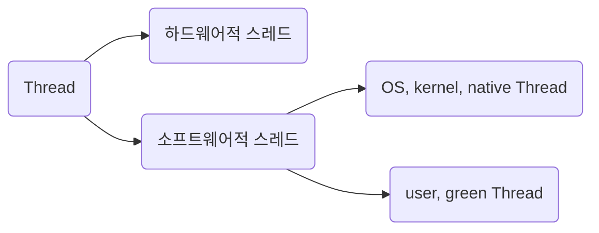
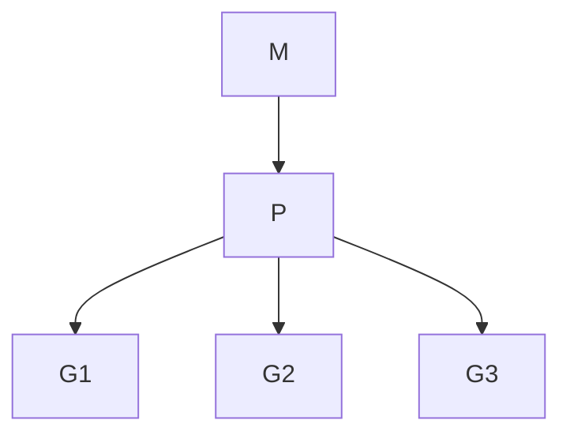
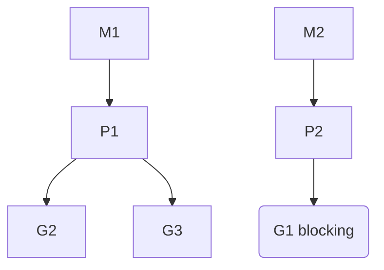

<!-- @import "[TOC]" {cmd="toc" depthFrom=1 depthTo=6 orderedList=false} -->

- [동시성을 향한 여정](#동시성을-향한-여정)
  - [사전 지식](#사전-지식)
  - [컴퓨터의 발전과 동시성](#컴퓨터의-발전과-동시성)
  - [하드웨어적 스레드와 소프트웨어적 스레드](#하드웨어적-스레드와-소프트웨어적-스레드)
  - [동시성과 병렬성](#동시성과-병렬성)
  - [multi-threading & multi-processing](#multi-threading--multi-processing)
  - [threading model : 프로그래밍 언어에서 user thread를 os thread와 매핑하는 방법](#threading-model--프로그래밍-언어에서-user-thread를-os-thread와-매핑하는-방법)
  - [공유 자원 문제](#공유-자원-문제)
    - [(CPython 한정) GIL(Global Interpreter Lock)](#cpython-한정-gilglobal-interpreter-lock)
  - [blocking, non-blocking, sync, async](#blocking-non-blocking-sync-async)
    - [2x2 matrix로 설명](#2x2-matrix로-설명)
    - [blocking, non-blocking의 대한 응용 및 생각](#blocking-non-blocking의-대한-응용-및-생각)
  - [CPU bound, I/O bound](#cpu-bound-io-bound)
  - [network I/O를 이해하기 위한 socket 및 다중 접속 처리](#network-io를-이해하기-위한-socket-및-다중-접속-처리)
    - [TCP](#tcp)
    - [UDP](#udp)
    - [HTTP](#http)
      - [HTTP 1.1](#http-11)
      - [HTTP 2.0](#http-20)
      - [HTTP 3.0 (2020)](#http-30-2020)
    - [다중 접속 처리](#다중-접속-처리)
      - [프로세스를 여러 개 생성하여 다중 접속을 처리하는 것이 왜 문제가 되느냐?](#프로세스를-여러-개-생성하여-다중-접속을-처리하는-것이-왜-문제가-되느냐)
    - [event-loop 모델](#event-loop-모델)
  - [actor model](#actor-model)
  - [green thread](#green-thread)
  - [coroutine](#coroutine)
  - [golang의 goroutine](#golang의-goroutine)
    - [고루틴은 무엇인가](#고루틴은-무엇인가)
    - [고루틴은 왜 저렴한가](#고루틴은-왜-저렴한가)
    - [고루틴의 쓰레드 모델](#고루틴의-쓰레드-모델)
    - [go runtime의 고루틴 스케쥴링](#go-runtime의-고루틴-스케쥴링)
  - [브라우저 런타임에서의 동시성](#브라우저-런타임에서의-동시성)
    - [브라우저 런타임에서 web worker를 활용한 multi threading](#브라우저-런타임에서-web-worker를-활용한-multi-threading)
  - [docs](#docs)
    [docs](#docs)

<!-- code_chunk_output -->
<!-- /code_chunk_output -->

---

# 동시성을 향한 여정

## 사전 지식

[operating-system](os.md)  
[computer-structured](computer-structure.md)
[network](network.md)

## 컴퓨터의 발전과 동시성

- 40년대 : 천공 카드 시절에는 한 번에 한 프로그램이 돌아갔다.

- 50년대 : queue 기반으로 여러 작업을 FIFO 방식으로 처리할 수 있었지만, 여전히 한 번에 한 프로그램만이 돌아갔다. 한 번에 한 프로그램만이 들어간다는 것은, 특정 작업 도중 다른 작업을 할 수 없다는 것을 의미하며 이는 자연스레 cpu idle이 높다는 것이다.

- 60년대 : OS의 원시 단계라 할 수 있는 라는 프로그램이 등장하였다. I/O 대기하고 있는 프로그램이 있을 경우 waiting queue에 대기하고 있는 다른 프로그램에게 CPU를 할당하여 가급적 cpu idle을 줄이고자 하였다. 결국, [시분할 시스템](https://en.wikipedia.org/wiki/Time-sharing)이 도입되었다고 할 수 있다.

- 70년대 : 복잡한 형태의 OS가 등장. 여러 프로그램은 concurrency하게 구동하는 기법이 발전하였다.

  - `프로세스(process)`
    - 두 프로그램이 같은 메모리 주소를 사용하여 발생하는 [race condition](https://en.wikipedia.org/wiki/Race_condition)을 방지하기
      - 각 프로그램은 격리되어 고유한 메모리 공간을 사용해야함
      - 각 프로그램이 소통하기 위해선 message를 넘김으로써만 가능해야함
      - 각 프로그램을 식별할 unique identifier가 필요함
    - 위 조건을 충족하기 위해서 프로그램을 `프로세스(process)`단위로 나누고, PID를 부여하였다.
  - `스레드(thread)`
    - 프로그램 중 일부분이 concurrent하게 동작하길 바랄 수 있다.
    - 각 thread가 마다 stack을 따로 가지고 있고 프로세스 내 heap, data, code 부분은 공유하므로 공유 자원에 대한 접근 문제로 process와 달리 race condition이 발생한다.
    - thread에 대한 자세한 설명은 multi-threading & multi-processing 파트에서 후술한다.
  - 결국 스케쥴링과 스케쥴링 큐(말만 큐이지 FIFO의 큐와는 거리가 있는)의 문제로 귀결된다. 이는 OS 다루는 글에서 후술.

- 그 이후 : 멀티 코어의 시대
  - 2000년대 중반 즈음 단일 연산 유닛의 동작 속도를 높여서 연산 속도를 높이는 방식이 물리적인 한계로 인하여 불가능해졌다. 흔히 [The free launch is over](https://drdobbs.com/web-development/a-fundamental-turn-toward-concurrency-in/184405990)로 유명한 말과 같이 설명된다. 여튼, 그래서 명령어를 처리하는 단위인 '코어'를 여러대 두는 것으로 발전했다. CPU 내 1 core 당 ALU, 제어 장치, register가 들어 있다.
  - 결국, 한 CPU를 busy하게 만드는 것은 OS의 스케쥴링에 따른 것이며 concurrency의 영역이지만 여러 코어를 사용하는 것은 parallelism이다.

[a-brief-history-of-modern-computers-multitasking-and-operating-systems](https://dev.to/leandronsp/a-brief-history-of-modern-computers-multitasking-and-operating-systems-2cbn)

## 하드웨어적 스레드와 소프트웨어적 스레드



하드웨어 스레드는 1 core 당 처리하는 명령어 단위이다. 멀티 쓰레드 지원하는 CPU는 1 core에서 여러 개의 명령어를 동시에 실행할 수 있다.  
어떻게 이런게 가능하냐면.. -> 레지스터를 여러대 두면 된다.
예를 들어 2 core, 4 thead는 CPU에 2개의 코어가 들어가 있고 각 코어당 2개의 명령어를 동시에 처리할 수 있다는 말일 터이다. 어쨌거나 OS 입장에서는 동시에 4개의 명령어가 동시 처리 되니까 "어? 코어가 4개인가?" 라는 생각을 하게 된다. 그래서 하드웨어 스레드를 논리 프로세서라 부르기도 한다.

반면 소프트웨어적 스레드는 하나의 프로그램에서 독립적으로 실행되는 단위이다. 한 소프트웨어 내에서 여러 기능들이 동시에 수행되려면 각 기능의 코드마다 스레드로 만들면 동시에 실행할 수 있다. 프로그램 하나 켜서 1 Process가 돌고 그 안에서 여러 스레드가 돈다고 생각하자. (실제로는 Process가 여러개일 수도 있지만..)

**결국 이 하드웨어 스레드와 소프트웨어 스레드가 각각 의미하는 것이 다르기 때문에 1 core 1 thread CPU 에서도 하드웨어 스레드가 여러 개라면 (인텔의 [하이퍼 스레딩](https://www.intel.co.kr/content/www/kr/ko/gaming/resources/hyper-threading.html)이라던가) OS는 해당 스레드 갯수 만큼의 코어가 있다고 판단하고 해당 자원에 맞춰서 소프트웨어적 스레드를 스케줄링한다.**

예를 들어 2 core에 4 thread라면 하드웨어적으로는 4개(2 \* 2)의 하드웨어 스레드가 존재한다는 말이고, OS는 마치 4개의 코어가 있는 것처럼 인식한다. 여기에 OS 스레드 8개를 돌리고자 한다면 균등 분배하여 각 코어마다 2개의 소프트웨어 스레드를 스케쥴링할 것이다.

OS 스레드와 유저 스레드의 구별로는, OS 스레드는 OS에 의해 지원되고 관리되나 유저 스레드는 유저가 커널의 윗단에서 조작되는 스레드이다.

## 동시성과 병렬성

- 동시성(concurrency) : 싱글 코어에서 멀티 쓰레드를 동작 시키는 방식. 따라서 동시에 실행되는 것처럼 보이는 것일 뿐임.
  - cpu idle을 줄이고 cpu를 가급적 busy하게 task에게 할당하는 것
  - context switching이 매우 빠르게 작동하여 동시에 여러 작업을 하는 것처럼 보이는 것
- 병렬성(parallelism) : 멀티 코어에서 멀티 쓰레드를 동작시키는 방식. 실제로 동시에 실행됨. 멀티 코어 CPU가 필요함.

- 동시성과 병렬성의 차이가 뭐지

  - 1 core면 병렬 프로그래밍 불가
  - 동시성은 보통 `한 개의 작업을 공유하여 처리하는 작업`에 사용함
  - 병렬성은 보통 주로 `별개의 작업을 처리`하는데 사용함

- CPU 내 1 core 당 ALU, 제어 장치, register가 들어 있다. 이것은 core 당 독립적인 명령어 처리가 가능하다는 것이다. 여러 CPU를 묶어놓은 것이라 생각하면 편하다.
- 하드웨어 스레드와 소프트웨어의 스레드는 별개의 용어이므로 혼동하지 말 것. 혼동을 피하기 위해 하드웨어 스레드는 논리 프로세서라고 부르기도 함.
  - 흔히 2core 4thread와 같이 하드웨어 스펙이 적혀있으면 한 번에 4개의 명령어를 동시에 처리할 수 있다는 의미임.
  - 소프트웨어적 스레드는 하나의 프로그램에서 독립적으로 실행되는 단위이다. 한 소프트웨어 내에서 여러 기능들이 동시에 수행되려면 각 기능의 코드마다 스레드로 만들면 동시에 실행할 수 있다. 결국 이 하드웨어 스레드와 소프트웨어 스레드가 각각 의미하는 것이 다르기 때문에 1 core 1 thread CPU 에서도 소프트웨어적 스레드를 수십개 실행할 수 있다.

## multi-threading & multi-processing

- multi-threading

  - thread마다 stack을 가지고 있고 code, data, heap은 프로세스 내에 공유함. 따라서 multi-threading은 multi-processing보다 context switching 비용이 낮음
    - multi thread의 task는 각 thread 내의 stack에 할당된다. task는 stack frame에 저장되고, 끝나면 해당 메모리에 접근할 수 없도록 만들 것이다. 포인터를 사용한다면 stack frame 내 지역 변수의 포인터를 반환하여 dangling pointer를 발생시키지 않도록 주의하자.
  - 리눅스 커널에선 thread와 process을 딱히 구분하지 않고 `task` 라는 개념을 사용한다. 즉, 커널 입장에선 thread냐 process냐의 구분 보다는 이 task가 다른 task와 fd/memory/pid를 공유하는가? 차이일 뿐

- multi-processing
  - single core시 사용 불가
  - multi-thread보다 overhead가 크긴 하지만 CPython 환경에서는 GIL 때문에 멀티 코어 환경을 활용하려면 multi-processing 이용이 권장됨

## threading model : 프로그래밍 언어에서 user thread를 os thread와 매핑하는 방법

multi thread 방식으로 코딩을 하면 user thread가 os thread와 곧장 1:1 방식으로 매핑되는 언어가 있다.  
이런 언어는 java, c# 등이 그러하다.

> 이 글을 쓰는 2022년 9월 말 시점에는 [Java 19에서 virtual thread](https://blogs.oracle.com/javamagazine/post/java-loom-virtual-threads-platform-threads) 관련 이야기가 나오고 있다. 필자는 java를 사용하지는 않지만 관련 내용을 관심 있는 분들은 디깅해보셔도 좋으실 것 같다. (필자는 잘 모르겠다는 말이다.)

그 외 다른 언어는 1:n 방식, m:n으로 매핑하는 경우도 있다. 예를 들어 python은 1:n이다. 여러 thread를 써도 GIL로 인해서 실제로는 하나의 OS 스레드만 사용하게 된다.

- N:1: 여러 유저 스레드가 하나의 OS 스레드에 매핑됨

  - 하나의 유저 스레드가 syscall해서 blocking되면 다른 유저 스레드들은 기다려야 함.
  - 거의 사용되지 않는 모델

- 1:1: 1개의 스레드는 1개의 OS 스레드와 일치합니다.

  - 사용자 스레드 하나를 만들면 그에 따라 OS 스레드 하나가 생성
  - 멀티코어를 활용할 수 있음
  - 무한정 OS 스레드를 만들 순 없기 때문에 갯수를 신경 써야 함

- M:N: 여러개의 OS 스레드 위에 여러개의 고루틴을 돌립니다.
  - 여러 유저 스레드를 여러 OS 스레드에 매핑함.
  - 컨텍스트 스위치 속도도 빠르고 멀티코어도 활용할 수 있어서 N:1, 1:1 스레드 모델의 문제점들을 해결하나 구현이 어려움

## 공유 자원 문제

- 공유된 메모리 뿐만 아니라 file IO, DB 등 동시 접근 가능한 리소스는 불일치 문제에 부딪힐 수 있음.
- multi threading에서는 stack을 제외한 모든 자원을 공유하므로, 공유 자원에 대한 동시 접근 문제가 발생할 수 있음.
- Semaphore : 공유 자원에 접근할 수 있는 프로세스 혹은 스레드의 갯수(세마포어 카운터)를 제한하기

  - 임계 구역에 진입할 수 있는 프로세스의 개수(사용 가능한 공유 자원의 개수)를 나타내는 전역 변수 S
  - 임계 구역에 들어가도 좋은지, 기다려야 할지를 알려주는 wait 함수
  - 임계 구역 앞에서 기다리는 프로세스에 이제 가도 좋다고 신호를 주는 signal 함수

- Mutex(mutual exclusion) : 공유된 자원의 데이터를 여러 쓰레드가 접근하는 것을 막는 것

  - 공유 자원에 오로지 하나의 스레드만 접근할 수 있게 하는 것. → _lock_
  - `임계 구역(Critical Section)에 접근할 수 있는 세마포어 카운터가 1인 특별한 종류의 세마포어`
  - 일부 deadlock 문제에 대한 해결책이 될 수 있다.
  - 뮤텍스 락의 매우 단순한 형태는 하나의 전역 변수와 두 개의 함수로 구현할 수 있습니다.
    - 자물쇠 역할: 프로세스들이 공유하는 전역 변수 lock
    - 임계 구역을 잠그는 역할: acquire
    - 함수 임계 구역의 잠금을 해제하는 역할: release 함수
  - C/C++, python 등의 프로그래밍 언어에서는 사용자가 직접 acquire, release 함수를 구현하지 않도록 뮤텍스 락 기능을 제공합니다.
    - thread/thread_sync.py 참고
  - 커널단에서는 빅 커널락(BKL)을 통해 동시 접근을 제어한다

### (CPython 한정) GIL(Global Interpreter Lock)

- GIL은 단일 스레드 만이 python object에 접근하게 제한하는 mutex이다.
  - 알다시피 Mutex는 dead lock을 발생시킬 수 있는 요인 중 하나임. (다른 요인으론 점유/대기, 비선점 방식, 자원 할당 그래프 상 원형 대기를 들 수 있다.) 그러나 GIL은 단일 스레드만이 python object에 접근하게 제한함으로써 Mutex 사용으로 인해 발생 가능한 여러 잠재적 문제점(코더 문제지만)을 회피할 수 있게 되었다.
  - CPython에서는 단순화를 위해 정석적인 Mutex보다는 python interpreter 자체를 lock하기로 했다. 그래서 'Global Interpreter Lock'이라고 부른다.
- GIL 바깥에서 C/C++ extension을 통해서 연산하는 방안도 있다. numpy나 scipy가 그렇게 한다.
- 어쨌거나 CPython에서는 multi-threading을 사용하더라도 실제로는 single-threading으로 동작함. user thread를 여러개 펼쳐놓아도 os thread는 한개만 돈다는 의미이다. 따라서 multi-process 등의 다른 방법을 사용해야 함.

  - 공식 문서에 의하면,
    > 응용 프로그램에서 멀티 코어 기계의 계산 자원을 더 잘 활용하려면 multiprocessing이나 concurrent.futures.ProcessPoolExecutor를 사용하는 것이 좋습니다. 그러나, 여러 I/O 병목 작업을 동시에 실행하고 싶을 때 threading은 여전히 적절한 모델입니다.
  - 부연 설명하자면, 스레드로 쪼개어 io 작업을 해야 유휴 시간을 활용할 수 있기 때문이다.

## blocking, non-blocking, sync, async

- blocking, non-blocking은 요청의 결과를 곧바로 future든 promise든 돌려주는지, 아니면 기다리는(blocking) 것인지의 여부

  - 제어권을 넘겨주는지, 아니면 기다리는지의 여부
  - blocking이라면 요청의 결과를 기다려야하며 다른 일을 할 수 없다. 제어권이 커널 소유에게 있고 호출한 쪽은 기다려야 한다는 말이다

- sync, async
  - sync : 작업 완료 여부를 호출한 쪽이 커널한테 물어본다면
    - "일 다 됐어요?" 즉, 주기적으로 물어봐야 한다.
    - 동기 처리시 실행 순서가 보장됨
  - async : 작업 완료 여부를 커널이 호출한 쪽에 알려준다면
    - "야 일 다 됐다"(I/O operation is completed, the process is notified by the OS)
    - 작업이 완료되면 callback을 호출해서 알려주는 방식이 대표적 패턴
    - 비동기 처리시 실행 순서가 보장되지 않음

### 2x2 matrix로 설명

- `sync, blocking` -> 값 들어올 때까지 기다려야하며, 작업 완료 여부를 호출 프로세스에서 물어봐야 함
- async, blocking -> 값이 들어올 때까지 기다려야하며, 작업 완료 여부를 처리하는 쪽에서 호출 프로세스로 callback해준다
- `async, non-blocking` -> 값이 들어올 때까지 기다리지 않고 다른 일을 할 수 있으며, 작업 완료 여부를 처리하는 쪽에서 호출 프로세스로 callback해준다
- async, non-blocking -> 값이 들어올 때까지 기다리지 않고 다른 일을 할 수 있으며, 작업 완료 여부를 호출 프로세스에서 물어봐야 함

### blocking, non-blocking의 대한 응용 및 생각

[node.js Overview of Blocking vs Non-Blocking](https://nodejs.org/en/docs/guides/blocking-vs-non-blocking/)

## CPU bound, I/O bound

- 비디오 재생, 네트워크 통신, 디스크 읽고 쓰기 등의 작업을 담당하는 프로세스 -> **입출력 집중 프로세스 I/O bound process**
- 복잡한 수학 연산, 컴파일, 그래픽 처리 작업을 담당하는 프로세스와 같이 CPU 작업이 많은 프로세스도 있습니다. -> **CPU 집중 프로세스 CPU bound process**

  - CPU를 이용하는 작업을 **CPU 버스트(CPU burst)** 라 하고, 입출력장치를 기다리는 작업을 **입출력 버스트(I/O burst)** 라 부른다. 즉, 프로세스는 일반적으로 CPU 버스트와 입출력 버스트를 반복하며 실행된다고 볼 수 있다. 그래서 입출력 집중 프로세스는 입출력 버스트가 많은 프로세스, CPU 집중 프로세스는 CPU 버스트가 많은 프로세스라고 정의할 수 있습니다.

- I/O bound가 느린 이유는 대개 작업을 위해 작동해야 하는 기기의 차이로 인한 latency 때문이다. [Latency Numbers Every Programmer Should Know](https://gist.github.com/sergekukharev/ccdd49d23a5078f108175dc71ad3c06c)를 참고하고, [memory hierarchy](https://www.geeksforgeeks.org/memory-hierarchy-design-and-its-characteristics/)에 근거하면 cpu > memory > disk의 속도임을 확인할 수 있다.

  - 이것이 I/O bound 작업의 `유휴 시간`을 발생시키는 원인이다.
  - 그래서 입출력 집중 프로세스는 실행 상태보다는 입출력을 위한 대기 상태에 더 많이 머무르게 된다. 반대로 CPU 집중 프로세스는 대기 상태보다는 실행 상태에 더 많이 머무르게 된다. 그래서 보통 I/O bound process가 CPU bound process보다 우선순위가 높다.

  - CPU는 하나다. (core는 여러개지만.) 희소한 자원인 까닭에 운영체제는 프로세스마다 우선순위 priority를 부여하고 관리한다. 운영체제는 각 프로세스의 PCB에 우선순위를 명시하고, PCB에 적힌 우선순위를 기준으로 먼저 처리할 프로세스를 결정한다.

- 일반적으로 CPU bound 작업은 multi process, I/O bound 작업은 multi thread로 구현하는 편이다.
  - 연산을 많이 해야 한다면 CPU를 많이 사용해야 하므로 multi process가 적합하다.
  - I/O 작업에서 요청에 대한 유휴 시간을 효율적으로 사용하기 multi thread가 적합하다.

## network I/O를 이해하기 위한 socket 및 다중 접속 처리

> socket?  
> 소켓은 네트워크에서 서버와 클라이언트, 두 개의 프로세스가 특정 포트를 통해 양방향 통신이 가능하도록 만들어 주는 추상화된 장치입니다. 메모리의 사용자 공간에 존재하는 프로세스(서버, 클라이언트)는 커널 공간에 생성된 소켓을 통해 데이터를 송수신할 수 있습니다.
>
> https://engineering.linecorp.com/ko/blog/do-not-block-the-event-loop-part1

### TCP

두 개체 간 데이터 전송의 신뢰성 중시. 네트워크 정체 등의 이유가 발생하더라도 packet loss를 최소화하기 위해 노력함.

- 3 way handshake. → 연결 수립을 위한 통신이 필요함

  - 이 때문에 TCP 기반 HTTP1, 2는 connection 생성 비용 문제를 겪게 됨. HTTP3가 UDP로 갈아타고 신뢰성은 애플리케이션 단에서 구현한 이유.
  - SYN -> SYN/ACK -> ACK
    - 각 패킷에 든 시퀀스 번호 등의 로우 레벨에 대한 설명은 생략
  - TCP 세션 종료 시 어느 한 쪽에서 FIN 패킷을 보내며 종료 시퀀스 진행함. (stop), 강제 종료 등 갑작스런 종료에는 RST 패킷을 보내며 종료.

- Dial 시 적절한 timeout을 설정하여 빠르게 실패하도록 할 것
-

### UDP

- connectionless라서 connection 생성 비용이 없음. 대신 신뢰성이 떨어짐
- 비교적 데이터의 신뢰성이 중요하지 않을 때 사용함.

### HTTP

#### HTTP 1.1

- keep-alive
  - HTTP 1.0은 매 요청 마다 3 way handshake로 연결을 맺어야 해서 latency가 높았음. 그래서 TCP connection을 지속해서 재활용 할 수 있게 함.
    - connection 생성은 오래 걸리는 일임.
  - 다만 connection 수립에 의한 latency를 해결할 수 있었을 뿐이지 **병렬적인 요청-응답은 불가능했음**. 따라서 다량의 멀티미디어 리소스를 처리 해야하는 웹페이지에서 pageload가 느렸음.
    keep-alive로 tcp connection 재활용은 가능하지만 요청과 응답이 순차적으로 이루어져 느렸음.
- **pipelining과 HOL (head-of-line) blocking(HOLB)**
  - 위 병렬 요청-응답이 불가능함에 따라 성능 개선을 위하여 pipelining 기술을 사용하게 됨
    - 정말 단순한게, 그냥 지난 요청에 대한 응답을 기다리지 않고 여러번 요청을 보내면 서버에서 들어온 순서대로 (FIFO, 큐) 응답을 내려 보내주는 것이다.
  - 성능 개선이 이루어졌기는 했지만 http HOLB 문제를 야기하였음. **들어온 순서대로 응답을 내려보내 준다는 것은 첫 요청이 매우 느리다면 뒤 이어 들어온 요청에 대한 연산이 끝났음에도 응답으로 내려줄 수 없다는 것**이다.
  - HOLB 문제로 인하여 그래서 모던 브라우저들은 대부분은 파이프라이닝을 사용하지 못하도록 막아 놓았음.
- HTTP 1.1 단점 극복을 위해 구글에서 SPDY 프로토콜을 새로 구현하였으나 이제는 deprecated 됨. 구글 당사자도 안 씀.

#### HTTP 2.0

- HTTP 2.0
  - 모던 브라우저는…
    - 처음부터 여러 개의 tcp connection을 생성해놓고 병렬적으로 처리함.
      - 몇 개나 생성하느냐는 정책은 브라우저마다 다른데 6개가 일반적임.
  - `multiplexing`
    - multiplexing의 뜻 → 단일 연결 안에서 여러 데이터가 섞이지 않게 전송하는 기법. → 병렬 처리를 위해 중요함.
    - 즉, 하나의 TCP connection에 여러 데이터를 병렬적으로 처리할 수 있게 된 것임.
    - 한 커넥션으로 동시에 여러개의 메세지를 주고 받을 있으며, 응답은 순서에 상관없이 stream으로 주고 받는다. multiplexing은 HTTP/1.1의 Connection Keep-Alive, Pipelining의 개선이라 보면 된다.
    - http HOLB는 해결 되었지만 TCP HOLB는 미해결
      - TCP HOLB는 또 뭐냐, TCP는 데이터의 순서를 보장하는 프로토콜임. 그래서 먼저 전송되어야 하는 버퍼가 지연되면 그 뒤 버퍼도 전부 다 지연되는 걸 말함.
  - Stream Prioritization
    - 각 요청에 중요도를 부여
    - 예를 들어 image보다 css가 먼저 로드되어야 브라우저에서 렌더링이 될 터이니 css에게 높은 중요도를 부여함으로써 브라우저가 렌더링을 할 수 있게 만들기.
  - header compression
    - HTTP 헤더 압축을 통해 트래픽을 보다 효율적으로 전송
  - server push
    - 서버는 클라이언트의 요청에 대해 요청하지도 않은 리소스를 마음대로 보내줄 수 도 있다.
    - 그러니까 html 파싱 해나가면서 css나 script를 만나게 되면 해당 내용을 요청하는 방식이지만 HTTP 2.0에선 없어도 서버단에서 push해서 넣을 수 있다는 것이다. 이를 **PUSH_PROMISE**라 한다. HTTP 2.0 프레임을 보자.
    - 서버가 요청받지 않은 리소스도 클라이언트로 보낼 수 있도록 서버 푸시에 대한 지원이 추가
- **HTTP 1.1과의 성능 차이는 꽤나 dramatic하므로 성능을 생각한다면 꼭 HTTP 버전을 높게.**
- HTTP/2 protocol을 지원하지 않는 브라우저는 이제 없다고 봐도 됨. [https://caniuse.com/http2](https://caniuse.com/http2)

- HTTPS와 HTTP/2는 다른 개념이지만 같이 사용된다.
  - HTTP/2 프로토콜에 반드시 SSL/TLS로 보안된 연결을 사용해야 하는 것은 아니지만 많은 HTTP/2 클라이언트가 HTTP/2 사용 시 반드시 암호화된 연결을 사용하도록 하고 있기 때문에 그렇다.

#### HTTP 3.0 (2020)

- TCP HOLB 문제가 생긴다. 이게 다 TCP 때문이다. UDP를 사용하자.
  - UDP는 TCP와 다르게 신뢰성이 없다고 들었다. → 어프릴케이션 계층에서 신뢰성을 구현하자.
  - 독립 stream
- It uses QUIC instead of TCP for the underlying transport protocol, thus removing HOL blocking in the transport layer.
  - QUIC is based on UDP. It introduces streams as first-class citizens at the transport layer. QUIC streams share the same QUIC connection, so no additional handshakes and slow starts are required to create new ones. But QUIC streams are delivered independently such that in most cases packet loss affecting one stream doesn't affect others.

### 다중 접속 처리

장단점 및 구현의 경제성을 고려하여 적절한 것을 선택해야겠다만 다중 접속을 처리하기 위한 여러가지 방법이 있다.

- connection마다 process를 생성하는 multi process 방식
- connection마다 thread를 생성하는 multi thread 방식
- multiplexing
  - 단일 연결 안에서 여러 데이터가 섞이지 않게 전송하는 기법. 하나의 TCP connection에 여러 데이터를 병렬적으로 처리할 수 있게 된 것임.

#### 프로세스를 여러 개 생성하여 다중 접속을 처리하는 것이 왜 문제가 되느냐?

과거 apache는 connection이 생성될 때마다 process를 생성하는 multi process 방식으로 다중 connection을 처리했었다. 조금 다른 점이 있다면 process를 만드는 건 시간이 소요되는 일이므로 prefork 방식(미리 process를 만듦)으로 작동하였다.

문제는 클라이언트가 많이 짐에 따라 ‘동시에 연결된 커넥션'이 많아졌을 때 **C10K Problem**이 발생 (connection 1만개 문제) 커넥션을 더 이상 늘릴 수 없게 됨. 이는 하드웨어 성능 문제가 아니었음. apache 서버가 connection이 생성될 때마다 process를 생성하는 구조이기 때문에 문제가 되는 것임. 프로세스가 많아서 메모리 부족으로 이어짐. 게다가 프로세스를 바꿔가며 일해야 하기 때문에 context switching이 자주 일어나게 되었음.

### event-loop 모델

작성 예정...

node.js 공홈의 유명한 글인 [dont-block-the-event-loop](https://nodejs.org/en/docs/guides/dont-block-the-event-loop/)은 다중 접속 하에 오는 여러 client들의 요청을 처리하는 스레드가 blocking 방식의 처리를 하면 성능 처하가 일어날 수 있다고 설명하고 있다.

[node-js-event-loop]https://www.korecmblog.com/node-js-event-loop/#%EA%B8%80%EC%97%90-%EB%93%A4%EC%96%B4%EA%B0%80%EA%B8%B0%EC%97%90-%EC%95%9E%EC%84%9C

## actor model

코어 수와 성능이 1:1로 비례하지 않는다. 코어가 추가될 때마다 성능 향상 폭이 줄어든다.  
또한 쓰레드가 너무 많으면 공유 자원에 대한 경쟁으로 코어가 늘었음에도 성능이 줄어들 수도 있다.  
Lock을 잡았을 때 다른 스레드들은 Wait 상태이다. 애초에 메모리 자원 분배를 잘해야 Lock으로 인한 쓰레드의 대기 상태를 줄일 수 있다.

1. 신경 쓰지 않고 그냥 코딩한다.
   1. Lock이 빈번해서 Wait가 자주 발생해 전반적으로 쓰레드가 대기 상태에 자주 머물게 된다.
   2. Lock으로 인한 Deadlock이나 race condition이 발생할 수도 있음.
2. Actor 기준으로 나눈다 (Actor 모델)
   1. AKKA 프레임워크의 방식이다.
   2. actor들이 각각의 스레드를 가지고 있고 각자 처리하는 방식.
   3. Actor 간의 통신은 메세지를 통해서 전달함. 메세지는 actor마다 queue가 있어 순차적으로 처리함. 그래서 Lock이 필요없고 공유 자원이 없어서 골치 아픈 문제가 줄어든다.
   4. 물론 위의 장점은 이상적인 상황임. actor간 메세지로 통신한다고 하더라도 여러 actor가 한 actor를 조회할 때 타이밍 이슈가 생기기 마련임. 물론 Lock을 걸면 되지만 그러면 회피하고자 하는 쓰레드 대기 문제가 발생한다.
3. System 기준으로 나눈다 (ECS, entity component system)
   1. entity가 component를 소유한다. 예를 들어 캐릭터 A가 attack 기능을 가지고 있다면 attack component를 소유하고 있는 셈이다.
   2. 각 컴포넌트는 state 데이터만 가지고 있으며 기능을 가지고 있지 않다. 예를 들어 attack component는 공격의 상태 데이터만 가지고 있으며 실제로 공격을 하는 기능을 가지고 있지 않다.
      1. 곁다리로, class의 경우 state data + 기능 까지 가지고 있는 객체이다.
      2. C struct의 경우 순수하게 state data만 가지고 있으므로 컴포넌트와 비슷하다고 이해할 수 있다.
   3. 모든 기능은 system이 가지고 있다.
      1. 시스템 기준으로 스레드를 나눌 수 있다.
      2. 문제는 시스템과 컴포넌트가 1:1 대응이 되지 않으며 system 간의 의존 문제가 발생할 수 있다. Actor 모델과 같은 문제점이 발생한다

## green thread

앞서 살펴본 thread는 os thread, 즉 os 레벨의 스레드를 말한다.  
그러나 green thread(micro thread라 부르기도 함)는 `애플리케이션 단의 thread`이다.  
언어마다 세부 구현이 다르기 때문에 주력 언어별로 각자 살펴봐야할 것 같다.

## coroutine

작성 예정...

## golang의 goroutine

### 고루틴은 무엇인가

고루틴은 `go runtime에 스케쥴링되는 coroutine`이라 할 수 있다.
해당 런타임의 스케쥴러 소스 코드는 [여기](https://github.com/golang/go/blob/master/src/runtime/runtime2.go)서 볼 수 있다.

coroutine은 suspend하거나 reentry할 수 있는 여러 지점이 있지만 고루틴은 그런 지점이 없다. 대신 고루틴은 go runtime에 의해 관리된다. 고루틴이 blocking되었을 때 자동으로 다른 고루틴으료 교체하며 blocking이 끝나면 다시 실행시킨다. 즉, 런타임에 의해 효율적으로 고루틴이 관리된다. (내가 안해서 다행이다!)

예를 들어, 네트워크로 어떤 데이터를 받던가, I/O를 위해 시스템 콜을 호출해야할 때, Go언어에서는 blocking 상태로 보고, 기다리는 다른 고루틴과 교체한다.

원래 io bound 작업은 유휴 시간 때문에 대기 시간이 길고, 이 유휴 시간을 효율적으로 사용하기 위해(그 동안 다른 작업을 하기 위해) event loop 등을 사용하는 등의 방법을 활용한다. python asyncio로 그러한 맥락으로 이해할 수 있다. 그 다양한 방법 중 go runtime은 고루틴을 교체함으로써 I/O 유휴 시간을 효율적으로 사용하는 것이다.

### 고루틴은 왜 저렴한가

OS 스레드의 생성, 제거, CS(context switching) 비용은 비싸다. 유저 스레드의 비용은 상대적으로 저렴하지만 고루틴에 비하면 비싸다. (벤치마킹은 생략하자...) 고루틴은 런타임에서 만들어지고 제거되는 작업들이 매우 저렴한 편이다.

왜인가? 쓰레드는 아니지만 프로세스가 context switching하는 것을 생각해보자.
프로세스 A에서 프로세스 B로 스위칭했다가 다시 돌아오는 과정을 순차적으로 나열하면 다음과 같다.

```text
프로세스 A 실행 -> A의 context를 A의 PCB에 저장 -> B의 PCB에서 context를 불러옴 -> 프로세스 B 실행 -> 프로세스 B의 context를 B의 PCB에 저장 -> A의 PCB에서 context를 다시 불러옴 -> 프로세스 A 실행
```

그렇다면 쓰레드는 어떨까? 프로세스만큼은 아니지만 많은 context 정보를 저장해야 한다.

> 16개의 범용 레지스터, PC(Program Counter), SP(Stack Pointer), segment 레지스터, 16개의 XMM 레지스터, FP coprocessor state, 16개의 AVX 레지스터, 모든 MSR들 등을 save/restore해야 합니다. ... (중략)  
> 고루틴은 협조적으로 스케쥴링되고 교체가 일어날 때, 오직 3개의 레지스터만이 save/restore되기 위해 필요합니다. 바로 Program Counter, Stack Pointer 그리고 DX입니다. 비용은 훨씬 덜 듭니다.
>
> - 출처 : https://stonzeteam.github.io/How-Goroutines-Work/

즉, 애초에 저장해야 할 context 자체가 적어 CS 비용이 적다고 볼 수 있다.

### 고루틴의 쓰레드 모델

many-to-many, M:N입니다.

### go runtime의 고루틴 스케쥴링

blocking된 고루틴을 다른 고루틴으로 교체하고, blocking이 풀리면 다시 넣는 방식으로 스케쥴링 된다고 설명은 했지만 약간 모호하다. 구체적으로 어떻게 동작하는 것일까?

모호하게 blocking으로 표현된 것은 사실 다음과 같다.

> unbuffered 채널에 접근할 때(읽거나 쓸 때)  
> 시스템 I/O가 발생했을 때  
> 메모리가 할당되었을 때  
> time.Sleep() 코드 실행(python asyncio에서 asyncio.sleep()을 이용해 yield하는 것과 유사합니다)  
> runtime.Gosched() 코드 실행  
> 출처 : https://tech.ssut.me/goroutine-vs-threads/

내부 코드에 따르면 go scheduler는 G, M, P란 struct를 가지고 있다. 모두 [runtime2.go](https://github.com/golang/go/blob/master/src/runtime/runtime2.go)에 정의되어 있다.

- g(고루틴) : https://github.com/golang/go/blob/master/src/runtime/runtime2.go#L407
- m(OS thread) : https://github.com/golang/go/blob/master/src/runtime/runtime2.go#L526
- p(프로세서, 코어) : https://github.com/golang/go/blob/master/src/runtime/runtime2.go#L609

  - p는 runtime.GOMAXPROCS 갯수 만큼 생성될 수 있습니다. Go 1.5 이전에는 default가 1, 즉, 싱글 코어만 사용하게끔 되어 있었지만, Go 1.5부터는 default가 CPU 코어 수만큼 사용하게끔 되어 있습니다. 굳이 `runtime.GOMAXPROCS(runtime.NumCPU())` 꼴로 바꿀 필요가 없다는 말입니다. 그냥 기본값으로 두어도 멀티 코어로 돌아갑니다.
  - 모든 코어를 사용하기 싫다면 runtime.GOMAXPROCS을 변경하면 됩니다.
  - > The GOMAXPROCS variable limits the number of operating system threads that can execute user-level Go code simultaneously. There is no limit to the number of threads that can be blocked in system calls on behalf of Go code; those do not count against the GOMAXPROCS limit. This package's GOMAXPROCS function queries and changes the limit.  
    > 출처: https://pkg.go.dev/runtime

위 3가지 객체가 어떻게 협조하며 구성되는지를 도식화 해보자면 다음과 같습니다.
프로세서에는 여러 `runqueue`가 존재합니다.



여기서 실행 중인 고루틴이 끝나거나 blocking되었을 때는 해당 G를 다른 M에게 넘기고 P는 runqueue에서 다음 고루틴 작업을 꺼내서 처리하는 방식입니다. blocking된 G는 건네 받은 M에도 P가 붙어 있습니다. 해당 고루틴의 state를 저장하고 계속 처리하기 위함입니다. 이를 도식화해보자면 다음과 같습니다.



- https://blog.nindalf.com/posts/how-goroutines-work/
- https://stonzeteam.github.io/How-Goroutines-Work/
- https://tech.ssut.me/goroutine-vs-threads/
- https://groups.google.com/g/golang-nuts/c/2IdA34yR8gQ

## 브라우저 런타임에서의 동시성

작성 예정..

### 브라우저 런타임에서 web worker를 활용한 multi threading

web worker나 교차 출처 iframe은 자신만의 스택, 힙, 메시지 큐를 가진다. 이는 자신만의 런타임을 가진다는 뜻이다. 이러한 특성을 이용하여 멀티 스레딩과 비슷한 동작을 구현할 수 있다.

https://developer.mozilla.org/ko/docs/Web/JavaScript/EventLoop  
https://darrengwon.tistory.com/1171
https://codersblock.com/assets/demos/web-workers/single.html -> source tabdp서 코드 확인 요망

## docs

https://docs.python.org/ko/3/library/threading.html  
https://docs.python.org/ko/3/library/multiprocessing.html  
https://docs.python.org/ko/3/library/concurrent.futures.html  
https://docs.python.org/ko/3/library/asyncio.html  
https://tech.ssut.me/python-3-play-with-asyncio/  
https://blog.nindalf.com/posts/how-goroutines-work/  
https://leimao.github.io/blog/Python-Concurrency-High-Level/  
https://developer.mozilla.org/ko/docs/Web/API/Web_Workers_API  
https://engineering.linecorp.com/ko/blog/do-not-block-the-event-loop-part1
