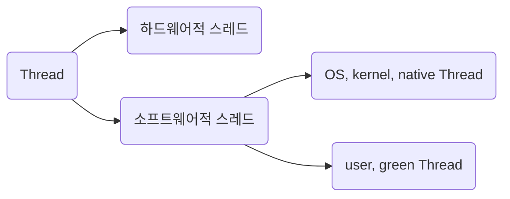

<!-- @import "[TOC]" {cmd="toc" depthFrom=1 depthTo=6 orderedList=false} -->

- [동시성을 향한 여정](#동시성을-향한-여정)
  - [하드웨어적 스레드와 소프트웨어적 스레드](#하드웨어적-스레드와-소프트웨어적-스레드)
  - [동시성과 병렬성](#동시성과-병렬성)
  - [multi-threading & multi-processing](#multi-threading--multi-processing)
  - [공유 자원 문제](#공유-자원-문제)
    - [(CPython 한정) GIL(Global Interpreter Lock)](#cpython-한정-gilglobal-interpreter-lock)
  - [blocking, non-blocking, sync, async](#blocking-non-blocking-sync-async)
    - [2x2 matrix로 설명](#2x2-matrix로-설명)
  - [CPU bound, I/O bound](#cpu-bound-io-bound)
  - [network I/O를 이해하기 위한 socket 및 다중 접속 처리](#network-io를-이해하기-위한-socket-및-다중-접속-처리)
    - [socket](#socket)
      - [TCP](#tcp)
      - [UDP](#udp)
      - [HTTP](#http)
    - [다중 접속 처리](#다중-접속-처리)
      - [기타 처리](#기타-처리)
      - [프로세스를 여러 개 생성하여 다중 접속을 처리하는 것이 왜 문제가 되느냐?](#프로세스를-여러-개-생성하여-다중-접속을-처리하는-것이-왜-문제가-되느냐)
    - [event-loop 모델](#event-loop-모델)
  - [actor model](#actor-model)
  - [green thread](#green-thread)
    - [threading model : 프로그래밍 언어에서 user thread를 os thread와 매핑하는 방법](#threading-model--프로그래밍-언어에서-user-thread를-os-thread와-매핑하는-방법)
    - [적절한 thread pool size란 얼마인가](#적절한-thread-pool-size란-얼마인가)
  - [coroutine](#coroutine)
  - [golang의 goroutine](#golang의-goroutine)
  - [브라우저 런타임에서 web worker를 활용한 multi threading](#브라우저-런타임에서-web-worker를-활용한-multi-threading)
  - [docs](#docs)

<!-- code_chunk_output -->
<!-- /code_chunk_output -->

---

# 동시성을 향한 여정

## 하드웨어적 스레드와 소프트웨어적 스레드

하드웨어 스레드는 1 core 당 처리하는 명령어 단위이다. 멀티 쓰레드 지원하는 CPU는 1 core에서 여러 개의 명령어를 동시에 실행할 수 있다.  
어떻게 이런게 가능하냐면.. -> 레지스터를 여러대 두면 된다.
예를 들어 2 core, 4 thead는 CPU에 2개의 코어가 들어가 있고 각 코어당 2개의 명령어를 동시에 처리할 수 있다는 말일 터이다. 어쨌거나 OS 입장에서는 동시에 4개의 명령어가 동시 처리 되니까 "어? 코어가 4개인가?" 라는 생각을 하게 된다. 그래서 하드웨어 스레드를 논리 프로세서라 부르기도 한다.

반면 소프트웨어적 스레드는 하나의 프로그램에서 독립적으로 실행되는 단위이다. 한 소프트웨어 내에서 여러 기능들이 동시에 수행되려면 각 기능의 코드마다 스레드로 만들면 동시에 실행할 수 있다. 프로그램 하나 켜서 1 Process가 돌고 그 안에서 여러 스레드가 돈다고 생각하자. (실제로는 Process가 여러개일 수도 있지만..)

**결국 이 하드웨어 스레드와 소프트웨어 스레드가 각각 의미하는 것이 다르기 때문에 1 core 1 thread CPU 에서도 하드웨어 스레드가 여러 개라면 (인텔의 [하이퍼 스레딩](https://www.intel.co.kr/content/www/kr/ko/gaming/resources/hyper-threading.html)이라던가) OS는 해당 스레드 갯수 만큼의 코어가 있다고 판단하고 해당 자원에 맞춰서 소프트웨어적 스레드를 스케줄링한다.**

예를 들어 2 core에 4 thread라면 하드웨어적으로는 4개(2 \* 2)의 하드웨어 스레드가 존재한다는 말이고, OS는 마치 4개의 코어가 있는 것처럼 인식한다. 여기에 OS 스레드 8개를 돌리고자 한다면 균등 분배하여 각 코어마다 2개의 소프트웨어 스레드를 스케쥴링할 것이다.

## 동시성과 병렬성

- 동시성(concurrency) : 싱글 코어에서 멀티 쓰레드를 동작 시키는 방식. 따라서 동시에 실행되는 것처럼 보이는 것일 뿐임.
  - context switching이 매우 빠르게 작동하여 동시에 여러 작업을 하는 것처럼 보이는 것
- 병렬성(parallelism) : 멀티 코어에서 멀티 쓰레드를 동작시키는 방식. 실제로 동시에 실행됨. 멀티 코어 CPU가 필요함.

- 동시성과 병렬성의 차이가 뭐지

  - 1 core면 병렬 프로그래밍 불가
  - 동시성은 보통 `한 개의 작업을 공유하여 처리하는 작업`에 사용함
  - 병렬성은 보통 주로 `별개의 작업을 처리`하는데 사용함

- CPU 내 1 core 당 ALU, 제어 장치, register가 들어 있다. 이것은 core 당 독립적인 명령어 처리가 가능하다는 것이다. 여러 CPU를 묶어놓은 것이라 생각하면 편하다.
- 하드웨어 스레드와 소프트웨어의 스레드는 별개의 용어이므로 혼동하지 말 것. 혼동을 피하기 위해 하드웨어 스레드는 논리 프로세서라고 부르기도 함.
  - 흔히 2core 4thread와 같이 하드웨어 스펙이 적혀있으면 한 번에 4개의 명령어를 동시에 처리할 수 있다는 의미임.
  - 소프트웨어적 스레드는 하나의 프로그램에서 독립적으로 실행되는 단위이다. 한 소프트웨어 내에서 여러 기능들이 동시에 수행되려면 각 기능의 코드마다 스레드로 만들면 동시에 실행할 수 있다. 결국 이 하드웨어 스레드와 소프트웨어 스레드가 각각 의미하는 것이 다르기 때문에 1 core 1 thread CPU 에서도 소프트웨어적 스레드를 수십개 실행할 수 있다.

## multi-threading & multi-processing

- multi-threading

  - thread마다 stack을 가지고 있고 code, data, heap은 프로세스 내에 공유함. 따라서 multi-threading은 multi-processing보다 context switching 비용이 낮음
    - multi thread의 task는 각 thread 내의 stack에 할당된다. task는 stack frame에 저장되고, 끝나면 해당 메모리에 접근할 수 없도록 만들 것이다. 포인터를 사용한다면 stack frame 내 지역 변수의 포인터를 반환하여 dangling pointer를 발생시키지 않도록 주의하자.
  - 리눅스 커널에선 thread와 process을 딱히 구분하지 않고 `task` 라는 개념을 사용한다. 즉, 커널 입장에선 thread냐 process냐의 구분 보다는 이 task가 다른 task와 fd/memory/pid를 공유하는가? 차이일 뿐

- multi-processing
  - single core시 사용 불가
  - multi-thread보다 overhead가 크긴 하지만 CPython 환경에서는 GIL 때문에 멀티 코어 환경을 활용하려면 multi-processing 이용이 권장됨

## 공유 자원 문제

- 공유된 메모리 뿐만 아니라 file IO, DB 등 동시 접근 가능한 리소스는 불일치 문제에 부딪힐 수 있음.
- multi threading에서는 stack을 제외한 모든 자원을 공유하므로, 공유 자원에 대한 동시 접근 문제가 발생할 수 있음.
- Semaphore : 공유 자원에 접근할 수 있는 프로세스 혹은 스레드의 갯수(세마포어 카운터)를 제한하기

  - 임계 구역에 진입할 수 있는 프로세스의 개수(사용 가능한 공유 자원의 개수)를 나타내는 전역 변수 S
  - 임계 구역에 들어가도 좋은지, 기다려야 할지를 알려주는 wait 함수
  - 임계 구역 앞에서 기다리는 프로세스에 이제 가도 좋다고 신호를 주는 signal 함수

- Mutex(mutual exclusion) : 공유된 자원의 데이터를 여러 쓰레드가 접근하는 것을 막는 것

  - 공유 자원에 오로지 하나의 스레드만 접근할 수 있게 하는 것. → _lock_
  - `임계 구역(Critical Section)에 접근할 수 있는 세마포어 카운터가 1인 특별한 종류의 세마포어`
  - 일부 deadlock 문제에 대한 해결책이 될 수 있다.
  - 뮤텍스 락의 매우 단순한 형태는 하나의 전역 변수와 두 개의 함수로 구현할 수 있습니다.
    - 자물쇠 역할: 프로세스들이 공유하는 전역 변수 lock
    - 임계 구역을 잠그는 역할: acquire
    - 함수 임계 구역의 잠금을 해제하는 역할: release 함수
  - C/C++, python 등의 프로그래밍 언어에서는 사용자가 직접 acquire, release 함수를 구현하지 않도록 뮤텍스 락 기능을 제공합니다.
    - thread/thread_sync.py 참고
  - 커널단에서는 빅 커널락(BKL)을 통해 동시 접근을 제어한다

### (CPython 한정) GIL(Global Interpreter Lock)

- GIL은 단일 스레드 만이 python object에 접근하게 제한하는 mutex이다.
  - 알다시피 Mutex는 dead lock을 발생시킬 수 있는 요인 중 하나임. (다른 요인으론 점유/대기, 비선점 방식, 자원 할당 그래프 상 원형 대기를 들 수 있다.) 그러나 GIL은 단일 스레드만이 python object에 접근하게 제한함으로써 Mutex 사용으로 인해 발생 가능한 여러 잠재적 문제점(코더 문제지만)을 회피할 수 있게 되었다.
  - CPython에서는 단순화를 위해 정석적인 Mutex보다는 python interpreter 자체를 lock하기로 했다. 그래서 'Global Interpreter Lock'이라고 부른다.
- GIL 바깥에서 C/C++ extension을 통해서 연산하는 방안도 있다. numpy나 scipy가 그렇게 한다.
- 어쨌거나 CPython에서는 multi-threading을 사용하더라도 실제로는 single-threading으로 동작함. user thread를 여러개 펼쳐놓아도 os thread는 한개만 돈다는 의미이다. 따라서 multi-process 등의 다른 방법을 사용해야 함.

  - 공식 문서에 의하면,
    > 응용 프로그램에서 멀티 코어 기계의 계산 자원을 더 잘 활용하려면 multiprocessing이나 concurrent.futures.ProcessPoolExecutor를 사용하는 것이 좋습니다. 그러나, 여러 I/O 병목 작업을 동시에 실행하고 싶을 때 threading은 여전히 적절한 모델입니다.
  - 부연 설명하자면, 스레드로 쪼개어 io 작업을 해야 유휴 시간을 활용할 수 있기 때문이다.

## blocking, non-blocking, sync, async

- blocking, non-blocking은 요청의 결과를 곧바로 future든 promise든 돌려주는지, 아니면 기다리는(blocking) 것인지의 여부

  - 제어권을 넘겨주는지, 아니면 기다리는지의 여부
  - blocking이라면 요청의 결과를 기다려야하며 다른 일을 할 수 없다. 제어권이 커널 소유에게 있고 호출한 쪽은 기다려야 한다는 말이다

- sync, async
  - sync : 작업 완료 여부를 호출한 쪽이 커널한테 물어본다면
    - "일 다 됐어요?" 즉, 주기적으로 물어봐야 한다.
    - 동기 처리시 실행 순서가 보장됨
  - async : 작업 완료 여부를 커널이 호출한 쪽에 알려준다면
    - "야 일 다 됐다"
    - 작업이 완료되면 callback을 호출해서 알려주는 방식이 대표적 패턴
    - 비동기 처리시 실행 순서가 보장되지 않음

### 2x2 matrix로 설명

- `sync, blocking` -> 값 들어올 때까지 기다려야하며, 작업 완료 여부를 호출 프로세스에서 물어봐야 함
- async, blocking -> 값이 들어올 때까지 기다려야하며, 작업 완료 여부를 처리하는 쪽에서 호출 프로세스로 callback해준다
- `async, non-blocking` -> 값이 들어올 때까지 기다리지 않고 다른 일을 할 수 있으며, 작업 완료 여부를 처리하는 쪽에서 호출 프로세스로 callback해준다
- async, non-blocking -> 값이 들어올 때까지 기다리지 않고 다른 일을 할 수 있으며, 작업 완료 여부를 호출 프로세스에서 물어봐야 함

## CPU bound, I/O bound

- 비디오 재생, 네트워크 통신, 디스크 읽고 쓰기 등의 작업을 담당하는 프로세스 -> **입출력 집중 프로세스 I/O bound process**
- 복잡한 수학 연산, 컴파일, 그래픽 처리 작업을 담당하는 프로세스와 같이 CPU 작업이 많은 프로세스도 있습니다. -> **CPU 집중 프로세스 CPU bound process**

  - CPU를 이용하는 작업을 **CPU 버스트(CPU burst)** 라 하고, 입출력장치를 기다리는 작업을 **입출력 버스트(I/O burst)** 라 부른다. 즉, 프로세스는 일반적으로 CPU 버스트와 입출력 버스트를 반복하며 실행된다고 볼 수 있다. 그래서 입출력 집중 프로세스는 입출력 버스트가 많은 프로세스, CPU 집중 프로세스는 CPU 버스트가 많은 프로세스라고 정의할 수 있습니다.

- I/O bound가 느린 이유는 대개 작업을 위해 작동해야 하는 기기의 차이로 인한 latency 때문이다. [Latency Numbers Every Programmer Should Know](https://gist.github.com/sergekukharev/ccdd49d23a5078f108175dc71ad3c06c)를 참고하고, [memory hierarchy](https://www.geeksforgeeks.org/memory-hierarchy-design-and-its-characteristics/)에 근거하면 cpu > memory > disk의 속도임을 확인할 수 있다.

  - 이것이 I/O bound 작업의 `유휴 시간`을 발생시키는 원인이다.
  - 그래서 입출력 집중 프로세스는 실행 상태보다는 입출력을 위한 대기 상태에 더 많이 머무르게 된다. 반대로 CPU 집중 프로세스는 대기 상태보다는 실행 상태에 더 많이 머무르게 된다. 그래서 보통 I/O bound process가 CPU bound process보다 우선순위가 높다.

  - CPU는 하나다. (core는 여러개지만.) 희소한 자원인 까닭에 운영체제는 프로세스마다 우선순위 priority를 부여하고 관리한다. 운영체제는 각 프로세스의 PCB에 우선순위를 명시하고, PCB에 적힌 우선순위를 기준으로 먼저 처리할 프로세스를 결정한다.

- 일반적으로 CPU bound 작업은 multi process, I/O bound 작업은 multi thread로 구현하는 편이다.
  - 연산을 많이 해야 한다면 CPU를 많이 사용해야 하므로 multi process가 적합하다.
  - I/O 작업에서 요청에 대한 유휴 시간을 효율적으로 사용하기 multi thread가 적합하다.

## network I/O를 이해하기 위한 socket 및 다중 접속 처리

### socket

> 소켓은 네트워크에서 서버와 클라이언트, 두 개의 프로세스가 특정 포트를 통해 양방향 통신이 가능하도록 만들어 주는 추상화된 장치입니다. 메모리의 사용자 공간에 존재하는 프로세스(서버, 클라이언트)는 커널 공간에 생성된 소켓을 통해 데이터를 송수신할 수 있습니다.
>
> > https://engineering.linecorp.com/ko/blog/do-not-block-the-event-loop-part1

#### TCP

작성 예정

#### UDP

작성 예정

#### HTTP

작성 예정

### 다중 접속 처리

장단점 및 구현의 경제성을 고려하여 적절한 것을 선택해야겠다만 다중 접속을 처리하기 위한 여러가지 방법이 있다.

- connection마다 process를 생성하는 multi process 방식
- connection마다 thread를 생성하는 multi thread 방식
- 멀티 플렉싱

#### 기타 처리

#### 프로세스를 여러 개 생성하여 다중 접속을 처리하는 것이 왜 문제가 되느냐?

과거 apache는 connection이 생성될 때마다 process를 생성하는 multi process 방식으로 다중 connection을 처리했었다. 조금 다른 점이 있다면 process를 만드는 건 시간이 소요되는 일이므로 prefork 방식(미리 process를 만듦)으로 작동하였다.

문제는 클라이언트가 많이 짐에 따라 ‘동시에 연결된 커넥션'이 많아졌을 때 **C10K Problem**이 발생 (connection 1만개 문제) 커넥션을 더 이상 늘릴 수 없게 됨. 이는 하드웨어 성능 문제가 아니었음. apache 서버가 connection이 생성될 때마다 process를 생성하는 구조이기 때문에 문제가 되는 것임. 프로세스가 많아서 메모리 부족으로 이어짐. 게다가 프로세스를 바꿔가며 일해야 하기 때문에 context switching이 자주 일어나게 되었음.

### event-loop 모델

작성 예정...

node.js 공홈의 유명한 글인 [dont-block-the-event-loop](https://nodejs.org/en/docs/guides/dont-block-the-event-loop/)은 다중 접속 하에 오는 여러 client들의 요청을 처리하는 스레드가 blocking 방식의 처리를 하면 성능 처하가 일어날 수 있다고 설명하고 있다.

## actor model

작성 예정...

## green thread

앞서 살펴본 thread는 os thread, 즉 os 레벨의 스레드를 말한다.  
그러나 green thread(micro thread라 부르기도 함)는 `애플리케이션 단의 thread`이다.  
언어마다 세부 구현이 다르기 때문에 주력 언어별로 각자 살펴봐야할 것 같다.

### threading model : 프로그래밍 언어에서 user thread를 os thread와 매핑하는 방법

multi thread 방식으로 코딩을 하면 user thread가 os thread와 곧장 1:1 방식으로 매핑되는 언어가 있다. 이런 언어는 java, c# 등이 그러하다.

> 이 글을 쓰는 2022년 9월 말 시점에는 [Java 19에서 virtual thread](https://blogs.oracle.com/javamagazine/post/java-loom-virtual-threads-platform-threads) 관련 이야기가 나오고 있다. 필자는 java를 사용하지는 않지만 관련 내용을 관심 있는 분들은 디깅해보셔도 좋으실 것 같다. (글 쓰는 사람은 잘 모르겠다는 말이다. )

그 외 다른 언어는 1:n 방식, m:n으로 매핑하는 경우도 있다. 예를 들어 python은 1:n이다. 여러 thread를 써도 GIL로 인해서 실제로는 하나의 OS 스레드만 사용하게 된다.

### 적절한 thread pool size란 얼마인가

작성 예정...

## coroutine

작성 예정...

## golang의 goroutine

작성 예정...

## 브라우저 런타임에서 web worker를 활용한 multi threading

작성 예정...

https://darrengwon.tistory.com/1171
https://codersblock.com/assets/demos/web-workers/single.html -> source tabdp서 코드 확인 요망

## docs

https://docs.python.org/ko/3/library/threading.html  
https://docs.python.org/ko/3/library/multiprocessing.html  
https://docs.python.org/ko/3/library/concurrent.futures.html  
https://docs.python.org/ko/3/library/asyncio.html  
https://tech.ssut.me/python-3-play-with-asyncio/  
https://blog.nindalf.com/posts/how-goroutines-work/  
https://leimao.github.io/blog/Python-Concurrency-High-Level/  
https://developer.mozilla.org/ko/docs/Web/API/Web_Workers_API  
https://engineering.linecorp.com/ko/blog/do-not-block-the-event-loop-part1
