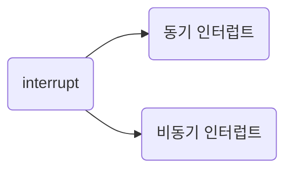
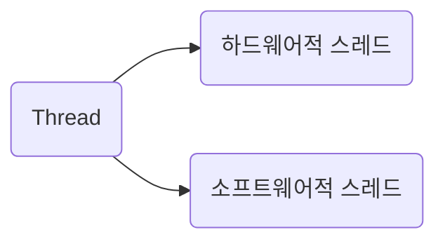
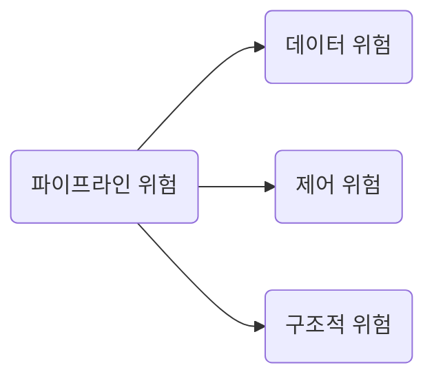
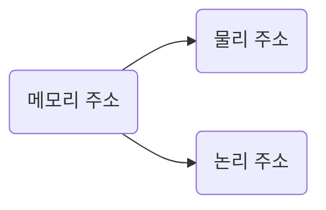

# computer structure

## cpu

CPU = ALU(arithmetic and logical unit) + register + 제어 장치 + etc.
CPU는 기본적으론 RAM에 저장된 명령어와 데이터를 불러오고 읽고 연산을 수행하고 재저장

명령어 = 연산 코드 + operand(data or address)
이 중 operand에 넣은 주소를 어떻게 찾아갈 것인가에 따라 **주소 지정 방식(address mode)** 분류가 이뤄짐.
예를 들자면, 즉시 주소 지정, 직접 주소 지정, 간접 주소 지정, 레지스터 주소 지정(RAM이 아니라 CPU 레지스터), 레지스터 간접 주소 지정, 스택 주소 지정, 변위 주소 지정 방식(상대 주소 지정 방식, 베이스 레지스터 주소 지정 방식)

ALU는 레지스터를 통해 피연산자를 받아들이고, 제어장치로부터 수행할 연산을 알려주는 제어 신호를 받아들입니다. ALU는 레지스터와 제어장치로부터 받아들인 피연산자와 제어 신호로 산술 연산, 논리 연산 등 다양한 연산을 수행합니다

수행한 결과는 일시적으로 레지스터에 저장한다. CPU가 RAM에 접근하는 속도는 레지스터에 접근하는 속도보다 느리다. 그래서 연산 결과를 곧바로 메모리에 저장하지 않고 resgister에 일단 저장하는 것이다.

제어장치는 클럭, 현재 수행할 명령어, 플래그, 제어 신호를 받아들입니다.

### cpu register

제조사마다 다르다. 심지어 아래 레지스터 이름도 제조사마다 다 달라서 실제로는 cpu 문서를 읽어봐야 앎. 아래는 그나마 공통적인 것을 뽑은 것.

- PC(program counter) : RAM에서 가져올 명령어의 주소
- IR(instruct) : RAM에서 가져온 명령어
- MAR(mem address) : RAM에서 읽어올 주소, 주소 버스로 내보낼 값만 저장. 즉, RAM에게 요청할 때 MAR에 든 주소 활용함.
- MBR(mem buffer) : RAM에 가져왔거나 써야할 값. 데이터 버스로 주고 받을 값만 저장함.
- 범용 레지스터 : 말 그대로 범용.
- 플래그 레지스터 : ALU 연산 결과에 따른 플래그 저장.
- 스택 포인터 : RAM의 스택 영역에 마지막에 쌓인 주소 저장하는 레지스터.
- 베이스 레지스터 : 베이스 레지스터 주소 지정 방식으로 명령어의 operand를 연산할 때 그 기본이 되는 주소를 지정하고 있는 레지스터.

RAM에 든 명령어를 요청하고 가져오는 과정
PC(명령어가 든 메모리의 주소)에 가져올 명령어의 주소
-> MAR(CPU가 읽어야 할 주소 임시 저장)
-> 제어 장치와 MAR에 든 주소를 통해 RAM에게 요청
-> RAM이 값을 내려 줌
-> MBR(RAM에서 읽어나 RAM에 저장할 값)에 임시 저장하고 PC가 증가됨.
-> IR로 이동
-> 제어 장치는 IR을 읽어 명령어를 수행
-> 증가된 PC에 따라 증가했으니 이제 다시 이 과정을 순차실행. 단, JUMP 등 특정 메모리로 건너 뛰거나 interrupt 발생 시는 순차 실행이 끊김.

### CPU 명령어 사이클과 interrupt



동기 인터럽트 = Exception = CPU가 실행하는 프로그램 내 에러
비동기 인터럽트 = 하드웨어 인터럽트

#### 왜 비동기 인터럽트라 부름?

하드웨어 인터럽트를 사용하지 않는다면 CPU는 프린터가 언제 프린트를 끝낼지 모르기 때문에 **주기적으로 프린터의 완료 여부를 확인해야 합니다**. 이로 인해 CPU는 다른 생산적인 일을 할 수 없으니 **CPU 사이클 낭비**입니다. 이는 마치 알림이 없는 전자레인지가 언제 조리를 끝낼지 모르기에 무작정 전자레인지 앞에서 서성이는 상황과도 같습니다.

#### CPU가 interrupt를 처리한다는 것은 뭔가?

interrupt를 처리하로 CPU에서 결정했다면 실행 중이던 프로그램을 잠시 프로그램 카운터 값 등 현재 프로그램을 재개하기 위해 필요한 모든 내용을 RAM 스택에 백업한다.

그 다음엔 interrupt vecotor를 참고하여 인터럽트 서비스 루틴(= interrupt handler)의 주소를 알아내 해당 명령들을 실행하고 다시 돌아옵니다.

## CPU 성능 향상

깡 클럭을 높게 하면 명령어 사이클이 빨리 돌겠지만 발열 문제가 생긴다.

CPU 내 1 core 당 ALU, 제어 장치, register가 들어 있다. 즉, 앞서 살펴본 CPU는 사실 코어이고 CPU는 코어의 집합임.

thread를 여러대 두는 방법도 있다. 주의할 점은 소프트웨어에서 다루는 쓰레드와 하드웨어에서 말하는 쓰레드가 다른 의미라는 것.

### 하드웨어적 스레드와 소프트웨어적 스레드



하드웨어적으로 먼저 살펴보자. 쓰레드는 1 core 당 처리하는 명령어 단위이다. 멀티 쓰레드 지원하는 CPU는 1 core에서 여러 개의 명령어를 동시에 실행할 수 있다.

2 core, 4 thead는 CPU에 2개의 코어가 들어가 있고 각 코어당 2개의 명령어를 동시에 처리할 수 있다는 말일 터이다. 어쨌거나 컴퓨터 입장에서는 동시에 4개의 명령어가 동시 처리 되니까 "어? 코어가 4개인가?" 라는 생각을 하게 된다. 그래서 하드웨어 스레드를 논리 프로세서라 부르기도 한다.

어떻게 이런게 가능한가? -> 레지스터를 여러대 두면 된다.

소프트웨어적 스레드는 하나의 프로그램에서 독립적으로 실행되는 단위이다. 한 소프트웨어 내에서 여러 기능들이 동시에 수행되려면 각 기능의 코드마다 스레드로 만들면 동시에 실행할 수 있다.

**결국 이 하드웨어 스레드와 소프트웨어 스레드가 각각 의미하는 것이 다르기 때문에 1 core 1 thread CPU 에서도 하드웨어 스레드가 여러 개라면 (인텔의 하이퍼 스레딩) OS는 해당 스레드 갯수 만큼 작업을 진행할 수 있다고 판단하고 해당 자원에 맞춰서 소프트웨어적 스레드를 스케줄링한다.**

### 명령어 병렬 처리 기법(ILP, instruction level parallelism)

성능 향상도 좋지만 core를 쉬지 않게 만드는 것이 중요하다. 파이프라이닝을 통해서 병렬적으로 명령어를 처리함. 여러 파이프라인을 두는 것을 `슈퍼 스칼라`라고 함.



### ISA와 CISC, RISC

CPU의 언어인 ISA 그리고 ISA를 기반으로 설계된 CISC와 RISC

ISA는 CPU가 실행 가능한 명령어의 세트라고 보면 된다.

인텔의 노트북 속 CPU는 x86 혹은 x86-64 ISA를 이해하고, 애플의 아이폰 속 CPU는 ARM ISA를 이해합니다. x86(x86-64)과 ARM은 다른 ISA이기 때문에 인텔 CPU를 사용하는 컴퓨터와 아이폰은 서로의 명령어를 이해할 수 없습니다.

ISA가 같은 CPU끼리는 서로의 명령어를 이해할 수 있지만, ISA가 다르면 서로의 명령어를 이해하지 못합니다. 따라서 인텔에서 빌드한 실행 파일을 애플에 옮기면 보통 안된다. build target을 정확하게 해야 한다.

ISA에 따라 CPU의 설계가 달라진다. 그래서 어떤 ISA가 있는가?

- CISC(Complex instruction Set Computer)
  복잡하고 다양한 명령어 집합 활용하는데 규격화가 어렵고 한 명령어당 클럭을 많이 잡아 먹음. 파이프라이닝하기에 좋지는 않음
  대표적으론 x86-64

- RISC(Reduced Instruction Set Computer)
  되도록 1클럭 내외로 실행되는 작은 명령어를 지향. 단순하고 고정 길이의 명령어 집합을 사용하며 명령어 갯수도 줄임. 대신 레지스터를 적극적으로 활용함.
  대표적으론 ARM

### CPU 지표

[CPU 지표 정리](https://brunch.co.kr/@leedongins/75)

## RAM

RAM = 명령어와 데이터 보관. 주소 기반으로 요청. 휘발성.

CPU는 보조기억장치에 직접 접근하지 못합니다. 그래서 일반적으로 보조기억장치인 비휘발성 저장 장치에는 보관할 대상을 저장하고, 휘발성 저장 장치인 RAM에는 실행할 대상을 저장합니다
그래서 RAM이 크면 보조기억장치에서 데이터를 가져오는 횟수가 줄어듦. 다만 이것도 한계치가 있음.

RAM의 종류는 크게 DRAM, SRAM, SDRAM, DDR SDRAM이 있습니다.

DRAM은 시간이 지나면 저장된 데이터가 점차 사라지는 RAM, SRAM은 시간이 지나도 저장된 데이터가 사라지지 않는 RAM입니다.
SDRAM은 클럭과 동기화된 DRAM입니다.
DDR SDRAM은 대역폭이 두 배 넓은 SDRAM입니다. DDR2, DDR3, DDR4로 넘버가 붙을 수록 2^N 만큼 대역폭이 넓어집니다.
최근에 흔히 사용하는 메모리는 DDR4 SDRAM으로, SDR SDRAM보다 열여섯 배 넓은 대역폭을 가집니다.

### 메모리의 주소 공간

#### 물리 주소와 논리 주소

물리 주소는 메모리 하드웨어가 사용하는 주소이고, 논리 주소는 CPU와 실행 중인 프로그램이 사용하는 주소입니다



#### MMU와 한계 레지스터

논리 주소와 물리 주소 간의 변환은 CPU와 주소 버스 사이에 위치한 메모리 관리 장치 MMU; Memory Management Unit(이하 MMU)라는 하드웨어에 의해 수행됩니다.
**MMU**는 CPU가 발생시킨 논리 주소에 베이스 레지스터 값을 더하여 논리 주소를 물리 주소로 변환합니다.

다른 프로그램의 영역을 침범할 수 있는 명령어는 위험하기 때문에 논리 주소 범위를 벗어나는 명령어 실행을 방지하고 실행 중인 프로그램이 다른 프로그램에 영향을 받지 않도록 보호할 방법이 필요합니다. 이는 **한계 레지스터 limit register**라는 레지스터가 담당합니다.

**베이스 레지스터가 실행 중인 프로그램의 가장 작은 물리 주소를 저장**한다면, **한계 레지스터는 논리 주소의 최대 크기를 저장합니다.** 즉, 프로그램의 물리 주소 범위는 베이스 레지스터 값 이상, 베이스 레지스터 값 + 한계 레지스터 값 미만이 됩니다.

애초에 접근하려는 메모리의 논리 주소가 한계 레지스터 바깥이면 interrupt를 발생시켜 애초에 접근을 차단합니다. 이럼으로써 메모리에 올라간 다른 명령어와 데이터들을 보호할 수 있습니다.

### 캐시 메모리

CPU는 프로그램을 실행하는 과정에서 메모리에 저장된 데이터를 빈번하게 사용합니다. 하지만 CPU가 메모리에 접근하는 시간은 CPU의 연산 속도보다 느립니다.
L1 캐시 참조 시간은 0.5ns 정도라면 메모리 참조 시간은 7ns이다.
(https://gist.github.com/jboner/2841832, 2011년 자료임. 지금은 달라졌지만서도 메모리 접근이나 하드디스크 접근 속도는 느림.)

CPU가 연산을 빨리 한다 해도 메모리에 접근하는 시간이 느리면 CPU의 빠른 연산 속도는 아무런 쓸모가 없겠죠? 이를 극복하기 위한 저장 장치가 바로 캐시 메모리입니다.

캐시 메모리 cache memory는 CPU와 메모리 사이에 위치하고, 레지스터보다 용량이 크고 메모리보다 빠른 SRAM 기반의 저장 장치입니다.

코어와 가장 가까운 캐시 메모리를 L1 level 1 캐시, 그다음 가까운 캐시 메모리를 L2 level 2 캐시, 그다음 가까운 캐시 메모리를 L3 level 3 캐시라고 부릅니다. 일반적으로 L1 캐시와 L2 캐시는 코어 내부에, L3 캐시는 코어 외부에 위치해 있습니다.

레지스터 - L1 - L2 - L3 - RAM - 보조기억장치 순으로 memory hierarchy가 구성되어 있다.

멀티 코어 프로세서에서 L1-L2-L3 캐시는 일반적으로 L1 캐시와 L2 캐시는 코어마다 고유한 캐시 메모리로 할당되고, L3 캐시는 여러 코어가 공유하는 형태로 사용됩니다.

캐시 메모리는 CPU가 사용할 법한 대상을 예측하여 저장합니다. 이때 자주 사용될 것으로 예측한 데이터가 실제로 들어맞아 캐시 메모리 내 데이터가 CPU에서 활용될 경우를 캐시 히트 cache hit라고 합니다. 우리가 사용하는 컴퓨터의 캐시 적중률은 대략 85~95% 이상입니다.

적중률을 높이는 원리는 참조 지역성의 원리 locality of reference, principle of locality입니다. 최근에 접근했던 메모리 공간에 다시 접근하려는 경향이 있고(시간 지역성), 주변 메모리 공간에 접근하려는 경향이 있다. (공간 지역성)

## 보조 기억 장치

HDD와 플래시 메모리(SSD)로 나뉨.

### flash memory

플래시 메모리에는 **셀 cell**이라는 단위가 있습니다. 셀이란 플래시 메모리에서 데이터를 저장하는 가장 작은 단위입니다.

한 셀에 1비트를 저장할 수 있는 플래시 메모리를 SLC (Single Level Cell)타입, 한 셀에 2비트를 저장할 수 있는 플래시 메모리를 MLC(Multiple Level Cell) 타입, 한 셀에 3비트를 저장할 수 있는 플래시 메모리를 TLC (Triple-Level Cell) 타입이라고 합니다. 큰 차이가 아닌 것처럼 보여도 이는 플래시 메모리의 수명, 속도, 가격에 큰 영향을 끼칩니다. 참고로 한 셀에 4비트를 저장할 수 있는 QLC 타입도 있다.

성능은 SLC이 좋지만 용량 대비 비싸며 점차 셀에 넣을 수 있는 비트가 많아질수록 성능이 하락하지만 가격 대비 용량이 많아진다.

셀들이 모여 만들어진 단위를 페이지 page
-> 그리고 페이지가 모여 만들어진 단위를 블록 block이라고 합니다.
-> 블록이 모여 플레인 plane,
-> 플레인이 모여 다이 die가 됩니다.

플래시 메모리에서 읽기와 쓰기는 페이지 단위로 이루어집니다. 하지만 삭제는 페이지보다 큰 블록 단위로 이루어집니다.

삭제의 범위가 페이지보다 큰 블록이기 때문에 쓸모 없는 정보가 페이지에 남아 있어 플래시 메모리는 이런 쓰레기값을 정리하기 위해 가비지 컬렉션 garbage collection 기능을 제공합니다.

이 가비지 컬렉션은 생각보다 단순한데 유효한 페이지들만 새로운 블록으로 복사한 후 기존 블록을 삭제하여 공간을 정리하는 기능입니다.

### RAID

RAID Redundant Array of Independent Disks는 주로 하드 디스크와 SSD를 사용하는 기술로, 데이터의 안전성 혹은 높은 성능을 위해 여러 개의 물리적 보조기억장치를 마치 하나의 논리적 보조기억장치처럼 사용하는 기술을 의미합니다.

RAID 레벨에는 대표적으로 RAID 0, RAID 1, RAID 2, RAID 3, RAID 4, RAID 5, RAID 6이 있고, 그로부터 파생된 RAID 10, RAID 50 등이 있습니다.

RAID 2, 3은 현재 잘 활용되지 않고 대중적인 방식이 0, 1, 4, 5, 6 정도이다.

#### RAID 0 (striping)

RAID 0은 여러 개의 보조기억장치에 데이터를 단순히 나누어 저장하는 구성 방식입니다.
줄무늬처럼 분산되어 저장된 데이터를 스트라입 stripe이라 하고, 분산하여 저장하는 것을 스트라이핑 striping이라고 합니다. 하나의 대용량 저장 장치를 이용했더라면 여러 번에 걸쳐 읽고 썼을 데이터를 동시에 읽고 쓸 수 있기 때문이지요. 그렇기에 4TB 저장 장치 한 개를 읽고 쓰는 속도보다 RAID 0로 구성된 1TB 저장 장치 네 개의 속도가 이론상 네 배가량 빠릅니다.

단점은 하나 하드 뻑나면 정보를 읽는데 문제가 생긴다는 것.

#### RAID 1 (mirroring)

RAID 1은 복사본을 만드는 방식입니다. 마치 거울처럼 완전한 복사본을 만드는 구성이기에 미러링 mirroring이라고도 부릅니다. RAID 0의 스트라이핑이 사용되긴 하지만 미러링하는 하드가 또 있어서 백업 역할을 함.

단점은 사용할 수 있는 용량의 반절을 미러링하는 백업 디스크로 써야한다는 점.

#### RAID 4 (parity)

RAID 4는 RAID 1처럼 완전한 복사본을 만드는 대신 오류를 검출하고 복구하기 위한 정보를 저장한 장치를 두는 구성 방식입니다. 이때 오류를 검출하고 복구하기 위한 정보를 패리티 비트 parity bit라고 합니다.

이로써 RAID 4는 RAID 1보다 적은 하드 디스크로도 데이터를 안전하게 보관할 수 있습니다.

단점으론 parity 정보를 저장하고 있는 하드에 병목 현상이 일어난다는 것.

#### RAID 5 (parity 분산)

RAID 4는 패리티를 저장한 장치를 따로 두는 방식이고, RAID 5는 패리티를 분산하여 저장하는 방식입니다. 이로써 RAID 4의 parity 하드에 있는 병목 현상이 해소됩니다.

#### RAID 6 (RAID 5보다 좀 더 안전하게)

RAID 6의 구성은 기본적으로 RAID 5와 같으나, 서로 다른 두 개의 패리티를 두는 방식입니다. 이는 오류를 검출하고 복구할 수 있는 수단이 두 개가 생긴 셈입니다. 따라서 RAID 6은 RAID 4나 RAID 5보다 안전한 구성이라 볼 수 있습니다. 다만 새로운 정보를 저장할 때마다 함께 저장할 패리티가 두 개이므로, 쓰기 속도는 RAID 5보다 느립니다. 따라서 RAID 6은 데이터 저장 속도를 조금 희생하더라도 데이터를 더욱 안전하게 보관하고 싶을 때 사용하는 방식입니다.

-알라딘 eBook <혼자 공부하는 컴퓨터 구조 + 운영체제> (강민철 지음) 중에서

## 입출력장치

장치 컨트롤러(I/O controller)와 장치 드라이버

### 장치 컨트롤러(I/O controller)

입출력장치는 컴퓨터에 직접 연결되지 않고 장치 컨트롤러 device controller라는 하드웨어를 통해 연결됩니다. 장치 컨트롤러는 입출력 제어기 I/O controller, 입출력 모듈 I/O module 등으로 다양하게 불리기도 하는데, 이 책에서는 장치 컨트롤러라는 용어를 사용하겠습니다.

```
마더보드 <-> 장치 컨트롤러 <-> 입출력 장치
```

장치 컨트롤러는 CPU와 입출력 장치 간의 통신을 중개하고, 오류를 검출하고, 데이터 버퍼링을 제공합니다.

입출력장치 종류가 많아 정보 규격화가 어려웠던 문제는 장치 컨트롤러가 일종의 번역가 역할을 함으로써 해결할 수 있습니다.

버퍼링 buffering이란 전송률이 높은 장치와 낮은 장치 사이에 주고받는 데이터를 버퍼 buffer라는 임시 저장 공간에 저장하여 전송률을 비슷하게 맞추는 방법입니다. **쉽게 말해 버퍼링은 버퍼에 데이터를 조금씩 모았다가 한꺼번에 내보내거나, 데이터를 한 번에 많이 받아 조금씩 내보내는 방법**이라고 보면 됩니다. 즉, 장치 컨트롤러는 일반적으로 전송률이 높은 CPU와 일반적으로 전송률이 낮은 입출력장치와의 전송률 차이를 데이터 버퍼링으로 완화합니다.

CPU의 전송률이 입출력 장치의 전송률에 비해 높으니까 CPU -> 입출력 장치의 경우 버퍼에 쌓았다가 조금씩 내려주고, 입출력 장치 -> CPU의 경우 쌓았다가 한 번에 내려 준다.

### 장치 컨트롤러 내부 장치

- 데이터 레지스터 data register
  - 데이터 레지스터는 CPU와 입출력장치 사이에 주고받을 데이터가 담기는 레지스터입니다. 앞서 장치 컨트롤러는 데이터 버퍼링으로 전송률 차이를 완화한다고 했었죠? 데이터 레지스터가 그 버퍼 역할을 합니다. 최근 주고받는 데이터가 많은 입출력장치에서는 레지스터 대신 RAM을 사용하기도 합니다.
- 상태 레지스터status register
  - 상태 레지스터에는 입출력장치가 입출력 작업을 할 준비가 되었는지, 입출력 작업이 완료되었는지, 입출력장치에 오류는 없는지 등의 상태 정보
- 제어 레지스터 control register
  - 제어 레지스터는 입출력장치가 수행할 내용에 대한 제어 정보와 명령을 저장합니다.

### 장치 드라이버

장치 드라이버 device driver란 장치 컨트롤러의 동작을 감지하고 제어함으로써 장치 컨트롤러가 컴퓨터 내부와 정보를 주고받을 수 있게 하는 프로그램입니다.

쉽게 생각해서 장치 컨트롤러는 하드웨어, 해당 하드웨어를 굴리는 소프트웨어가 장치 드라이버

장치 드라이버를 인식하고 실행하는 주체는 운영체제이다. 이거 없으면 입출력장치를 못 쓴다.

### 입출력 방법

프로그램 입출력, 인터럽트 기반 입출력, DMA 입출력

#### 프로그램 입출력 programmed I/O

프로그램 입출력 programmed I/O은 기본적으로 프로그램 속 명령어로 입출력장치를 제어하는 방법입니다. CPU가 프로그램 속 명령어를 실행하는 과정에서 입출력 명령어를 만나면 CPU는 입출력장치에 연결된 장치 컨트롤러와 상호작용하며 입출력 작업을 수행합니다.

예를 들어 프린터 컨트롤러, 키보드 컨트롤러, 하드 디스크 컨트롤러 등 입출력기기에 해당하는 컨트롤러가 존재하고 해당 컨트롤러 내부 레지스터의 값들을 읽거나 쓰면서 CPU가 해당 입출력 기기를 조작하는 것이다.

#### 인터럽트 기반 입출력

입출력장치에 의한 하드웨어 인터럽트는 정확히 말하자면 입출력장치가 아닌 장치 컨트롤러에 의해 발생합니다. CPU는 장치 컨트롤러에 입출력 작업을 명령하고, 장치 컨트롤러가 입출력장치를 제어하며 입출력을 수행하는 동안 CPU는 다른 일을 할 수 있지요.

장치 컨트롤러가 입출력 작업을 끝낸 뒤 CPU에게 인터럽트 요청 신호를 보내면 CPU는 하던 일을 잠시 백업하고 인터럽트 서비스 루틴을 실행합니다

그런데 키보드, 모니터, 프린터 등등 다양한 하드웨어 인터럽트가 발생할테데, 모든 것을 순차적으로 처리하지는 않는다. 우선순위가 있다.

우선순위를 반영하여 다중 인터럽트를 처리하는 방법에는 여러 가지가 있지만, 많은 컴퓨터에서는 프로그래머블 인터럽트 컨트롤러 **PIC**; Programmable Interrupt Controller(이하 PIC)라는 하드웨어를 사용합니다. PIC는 여러 장치 컨트롤러에 연결되어 장치 컨트롤러에서 보낸 하드웨어 인터럽트 요청들의 우선순위를 판별한 뒤 CPU에 지금 처리해야 할 하드웨어 인터럽트는 무엇인지를 알려주는 장치입니다.

### DMA

입출력장치와 메모리가 CPU를 거치지 않고도 상호작용할 수 있는 입출력 방식인 DMA Direct Memory Access가 등장하였습니다.

DMA 입출력을 하기 위해서는 시스템 버스에 연결된 DMA 컨트롤러라는 하드웨어가 필요합니다.

DMA가 CPU가 사용하는 시스템 버스를 사용하여 병목을 주지 않게 하기 위해 별도의 버스를 이용하는데 입출력 버스라고 합니다. 입출력 버스에는 PCI Peripheral Component Interconnect 버스, PCI Express(PCIe) 버스 등 여러 종류가 있습니다.

## etc

명령어 = operation code(연산 코드) + operand(연산에 사용할 데이터가 든 RAM 혹은 CPU register 주소값)

- assembly를 예로 들면 `ADD eax edx` 꼴로, 한 줄의 명령어 안에 연산 코드와 연산에 사용될 데이터가 언급되어 있다.
- 연산 코드의 예를 들자면 LOAD(RAM -> CPU), STORE(RAM에 저장), PUSH(stack), POP(stack), ADD(operand에 + 1), JUMP, ...
- cpu 제조나사 종류에 따라 가능한 명령어가 조금씩 다르다

1kB는 1,024byte, 1MB는 1,024kB... 이런 식으로 표현하는 것은 잘못된 관습입니다. 이전 단위를 1,024개 묶어 표현한 단위는 kB, MB, GB, TB가 아닌 KiB, MiB, GiB, TiB입니다.

워드(word)란 CPU가 한 번에 처리할 수 있는 데이터 크기를 의미합니다. 컴퓨터의 워드 크기는 대부분 32비트 또는 64비트입니다. 가령 인텔의 x86 CPU는 32비트 워드 CPU, x64 CPU는 64비트 워드 CPU입니다.

우리가 흔히 알아보는 32비트, 64비트 하는 것은 워드 사이즈를 말하는 것입니다. 32비트 머신(CPU)라면 그 머신의 기본 데이터 처리 단위는 32비트가 되고, 64비트 머신이면 그 머신의 기본 데이터 처리 단위는 64비트가 되는 것입니다 현시점에는 거의 64비트입니다.

2의 보수를 매우 쉽게 표현하자면 모든 0과 1을 뒤집고, 거기에 1을 더한 값으로 이해하면 됩니다. 예를 들어 11(2)의 모든 0과 1을 뒤집으면 00(2)이고, 거기에 1을 더한 값은 01(2)입니다. 즉, 11(2)의 2의 보수(음수 표현)는 01(2)이 되는 것이죠.
