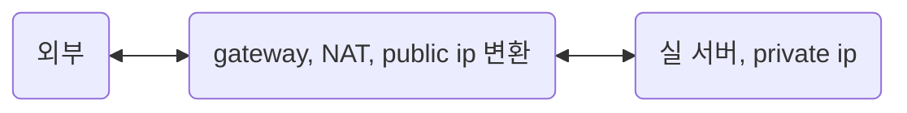

# network

## 네트워크에 대한 멘탈 모델 scaffolding

한 컴퓨터와 다른 컴퓨터가 소통하는 것. 해당 소통의 규칙을 프로토콜이라 한다.  
text protocol인 http, smtp, irc는 디버깅하기 편하고 텍스트 쓰는 그대로 다룰 수 있다.  
하지만 대부분 프로토콜은 binary protocol이고 이들을 디버깅하기 위해서는 wireshark, termshark, tcpdump와 같은 패킷 분석 도구가 필요하다.

종종 80(http), 443(https)는 생략되지만 우리가 다른 서버로 요청을 보낼 때, ip:port 적어 요청을 보낸다. 이는 요청 서버에서 다른 서버에 접촉할 때 최소한 ip와 port가 필요하다는 것이다. 이는 http 뿐만이 아니라 ipv4 시간으로 통신하는 프로토콜은 다 그렇다. TDP/UDP도 ip와 port가 필요하다.

```text
resp, err := http.Get("https://jsonplaceholder.typicode.com/todos/1") // golang
axios.get("http://localhost:3000") // javascript
```

요청을 받은 서버(응답 서버)는 목적지가 서버에 맞는지, 포트가 열려 있는지 등을 체크하는 등 TCP/IP 계층을 올라가며 deencapsulation을 통해 요청 서버에서 보낸 정보를 해석하고 받아들인다.

그 과정을 모두 구체적으로 적을 순 없겠지만 **요청 서버가 보낸 byte 덩어리를 NIC 내의 buffer에 쌓아뒀다가 응답 서버가 빼간다**.

> 💡 **NIC(네트워크 인터페이스 카드)**  
> 2계층(데이터 링크 계층)의 장치입니다. 컴퓨터를 네트워크에 연결하기 위한 하드웨어 장치. 별명이 많습니다. 랜 카드, 네트워크 인터페이스 컨트롤, 네트워크 카드 등등. 여러 일을 담당하고 있지만 최대한 단순하게 요약하자면 'NIC는 물리적 주소인 MAC 주소를 가지고 있고, 목적지 MAC 주소가 다른 패킷은 그냥 버린다'고 정리할 수 있다.  
> https://darrengwon.tistory.com/1306?category=907881

보통 서버와 서버의 곧장 통신하는 경우도 있지만 ipv4가 부족한 현 상황에서는 gateway 역할을 하는 public ip(공인 ip)가 앞에 있고 그 내부에 private ip(사설 ip)가 대부분의 상황이다.



- 대표적인 경우로 NAT 장비에 public ip가 있고 NAT을 경유하여 egress하는 내부 서버들의 ip는 private ip로 감춰져 있는 네트워크 구성.
- AWS 기준으로 설명하자면 private subnet에 존재하는 사설 대역 ip의 서버들이 public subnet에 존재하는 NAT을 통해 public IP로 변환되어 외부와 통신하게 되어 egress[outbound]가 가능하지만, 외부 인터넷에서 ingress[inbound]는 안되는 상황

이해를 돕기 위해 gateway를 통해 진행되는 네트워크 흐름 순서를 읊어보자.
private ip인 우리 서버가 gateway를 거쳐 naver.com에 닿는다고 해보자.

**[egress(private ip 실 서버→ gateway → naver)]**

- private ip이 10.0.0.1, 357 포트에서 요청을 보냈다.
- NAT이 해당 private ip를 public ip로 변환하고, private port를 public port로 변경하는 port-forwarding이 진행된다.
  - gateway는 이제 출발지(실서버)과 도착지의 ip, port를 알고 이를 **NAT table**에 기록한다.
- naver 서버는 NAT의 주소를 요청 서버를 거친 요청을 받아들인다.
  - naver는 인식하고 그 배후에 있는 private ip의 실 서버는 모른다.

**[ingress(naver → gateway → private ip 실 서버)]**

- naver가 요청에 대한 응답을 gateway로 보낸다.
- gateway는 NAT table을 보고 실 서버에게 패킷을 보낸다.
