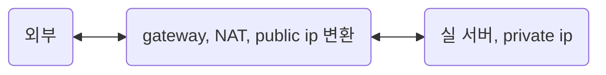

<!-- @import "[TOC]" {cmd="toc" depthFrom=1 depthTo=6 orderedList=false} -->

- [network](#network)
  - [네트워크에 대한 멘탈 모델 scaffolding](#네트워크에-대한-멘탈-모델-scaffolding)
  - [호스트의 네트워크 시스템 구조의 표준 : OSI 7계층 개괄](#호스트의-네트워크-시스템-구조의-표준--osi-7계층-개괄)
    - [프로토콜 설계 고려사항](#프로토콜-설계-고려사항)
    - [3L network와 해당 protocol](#3l-network와-해당-protocol)
      - [public ip, private ip](#public-ip-private-ip)
    - [4L transport와 해당 protocol](#4l-transport와-해당-protocol)
  - [네트워크 지식 일반](#네트워크-지식-일반)
    - [p2p 통신을 위해 NAT을 뚫는 홀펀칭(hole punching)](#p2p-통신을-위해-nat을-뚫는-홀펀칭hole-punching)
  - [glossary](#glossary)

<!-- code_chunk_output -->
<!-- /code_chunk_output -->

# network

## 네트워크에 대한 멘탈 모델 scaffolding

한 컴퓨터와 다른 컴퓨터가 소통하는 것. 해당 소통의 규칙을 프로토콜이라 한다.  
text protocol인 http, smtp, irc는 디버깅하기 편하고 텍스트 쓰는 그대로 다룰 수 있다.  
하지만 대부분 프로토콜은 binary protocol이고 이들을 디버깅하기 위해서는 wireshark, termshark, tcpdump와 같은 패킷 분석 도구가 필요하다.

종종 80(http), 443(https)는 생략되지만 우리가 다른 서버로 요청을 보낼 때, ip:port 적어 요청을 보낸다. 이는 요청 서버에서 다른 서버에 접촉할 때 최소한 ip와 port가 필요하다는 것이다.
(사실 정확하게는 송신 호스트, 수신 호스트의 mac, ip, port가 모두 필요하지만 우선은 간략하게 생각하자)

이는 http 뿐만이 아니라 ipv4 시간으로 통신하는 프로토콜은 다 그렇다. TDP/UDP도 ip와 port가 필요하다. ip는 호스트의 구별자, port는 해당 호스트에서 동작하는 여러 응용 프로그램의 구별자이다. 이는 connection이 src ip/port : dst ip/port로 이루어진 이유이며 전송 계층(transport) L4 계층에서 connection이 생성되는 이유이기도 하다.

```text
resp, err := http.Get("https://jsonplaceholder.typicode.com/todos/1") // golang
axios.get("http://localhost:3000") // javascript
```

응답 호스트는 자신에게 온 데이터에 적힌 헤더 정보를 통해 목적지가 자신이 맞는지, 해당 포트가 열려 있는지 등을 체크하는 등 TCP/IP 계층을 올라가며 de-encapsulation을 통해 요청 호스트에서 보낸 정보를 해석하고 받아들인다. 그 과정은 후술할 것이다.

## 호스트의 네트워크 시스템 구조의 표준 : OSI 7계층 개괄

달달 외우기 전에 먼저 네트워크가 시스템이 전송 매체를 통해 데이터를 주고 받으며, 이를 위해 접촉 지점인 interface를 비롯하여 다양한 `표준화`가 필요하다는 것을 체득해야 한다.

여러 가지를 표준화해야 겠지만 호스트 컴퓨터에는 복잡한 네트워크 기능을 표준화할 필요가 있고, ISO에서 제안한 OSI 7계층이 대표적이다. 즉, 네트워크에 연결된 호스트(스마트폰, PC, 기타 소형 단말)들은 7개의 계층으로 나누어진 역할, 기능을 갖추어야 한다는 것이다. 이는 중개 서버 또한 이러한 계층을 갖추어야 한다는 것을 의미한다.

- [7L]Application : 사용자가 사용하는 응용 프로그램 계층.
  - APDU
  - FTP, telnet, SMTP, DNS, HTTP, DHCP
- [6L]Presentation : MIME 인코딩(미디어 타입이 좀 더 친숙한 용어입니다), 암호화, 압축
  - PPDU
- [5L]Session : session 연결 담당. 4계층 connection보다 논리적 연결
  - SPDU
  - 5L부터 코더가 보통 작성하는 코드 레벨에서 구현되며 이전 계층은 OS에서 제공되어 syscall을 통해 사용하는게 일반적
- [4L]Transport : 결국 데이터를 교환하는 건 실행된 응용 프로그램(프로세스)이다. 송신 프로세스와 수신 프로세스의 connection을 제공 함.
  - TPDU (datagram, segment)
  - TCP, UDP
  - port. 한 호스트 내 여러 응용 프로그램(정확히는 네트워크 프로세스)을 구별하기 위한 주소
  - 호스트에서 실행되는 프로세스 사이의 connection을 만들어주기 때문에 사실상 가장 중요하고 자주 마주치는 계층
- [3L]Network : 데이터가 올바른 경로로 갈 수 있도록 보조. Router 역할의 호스트에서 패킷은 이 계층 까지만 간다.
  - NPDU (패킷)
  - IP, ICMP, ARP, RARP
  - 네트워크 트래픽이 과도하게 몰려서 전송 속도가 느려지는 것을 조절하는 Congestion Control 기능도 담당
- [2L]Data Link : 물리 매체로 받은 데이터의 Noise 등 오류에 대한 오류 제어
  - DPDU (frame)
  - LAN 카드와 이에 내장된 MAC 주소
- [1L]Physical : 물리 매체

4계층 이하는 OS에서 syscall 형태로 제공되고 5계층부터 코더가 응용 프로그램을 작성하면서 흔히 다루는 부분이다.

프로토콜은 데이터를 교환하기 위한 일련의 절차 규칙이라고 정의할 수 있지만 OSI 7계층에서는 계층화된 모듈로 나누어서 프로토콜을 n계층(모듈)들에게 책임을 할당하고 있는 모양새로 구성이 되어 있다.

구체적으론, 클라이언트 호스트에서 데이터를 전송할 때는 하위 계층으로 내려갈 때가며 각 계층의 프로토콜에서 정의한 헤더 정보가 추가된다. 서버 호스트는 상위 계층으로 올라가며 프로토콜을 수행한다.

인터넷에서 사용하는 주소는 MAC 주소, IP 주소, 포트 번호가 필요하고 통신을 위해서는 각각 송신 호스트와 수신 호스트의 이 3가지 주소가 모두 필요하다.

### 프로토콜 설계 고려사항

- 주소 표현
- 오류 제어 -> 보통 물리적 문제로 발생함

  - 데이터 분실
    - 매우 다양한 원인. 수신자는 알기 어려워 발송자의 timeout 등 발송자에서 오류 감지해야.
  - 데이터 변형
    - 수신 호스트에서 도착 순서를 바로잡으려면 데이터의 논리적인 순서를 의미하는 순서 번호 기능이 필요하다.

- 흐름 제어 -> 논리적 문제

  - 수신자 내부 버퍼에 공간이 없어서 데이터가 유실 되는 경우가 있음. 수신 호스트의 버퍼 처리 속도보다 송신 호스트가 데이터를 전송하는 속도가 빠르면 논리적인 데이터 분실 오류가 발생한다.
    - 소위 [back-pressure](https://medium.com/@jayphelps/backpressure-explained-the-flow-of-data-through-software-2350b3e77ce7)라 부르는 그 현상이다. provider 속도는 빠른데 consumer 속도가 느린 경우.
    - back pressure에 대처하는 여러 전략이 있는데, 이는 적용되는 분야(microservice, streaming, network, etc)마다 달라서 여기서는 다루지 않는다.

- 데이터 전달 방식
  - simplex, (full) duplex, half duplex

### 3L network와 해당 protocol

IP 프로토콜은 호스트를 식별하기 위한 프로토콜이지만 이것만으론 안정적으로 통신할 수 없다. 그래서 통신을 위해 추가적 정보를 얻기 위한 ARP, RARP 프로토콜과 송신 호스트에게 에러 메세지를 전달하는 ICMP 프로토콜 등이 부가적으로 동반되곤 한다.

- IP(Internet Protocol)

  - 데이터의 전송에 있어 경로 제어를 위한 프로토콜.
  - 호스트를 식별하기 위한 주소 체계를 정의한다.

- ARP(Address Resolution Protocol)

  - 수신 호스트 ip 주소를 활용해 수신 호스트의 MAC 주소를 알아내는 프로토콜
  - 처음 통신을 하려고 하면 요청을 보내는 측은 자신의 IP, MAC 주소와 상대방의 IP 주소는 알고 있지만 상대방의 MAC 주소를 모르고 있습니다. 2계층의 MAC 주소와 3계층의 IP 주소는 아무런 관련이 없기 때문에 상대방 IP 주소를 알고 있다고 해도 MAC 주소를 계산 내지는 유추할 수 없는 것이죠. 따라서 어떻게 해야 한다? 상대방에게 물어봐야 합니다. 상대방의 MAC 주소를 알기 위해서는 ARP 브로드캐스트를 이용하여 네트워크 전체에 상대방의 MAC 주소를 질의합니다. ARP 브로드캐스트를 받은 목적지는 ARP 프로토콜을 이용하여 자신의 MAC 주소를 보내줍니다. 이 과정을 마쳐야 비로소 요청을 보내는 측은 상대방의 MAC 주소를 캡슐화하여 상대방에게 요청을 보내게 됩니다.
  - https://darrengwon.tistory.com/1316

- RARP(Reverse Address Resolution Protocol)

  - LAN 카드에 저장된 MAC 주소를 기반으로 자신의 IP를 알아내는 프로토콜
  - 호스트의 IP 주소는 컴퓨터 설정 작업의 초기화 과정에서 특정 파일에 보관된다. 그러나 파일 시스템이 존재하지 않는 특수 목적의 시스템은 LAN 카드에 내장된 자신의 MAC 주소는 알지만, 자신의 IP 주소는 모르는 경우가 있다. 이 문제를 해결하기 위하여 MAC 주소를 IP 주소로 변환하는 RARPReverse Address Resolution Protocol가 필요하다.

- ICMP(Internet Control Message Protocol)
  - 전송 오류 발생시 송신 호스트에게 회신하여 복구 작업을 위해 에러 메세지를 전달하는 프로토콜

#### public ip, private ip

보통 서버와 서버의 곧장 통신하는 경우도 있지만 ipv4가 부족한 현 상황에서는 gateway 역할을 하는 public ip(공인 ip)가 앞에 있고 그 내부에 private ip(사설 ip)가 대부분의 상황이다.



- 대표적인 경우로 NAT 장비에 public ip가 있고 NAT을 경유하여 egress하는 내부 서버들의 ip는 private ip로 감춰져 있는 네트워크 구성.
- AWS 기준으로 설명하자면 private subnet에 존재하는 사설 대역 ip의 서버들이 public subnet에 존재하는 NAT을 통해 public IP로 변환되어 외부와 통신하게 되어 egress[outbound]가 가능하지만, 외부 인터넷에서 ingress[inbound]는 안되는 상황

이해를 돕기 위해 gateway를 통해 진행되는 네트워크 흐름 순서를 읊어보자.
private ip인 우리 서버가 gateway를 거쳐 naver.com에 닿는다고 해보자.

**[egress(private ip 실 서버→ gateway → naver)]**

- private ip이 10.0.0.1, 357 포트에서 요청을 보냈다.
- NAT이 해당 private ip를 public ip로 변환하고, private port를 public port로 변경하는 port-forwarding이 진행된다.
  - gateway는 이제 출발지(실서버)과 도착지의 ip, port를 알고 이를 **NAT table**에 기록한다.
- naver 서버는 NAT의 주소를 요청 서버를 거친 요청을 받아들인다.
  - naver는 인식하고 그 배후에 있는 private ip의 실 서버는 모른다.

**[ingress(naver → gateway → private ip 실 서버)]**

- naver가 요청에 대한 응답을 gateway로 보낸다.
- gateway는 NAT table을 보고 실 서버에게 패킷을 보낸다.

### 4L transport와 해당 protocol

TCP와 UDP 프로토콜은 OS 내부 커널에 구현되고, socket interface를 통해 사용자가 사용할 수 있도록 제공된다.

## 네트워크 지식 일반

### p2p 통신을 위해 NAT을 뚫는 홀펀칭(hole punching)

작성 예정

## glossary

💡 **NIC(네트워크 인터페이스 카드)**  
2계층(데이터 링크 계층)의 장치입니다. 컴퓨터를 네트워크에 연결하기 위한 하드웨어 장치. 별명이 많습니다. 랜 카드, 네트워크 인터페이스 컨트롤, 네트워크 카드 등등. 여러 일을 담당하고 있지만 최대한 단순하게 요약하자면 'NIC는 물리적 주소인 MAC 주소를 가지고 있고, 목적지 MAC 주소가 다른 패킷은 그냥 버린다'고 정리할 수 있다.  
이 이에도 **요청 호스트가 보낸 byte 덩어리를 NIC 내의 buffer에 쌓아뒀다가 응답 호스트가 빼갑니다**.
https://darrengwon.tistory.com/1306?category=907881
