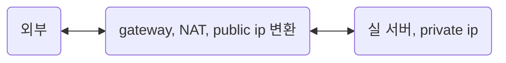

<!-- @import "[TOC]" {cmd="toc" depthFrom=1 depthTo=6 orderedList=false} -->

- [network](#network)
  - [네트워크에 대한 멘탈 모델 scaffolding](#네트워크에-대한-멘탈-모델-scaffolding)
  - [호스트의 네트워크 시스템 구조의 표준 : OSI 7계층 개괄](#호스트의-네트워크-시스템-구조의-표준--osi-7계층-개괄)
    - [프로토콜 설계 고려사항](#프로토콜-설계-고려사항)
    - [2L Data Link](#2l-data-link)
      - [Frame 구조](#frame-구조)
      - [전송 중 발생할 수 있는 Frame 오류 제어](#전송-중-발생할-수-있는-frame-오류-제어)
      - [MAC계층과 LLC계층](#mac계층과-llc계층)
    - [3L network와 해당 protocol](#3l-network와-해당-protocol)
      - [IP 프로토콜(Internet Protocol)](#ip-프로토콜internet-protocol)
      - [IPv6](#ipv6)
      - [3계층의 그 외의 제어용 프로토콜](#3계층의-그-외의-제어용-프로토콜)
      - [public ip, private ip](#public-ip-private-ip)
      - [혼잡 제어](#혼잡-제어)
    - [4L transport와 해당 protocol](#4l-transport와-해당-protocol)
      - [transport 계층 개괄](#transport-계층-개괄)
      - [TCP(Transmission Control Protocol)](#tcptransmission-control-protocol)
      - [UDP(User datagram protocol)](#udpuser-datagram-protocol)
      - [Reliable UDP(RUDP)](#reliable-udprudp)
    - [상위 계층(session, presentation, application)](#상위-계층session-presentation-application)
      - [Session](#session)
        - [세션 연결](#세션-연결)
      - [Presentation](#presentation)
      - [Application](#application)
  - [네트워크 지식 일반](#네트워크-지식-일반)
    - [라우팅](#라우팅)
      - [호스트, 네트워크 간 선을 어떤 식으로 연결할 수 있나?: 전용회선/교환회선](#호스트-네트워크-간-선을-어떤-식으로-연결할-수-있나-전용회선교환회선)
      - [교환 회선을 사용한다면 어떤 방식으로 데이터를 보낼 것인지?: 데이터 교환 방식](#교환-회선을-사용한다면-어떤-방식으로-데이터를-보낼-것인지-데이터-교환-방식)
      - [패킷의 전송 경로 설정 방법: 가상회선/데이터그램](#패킷의-전송-경로-설정-방법-가상회선데이터그램)
      - [정적/동적 라우팅](#정적동적-라우팅)
      - [간단한 라우터의 작동 방식](#간단한-라우터의-작동-방식)
      - [다양한 라우팅 방식](#다양한-라우팅-방식)
      - [internetwork](#internetwork)
    - [데이터 전송(Transmission)](#데이터-전송transmission)
      - [(유니|멀티)(포인트|캐스팅)](#유니멀티포인트캐스팅)
    - [홀펀칭(hole punching), STUN](#홀펀칭hole-punching-stun)
    - [HTTP](#http)
      - [HTTP 1.1](#http-11)
      - [HTTP 2.0](#http-20)
      - [HTTP 3.0 (2020)](#http-30-2020)
  - [glossary](#glossary)
  - [ref](#ref)

<!-- code_chunk_output -->
<!-- /code_chunk_output -->

# network

## 네트워크에 대한 멘탈 모델 scaffolding

네트워크는 시스템의 결합이며 Routing(Switching) + Transmission의 조합으로 데이터를 교환, 전송한다.

한 컴퓨터와 다른 컴퓨터가 소통하는 것. 해당 소통의 규칙을 프로토콜이라 한다.  
text protocol인 http, smtp, irc는 디버깅하기 편하고 텍스트 쓰는 그대로 다룰 수 있다.  
하지만 대부분 프로토콜은 binary protocol이고 이들을 디버깅하기 위해서는 wireshark, [termshark](https://github.com/gcla/termshark), [tcpdump](https://www.tcpdump.org/)와 같은 패킷 분석 도구가 필요하다.

종종 80(http), 443(https)는 생략되지만 우리가 다른 서버로 요청을 보낼 때, ip:port 적어 요청을 보낸다. 이는 요청 서버에서 다른 서버에 접촉할 때 최소한 ip와 port가 필요하다는 것이다.
(사실 정확하게는 송신 호스트, 수신 호스트의 mac, ip, port가 모두 필요하지만 우선은 간략하게 생각하자)

이는 http 뿐만이 아니라 ipv4 시간으로 통신하는 프로토콜은 다 그렇다. TDP/UDP도 ip와 port가 필요하다. ip는 호스트의 구별자, port는 해당 호스트에서 동작하는 여러 응용 프로그램의 구별자이다. 이는 connection이 src ip/port : dst ip/port로 이루어진 이유이며 전송 계층(transport) L4 계층에서 connection이 생성되는 이유이기도 하다.

```text
resp, err := http.Get("https://jsonplaceholder.typicode.com/todos/1") // golang
axios.get("http://localhost:3000") // javascript
```

응답 호스트는 자신에게 온 데이터에 적힌 헤더 정보를 통해 목적지가 자신이 맞는지, 해당 포트가 열려 있는지 등을 체크하는 등 TCP/IP 계층을 올라가며 de-encapsulation을 통해 요청 호스트에서 보낸 정보를 해석하고 받아들인다. 그 과정은 후술할 것이다.

## 호스트의 네트워크 시스템 구조의 표준 : OSI 7계층 개괄

달달 외우기 전에 먼저 네트워크가 시스템이 전송 매체를 통해 데이터를 주고 받으며, 이를 위해 접촉 지점인 interface를 비롯하여 다양한 `표준화`가 필요하다는 것을 체득해야 한다.

여러 가지를 표준화해야 겠지만 호스트 컴퓨터에는 복잡한 네트워크 기능을 표준화할 필요가 있고, ISO에서 제안한 OSI 7계층이 대표적이다. 즉, 네트워크에 연결된 호스트(스마트폰, PC, 기타 소형 단말)들은 7개의 계층으로 나누어진 역할, 기능을 갖추어야 한다는 것이다. 이는 중개 서버 또한 이러한 계층을 갖추어야 한다는 것을 의미한다.

- [7L]Application : 사용자가 사용하는 응용 프로그램 계층.
  - APDU
  - FTP, telnet, SMTP, DNS, HTTP, DHCP
- [6L]Presentation : MIME 인코딩(미디어 타입이 좀 더 친숙한 용어입니다), 암호화, 압축
  - PPDU
- [5L]Session : session 연결 담당. 4계층 connection보다 논리적 연결
  - SPDU
  - 5L부터 코더가 보통 작성하는 코드 레벨에서 구현되며 이전 계층은 OS에서 제공되어 syscall을 통해 사용하는게 일반적
- [4L]Transport(전송 계층) : 결국 데이터를 교환하는 건 실행된 응용 프로그램(프로세스)이다. 송신 프로세스와 수신 프로세스의 connection을 제공 함.
  - TPDU (datagram, segment)
  - TCP(연결형 서비스), UDP(비연결형 서비스)
  - port. 한 호스트 내 여러 응용 프로그램(정확히는 네트워크 프로세스)을 구별하기 위한 주소
  - 호스트에서 실행되는 프로세스 사이의 connection을 만들어주기 때문에 사실상 가장 중요하고 자주 마주치는 계층
- [3L]Network(네트워크 계층) : 데이터가 올바른 경로로 갈 수 있도록 보조. Router 역할의 호스트에서 패킷은 이 계층 까지만 간다.
  - NPDU (패킷)
  - IP, ICMP, ARP, RARP
  - 라우팅, 혼잡 제어, 패킷의 분할과 병합
- [2L]Data Link : 물리 매체로 받은 데이터의 Noise 등 오류에 대한 오류 제어
  - DPDU (frame)
  - LAN 카드와 이에 내장된 MAC 주소
- [1L]Physical : 물리 매체

4계층 이하는 OS에서 syscall 형태로 제공되고 5계층부터 코더가 응용 프로그램을 작성하면서 흔히 다루는 부분이다.

프로토콜은 데이터를 교환하기 위한 일련의 절차 규칙이라고 정의할 수 있지만 OSI 7계층에서는 계층화된 모듈로 나누어서 프로토콜을 n계층(모듈)들에게 책임을 할당하고 있는 모양새로 구성이 되어 있다.

구체적으론, 클라이언트 호스트에서 데이터를 전송할 때는 하위 계층으로 내려갈 때가며 각 계층의 프로토콜에서 정의한 헤더 정보가 추가된다. 서버 호스트는 상위 계층으로 올라가며 프로토콜을 수행한다.

인터넷에서 사용하는 주소는 MAC 주소, IP 주소, 포트 번호가 필요하고 통신을 위해서는 각각 송신 호스트와 수신 호스트의 이 3가지 주소가 모두 필요하다.

### 프로토콜 설계 고려사항

- 주소 표현
- 오류 제어 -> 보통 물리적 문제로 발생함

  - 데이터 분실
    - 매우 다양한 원인. 수신자는 알기 어려워 발송자의 timeout 등 발송자에서 오류 감지해야.
  - 데이터 변형
    - 수신 호스트에서 도착 순서를 바로잡으려면 데이터의 논리적인 순서를 의미하는 순서 번호 기능이 필요하다.

- 흐름 제어 -> 논리적 문제

  - 수신자 내부 버퍼에 공간이 없어서 데이터가 유실 되는 경우가 있음. 수신 호스트의 버퍼 처리 속도보다 송신 호스트가 데이터를 전송하는 속도가 빠르면 논리적인 데이터 분실 오류가 발생한다.
    - 소위 [back-pressure](https://medium.com/@jayphelps/backpressure-explained-the-flow-of-data-through-software-2350b3e77ce7)라 부르는 그 현상이다. provider 속도는 빠른데 consumer 속도가 느린 경우.
    - back pressure에 대처하는 여러 전략이 있는데, 이는 적용되는 분야(microservice, streaming, network, etc)마다 달라서 여기서는 다루지 않는다.

- 데이터 전달 방식
  - simplex, (full) duplex, half duplex

### 2L Data Link

물리 계층에서 건너온 데이터에 대한 오류 제어 및 흐름 제어

#### Frame 구조

물리 계층에 넘어온 정보를 프레임 단위로 나누어서 처리. 프레임의 구체적 정보를 프로토콜마다 다름.

- 문자 프레임

  - ASCII 문자 기반이며 프레임을 구별하기 위해 앞에 DLE, STX 뒤에 DLE, ETX를 붙임
  - 문자 기반이기 때문에 문자 프로토콜에서 주로 사용하며 미디어 데이터를 문자 프레임 방식을 사용해 전송한다면 문제를 일으킬 수도 있다.

- 비트 프레임
  - 프레임의 시작과 끝 위치에 정의된 비트 패턴(01111110)를 flag로 사용해 프레임 단위를 구분한다.
  - 01111110 | 011101010001010100111 | 01111110

#### 전송 중 발생할 수 있는 Frame 오류 제어

- 정상적으로 송신된 경우

  - 송신 호스트가 데이터를 전송한다
  - 수신 호스트는 잘 받았다고 Positive Acknowledgement을 날린다 (ACK 프레임)
  - 송신 호스트는 이를 받아 성공적으로 전송되었다 인지한다

- 데이터 분실

  - 매우 다양한 원인. 수신자는 알기 어려워 발송자의 timeout 등 발송자에서 오류 감지한다.
  - 데이터를 성공적으로 수신했다고 하더라도 Positive Acknowledgement이 분실되는 경우도 존재한다. 이 경우에는 timeout이 발생하고 재전송을 하게 될 터인데, 이 때 재전송을 하게 되면 수신자는 데이터를 중복으로 받게 된다. 이를 거르기 위하여 각 프레임 내부에 프레임 구분자인 Sequence Number를 기록해야 한다.

- 데이터 변형

  - 수신 호스트에서 도착 순서를 바로잡으려면 데이터의 논리적인 순서를 의미하는 순서 번호 기능이 필요하다.
  - 수신 호스트에서 프레임 변형 오류의 판단은 오류 검출 코드를 근거로 한다.
  - 수신 호스트는 2L Data Link 계층에 의해 에러를 검출하게 되어 Negative Acknowledgement Frame (NAK 프레임)를 송신 호스트에 보낸다
  - 송신 호스트는 데이터 변형 에러를 감지하고 재전송한다.

#### MAC계층과 LLC계층

보통 호스트간 거리에 기반하며 LAN과 WAN으로 구별하는데 이러한 규모와 환경 차이 때문에 네트워크의 동작이 달라지곤 한다. LAN 환경에서는 WAN 환경보다 효율적인 전송 관리를 통해 네트워크의 전송 효율을 극대화해야 한다. 그래서 LAN 환경에서는 네트워크 자원을 효율적으로 활용하려고 2계층의 기능을 LLC(logical link control) 계층과 MAC(medium access control) 계층으로 나누어 처리한다. MAC이 물리 계층과 가깝고, LLC가 그것보돠 더 상위 계층에 존재한다.

OSI 7계층 모델에 본 2L 데이터 링크 계층의 기본 기능은 주로 LLC 계층에서 처리한다. 즉, 물리 계층에서 넘어온 정보의 Noise 처리, 오류 제어, 흐름 제어를 책임진다. 물리적 전송 매체의 특징과 연결에 대해서는 MAC 계층이 처리한다.

MAC 계층은 물리적인 특성을 반영하므로 LAN의 종류에 따라 특성이 구분되며 종류도 다양하다.

- CSMA/CD 방식의 LAN(Ethernet)
- 토큰 버스 방식의 LAN
- 토큰 링 방식의 LAN

### 3L network와 해당 protocol

3계층은 송신 호스트와 수신 호스트 사이에 패킷을 전달하는 경로를 선택하는 '라우팅'을 담당한다.

#### IP 프로토콜(Internet Protocol)

- 비연결형 서비스
- 패킷 분할/병합 기능을 수행하기도 한다.
- Best Effort 원칙에 따라 전송함. 이는 수신 호스트에 패킷이 반드시 도착하는 것을 보장하지 않아 전송 오류 제어를 상위 계층에서 해결해야 한다.

#### IPv6

IPv4는 32비트인데 IPv6는 128비트로 주소 공간 확장. 추가로 헤더 구조 단순화, 흐름 제어 기능이 추가 됨.  
16비트 숫자 8개로 구성되며 콜론(:)으로 구분함. ex) D1D1:1111:3F3F:1700:4545:1212:1111:1231  
IPv4와 함께 사용하는 환경에서 v4 버전 주소를 X:X:X:X:X:X:d, d, d, d 꼴로 표현하기도.  
[Hello IPv6: a minimal tutorial for IPv4 users](https://metebalci.com/blog/hello-ipv6/)

#### 3계층의 그 외의 제어용 프로토콜

IP 프로토콜은 호스트를 식별 및 데이터 전송을 위한 프로토콜이지만 이것만으론 안정적으로 통신할 수 없다. 그래서 통신을 위해 추가적 정보를 얻기 위한 ARP, RARP 프로토콜과 송신 호스트에게 에러 메세지를 전달하는 ICMP 프로토콜 등이 부가적으로 동반되곤 한다.

- ARP(Address Resolution Protocol)

  - 수신 호스트 ip 주소를 활용해 수신 호스트의 MAC 주소를 알아내는 프로토콜
  - 처음 통신을 하려고 하면 요청을 보내는 측은 자신의 IP, MAC 주소와 상대방의 IP 주소는 알고 있지만 상대방의 MAC 주소를 모르고 있습니다. 2계층의 MAC 주소와 3계층의 IP 주소는 아무런 관련이 없기 때문에 상대방 IP 주소를 알고 있다고 해도 MAC 주소를 계산 내지는 유추할 수 없는 것이죠. 따라서 어떻게 해야 한다? 상대방에게 물어봐야 합니다. 상대방의 MAC 주소를 알기 위해서는 ARP 브로드캐스트를 이용하여 네트워크 전체에 상대방의 MAC 주소를 질의합니다. ARP 브로드캐스트를 받은 목적지는 ARP 프로토콜을 이용하여 자신의 MAC 주소를 보내줍니다. 이 과정을 마쳐야 비로소 요청을 보내는 측은 상대방의 MAC 주소를 캡슐화하여 상대방에게 요청을 보내게 됩니다.
  - https://darrengwon.tistory.com/1316

- RARP(Reverse Address Resolution Protocol)

  - LAN 카드에 저장된 MAC 주소를 기반으로 자신의 IP를 알아내는 프로토콜
  - 호스트의 IP 주소는 컴퓨터 설정 작업의 초기화 과정에서 특정 파일에 보관된다. 그러나 파일 시스템이 존재하지 않는 특수 목적의 시스템은 LAN 카드에 내장된 자신의 MAC 주소는 알지만, 자신의 IP 주소는 모르는 경우가 있다. 이 문제를 해결하기 위하여 MAC 주소를 IP 주소로 변환하는 RARPReverse Address Resolution Protocol가 필요하다.

- ICMP(Internet Control Message Protocol)
  - 전송 오류 발생시 송신 호스트에게 회신하여 복구 작업을 위해 에러 메세지를 전달하는 프로토콜

#### public ip, private ip

보통 서버와 서버의 곧장 통신하는 경우도 있지만 ipv4가 부족한 현 상황에서는 gateway 역할을 하는 public ip(공인 ip)가 앞에 있고 그 내부에 private ip(사설 ip)가 대부분의 상황이다.



- 대표적인 경우로 NAT 장비에 public ip가 있고 NAT을 경유하여 egress하는 내부 서버들의 ip는 private ip로 감춰져 있는 네트워크 구성.
- AWS 기준으로 설명하자면 private subnet에 존재하는 사설 대역 ip의 서버들이 public subnet에 존재하는 NAT을 통해 public IP로 변환되어 외부와 통신하게 되어 egress[outbound]가 가능하지만, 외부 인터넷에서 ingress[inbound]는 안되는 상황

이해를 돕기 위해 gateway를 통해 진행되는 네트워크 흐름 순서를 읊어보자.
private ip인 우리 서버가 gateway를 거쳐 naver.com에 닿는다고 해보자.

**[egress(private ip 실 서버→ gateway → naver)]**

- private ip이 10.0.0.1, 357 포트에서 요청을 보냈다.
- NAT이 해당 private ip를 public ip로 변환하고, private port를 public port로 변경하는 port-forwarding이 진행된다.
  - gateway는 이제 출발지(실서버)과 도착지의 ip, port를 알고 이를 **NAT table**에 기록한다.
- naver 서버는 NAT의 주소를 요청 서버를 거친 요청을 받아들인다.
  - naver는 인식하고 그 배후에 있는 private ip의 실 서버는 모른다.

**[ingress(naver → gateway → private ip 실 서버)]**

- naver가 요청에 대한 응답을 gateway로 보낸다.
- gateway는 NAT table을 보고 실 서버에게 패킷을 보낸다.

#### 혼잡 제어

전송 패킷이 많아지면 자연스레 네트워크 성능은 감소한다. 패킷이 많아 혼잡하는 것을 해결하기 위한 방안이 혼잡 제어이고, 보통 3L 네트워크 계층에서 담당하는 책임이다.

송수신 호스트간 합의한 트래픽보다 많은 패킷이 온다면 패킷 처리를 늦추거나 거부하는 트래픽 성형(traffic shaping) 방식, 사용할 수 있는 대역을 미리 할당 하는 자원 예약 방식 등으로 혼잡을 제어한다.

### 4L transport와 해당 protocol

#### transport 계층 개괄

transport 계층은 송신/수신 네트워크의 end-to-end 연결을 제공하는 계층이다. 진짜로 뭔가가 '연결 되었다'는 실감이 들게 해주는 계층이다. end-to-end 연결(connection)은 흔히 src ip/port : dst ip/port꼴로 표현된다.
ip가 호스트를 구별하기 위한 식별자라면 port는 네트워크 요청을 한 프로세스의 식별자이며 전송 서비스 접근점(TSAP)이다.

IP 프로토콜 위에서 동작하는 TCP와 UDP 프로토콜은 OS 내부 커널에 구현되고, socket interface를 통해 사용자가 사용할 수 있도록 제공된다. TCP는 연결형 서비스이며 UDP는 비연결형 서비스이다.

#### TCP(Transmission Control Protocol)

두 호스트 간 데이터 전송의 신뢰성 중시. 네트워크 정체 등의 이유가 발생하더라도 packet loss를 최소화하기 위해 노력함.

- 호스트 내 네트워크 커넥션 수립을 요청/수신하는 프로세스간 3 way handshake.

  - SYN -> SYN/ACK -> ACK
  - 이 때문에 TCP 기반 HTTP1, 2는 connection 생성 비용 문제를 겪게 됨. HTTP3가 UDP로 갈아타고 신뢰성은 애플리케이션 단에서 구현한 이유.
  - TCP 세션 종료 시 어느 한 쪽에서 FIN 패킷을 보내며 종료 시퀀스 진행함. (stop), 강제 종료 등 갑작스런 종료에는 RST 패킷을 보내며 종료.

- Dial 시 요청 프로세스 측은 적절한 timeout을 설정하여 빠르게 실패하도록 할 것

  - 오류 제어에서 살펴보았듯 데이터 분실에 대응하는 방법은 수신 호스트 측의 timeout 정책임.

- TCP 프로토콜은 full duplex 통신을 지원하므로 가상 회선으로 연결된 두 프로세스가 동시에 데이터를 전송할 수 있다. 따라서 전송 데이터와 응답 데이터를 함께 전송하는 Piggybacking 기능을 사용한다.

#### UDP(User datagram protocol)

- connectionless라서 connection 생성 비용이 없음. 대신 신뢰성이 떨어짐
- 비교적 데이터의 신뢰성이 중요하지 않을 때 사용함.

#### Reliable UDP(RUDP)

- 보통 게임 서버에서 많이들 사용하고 Unity에 내장되어 해당 코드를 많이들 참고함

[Reliability and Congestion Avoidance over UDP](https://gafferongames.com/post/reliability_ordering_and_congestion_avoidance_over_udp/)

### 상위 계층(session, presentation, application)

TCP/IP 모델에서는 보통 transport 계층 상위(session, presentation, application) 를 모두 Application 계층으로 퉁치곤 한다. 이는 일반적으로 세 계층의 기능이 하나의 프로그램으로 묶여 구현되기 때문이다.

#### Session

- 세션은 사용자 관점에서의 연결이다. transport 계층의 connection과 다른 점은, 연결된 사용자를 논리적으로 식별해낼 수 있다는 것이다. 예를 들어, TCP connection을 맺고 파일 전송 도중 연결이 끊겼다가 다시 돌아 왔을 때 세션으로 유저를 식별할 수 있다면 이전 파일 전송을 이어서 할 수 있다. 세션이 없다면 처음부터 받아야 한다.

  - 이는 '동기'(synchronization)와 '재동기'(re-synchronization)이란 세션 계층의 기능을 풀어 설명한 것이다. 재동기란, 세션 연결을 통해 데이터를 주고 받아 오류가 발생했을 때 동기점으로 복구하는 기능이다.

##### 세션 연결

- 프로세스간 연결 과정에서 CONNECT 요구가 발생하면 세션 계층은 이를 transport 계층 프리미티브인 CONNECT 요구로 변환하여 수신 세션 사용자에게 전달하고 연결한다.
- 클라이언트 프로세스와 서버 프로세스가 연결 되는 모델은 크게 두 가지가 존재한다.
  - N:1 세션 연결(`다중 세션 연결`)
    - 한 서버 프로세스에 여러 클라이언트 프로세스가 세션 연결되는 꼴이다.
    - 서비스 시간이 짧은 경우 이 방식이 좋지만, 클라이언트가 많아지면 대기 시간이 길어진다는 단점
  - 1:1 세션 연결(`단일 세션 연결`)
    - 대표 서버에 클라이언트가 연결을 요청하면 대표 서버는 해당 클라이언트를 위한 별도의 서버 프로세스를 하나 열어서 해당 프로세스와 세션 연결을 맺어준다. 대표 서버는 하위 프로세스를 생성해주는 역할인 하는 셈이다.
    - 클라이언트가 많아져도 대기 시간이 길어지지 않는다는 장점이 있지만, 알다시피 프로세스를 생성하는 비용은 크다. 그래서 서비스 시간이 짧은 경우에는 사용하지 않는 것이 좋다.
    - 일반적으로 텔넷, FTP 등과 같이 대부분의 TCP/IP 서비스는 단일 세션 연결 방식을 사용

#### Presentation

#### Application

## 네트워크 지식 일반

### 라우팅

3계층 네트워크 계층이 담당하는 기능이다. 라우터 역할을 하는 중간 호스트들에 도달한 데이터는 3L 까지만 데이터가 갔다가 라우팅되어 네트워크의 다른 홉으로 이동된다.

요약하자면, 물리적으론 교환 회선 방식으로 연결되어 있으며, 패킷 교환 방식으로 데이터를 전송하고, 패킷의 경로는 가상 회선 방식으로 모두 동일할 수도, 데이터그램 방식으로 제각각일 수도 있다. 데이터 그램의 경우 패킷 도착 순서가 보장되지 않아 수신 호스트에서 보정할 필요가 있다.

#### 호스트, 네트워크 간 선을 어떤 식으로 연결할 수 있나?: 전용회선/교환회선

- 전용 회선 방식: 송신 호스트와 수신 호스트가 전용으로 할당된 통신 선로로 데이터를 전송
  - 인터넷의 경우 모든 호스트 간 전용 회선을 설치할 수 없으므로 비현실적. 제한적인 용도로 활용됨.
- 교환 회선 방식: 전송 선로 하나를 다수의 호스트가 공유한다.
  - 일반적으로 인터넷에서 사용되는 방식.

#### 교환 회선을 사용한다면 어떤 방식으로 데이터를 보낼 것인지?: 데이터 교환 방식

- circuit switching(회선 교환)
  - 데이터를 전송하기 전에 통신 양단 사이에 고정된 연결 경로를 설정하는 회선 교환 방식
- message switching(메세지 교환)
  - 전송하는 메세지마다 헤더에 목적지 주소를 표시하며, 전체 데이터를 buffer에 쌓았다가 다른 교환 시스템으로 넘기는 방식
- package switching(패킷 교환)
  - 데이터를 패킷 단위로 나누어 전송하며 각 패킷은 제각각 다른 라우팅 경로를 거쳐 수신 호스트에 도착한다.
  - 쉬운 말로 풀자면, 모든 패킷이 동일한 경로로 가는게 아니라 제각각 다른 경로를 통해 수신 호스트에 도착한다는 것.
  - 때문에 패킷이 순서 대로 도착하는 보장이 없고, 도착까지의 지연 시간에 대한 분포([jitter](https://medium.com/@datapath_io/what-is-acceptable-jitter-7e93c1e68f9b))가 수용할만한 수준인지, 문제가 있는 수준인지 신경써야한다. 특히 실시간 비디오 스트리밍 등과 같은 서비스에서는 jitter가 유저 경험에 유의미한 영향을 미친다.
    > According to Cisco, jitter tolerance is as follows:  
    > Jitter should be below 30 ms.  
    >  Packet loss shouldn’t be more than 1%.  
    >  Network latency should not go over 150 ms. This is the latency in one direction meaning the round trip time (RTT) would be 300 ms.

#### 패킷의 전송 경로 설정 방법: 가상회선/데이터그램

- 가상 회선(Virtual Circuit)

  - 앞서 패킷은 각각 다른 경로를 통해 수신 호스트에 도착한다고 설명했지만 송신-수신 호스트간 마치 전용 회선을 연결한 것처럼 가상 연결을 통해 모든 패킷의 전달 경로가 동일하게 만드는 경로 설정 방법이다. 물론 전용 회선은 아니다. 데이터가 패킷으로 다 쪼개졌고, 대역폭을 독점하지 않기 때문이다.
  - 쪼개진 데이터가 같은 회선을 통해 가기 땜누에 킷의 도착 순서가 뒤바뀌지 않는다. 순서대로 온다.

- 데이터그램(Datagram)
  - 데이터그램 방식에서는 패킷의 경로 선택이 독립적으로 이루어진다. 데이터그램 방식은 전송할 정보의 양이 적거나 상대적으로 신뢰성이 중요하지 않은 환경에서 사용된다.
  - 데이터그램 방식에서 데이터의 도착 순서가 바뀌는 것은 흔하게 벌어지는 현상이므로 수신 호스트에서 데이터의 순서를 바로잡는 기능이 필요하다.

#### 정적/동적 라우팅

static routing은 각 라우터가 들고 있는 경로 정보를 고정적으로 활용하는 방식이다. 네트워크 상황에 대처할 수 없다는 단점이 있다.
dynamic routing은 네트워크 상황에 따라 경로 정보를 동적으로 변경하지만 경로 정ㅈ보를 수집, 관리 하는 연산이 추가로 필요하다.

#### 간단한 라우터의 작동 방식

- HELLO/ECHO 패킷을 통해 이웃 라우터의 경로 정보와 이웃 라우터까지의 전송 시간을 파악한다.
- 라우터마다 구성된 라우팅 테이블(목적지 호스트, 목적지 호스트에 도달하기 위해 가야 하는 다음 홉으로 구성된 테이블)을 참고하여 다음 홉으로 패킷을 전달한다.

#### 다양한 라우팅 방식

- 소스 라우팅
  - 송신 호스트가 경로를 모두 관리한다. 경로 정보를 패킷에 담아 보내고, 거쳐가는 라우터들은 해당 패킷의 경로 정보에 따라 다른 라우터로 패킷을 옮기는 역할만하기 때문에 중간 라우터들의 라우팅 테이블 관리가 필요 없어진다.
- 분산 라우팅
  - 각 라우터들이 라우팅 정보를 보유하고 패킷을 보냄. 일반적으로 우리가 생각하는 방식
- 중앙 라우팅
  - 특별한 호스트가 모든 경로 정보를 관리하는 방식
- 계층 라우팅
  - 중앙 라우팅과 분산 라우팅의 조합

#### internetwork

- network와 network를 중개하는 장비를 말함. 장비의 기능에 따라 올라가는 OSI 계층이 다름

  - 리피터 : 호스트 간 거리가 멀면 패킷의 자연 유실 가능성이 높아지므로 비트 신호를 증폭하는 장치. 1L인 물리 계층.
  - 브릿지 : 수신 호스트가 다른 network에 존재하면 MAC 주소 변환을 통해 중개 2L인 data link 계층까지 올라감

    - 브릿지에 LAN A, LAN B, ... , LAN Z가 연결되어 있다고 가정하자. 이 LAN 사이의 중개 역할을 브릿지가 이제 수행해야 한다.
      - 브릿지에 해당 프레임의 수신 호스트가 송신 호스트와 동일한 방향에 위치한 경우에는 프레임을 중개하는 과정이 필요 없기 때문에 브릿지가 무시한다.
      - 만약 프레임의 수신 호스트가 송신 호스트와 다른 방향에 위치한 경우에는 수신 호스트가 있는 방향으로 프레임을 중개해야 한다.
    - 이와 같은 중개 역할을 위해서는 브리지 내부에는 송수신 호스트가 동일한 방향에 있는지와 수신 호스트가 브리지의 어느 방향에 위치하는지에 대한 정보를 Routing Table을 참고하여 알게 된다.
      - Routing Table은 LAN이 동작하면서 자동으로 생성됨.

  - 라우터 : 3L 네트워크 계층. 패킷의 경로를 적절하게 설정.
    - 적절한 라우팅 경로라는 것은 인터넷 전체 구성과 현재 상태에 대한 정보를 고려한다는 말이다.
    - 고정 경로 배정(Fixed Routing)
      - 송수신간 고정된 경로를 배정
    - 적응 경로 배정(Adaptive Routing)
      - 네트워크 상태가 변화하면 경로로 변화함. 문제는 인터넷이 꽤 크기 때문에 경로 계산에 수반된 정보가 실제와 불일치할 수 있다는 것이고, 이 정보를 가급적 실시간적으로 유지하려고 노력할 수록 라우터의 연산 처리 능력에 부담.

### 데이터 전송(Transmission)

- 네트워크 내에서의 데이터 교환은 단순히 보면 라우팅과 전송의 조합이다
- 라우팅, 스위칭 = 전달 경로가 둘 이상 일 때 어느 곳으로 데이터를 어느 방향으로 보낼 것인가
- 전송(transmission) = 1:1로 연결된 시스템 간 데이터를 전송하는 것
  - 전송과 라우팅이 결합하여 호스트 간 데이터를 주고 받는 것이 가능해진다
  - 전송의 개념을 생각할 때 라우팅 기능은 배제하고 보아야 한다

#### (유니|멀티)(포인트|캐스팅)

- 포인트

  - unipoint: 1:1 연결
  - multipoint: 1:N 연결

- 캐스팅

  - unicast: 1:1 전송
    - 1:N 통신을 하려는데 애초에 멀티 캐스팅이었으면 좋겠지만 우리 사용하려는 것이 유니캐스팅 방식의 프로토콜이라면 멀티포인트 연결을 해야만 한다. 물론 멀티 포인트 유니캐스트는 수신 호스트 수가 많아지면 성능 문제 발생 가능
  - multicast: 1:N 전송
    - 프로토콜 자체가 multicast를 지원한다면 1:N 전송을 연결 요구 한 번만하고 비교적 손쉽게 할 수 있다.
  - broadcast: 송신 호스트가 네트워크에 연결된 모든 호스트에게 전송
    - 브로드캐스트 주소로 전송한다. 브로드캐스트 주소는 가능한 주소 중 가장 큰 수이다.
    - 예를 들어 10.128.0.0/16라면 10.128.255.255가 브로드캐스팅 주소일 것이다.

### 홀펀칭(hole punching), STUN

p2p 통신을 위해 NAT을 뚫는 방법.

https://elky.tistory.com/259  
https://cjwoov.tistory.com/6

### HTTP

#### HTTP 1.1

- keep-alive
  - HTTP 1.0은 매 요청 마다 3 way handshake로 연결을 맺어야 해서 latency가 높았음. 그래서 TCP connection을 지속해서 재활용 할 수 있게 함.
    - connection 생성은 오래 걸리는 일임.
  - 다만 connection 수립에 의한 latency를 해결할 수 있었을 뿐이지 **병렬적인 요청-응답은 불가능했음**. 따라서 다량의 멀티미디어 리소스를 처리 해야하는 웹페이지에서 pageload가 느렸음.
    keep-alive로 tcp connection 재활용은 가능하지만 요청과 응답이 순차적으로 이루어져 느렸음.
- **pipelining과 HOL (head-of-line) blocking(HOLB)**
  - 위 병렬 요청-응답이 불가능함에 따라 성능 개선을 위하여 pipelining 기술을 사용하게 됨
    - 정말 단순한게, 그냥 지난 요청에 대한 응답을 기다리지 않고 여러번 요청을 보내면 서버에서 들어온 순서대로 (FIFO, 큐) 응답을 내려 보내주는 것이다.
  - 성능 개선이 이루어졌기는 했지만 http HOLB 문제를 야기하였음. **들어온 순서대로 응답을 내려보내 준다는 것은 첫 요청이 매우 느리다면 뒤 이어 들어온 요청에 대한 연산이 끝났음에도 응답으로 내려줄 수 없다는 것**이다.
  - HOLB 문제로 인하여 그래서 모던 브라우저들은 대부분은 파이프라이닝을 사용하지 못하도록 막아 놓았음.
- HTTP 1.1 단점 극복을 위해 구글에서 SPDY 프로토콜을 새로 구현하였으나 이제는 deprecated 됨. 구글 당사자도 안 씀.

#### HTTP 2.0

- HTTP 2.0
  - 모던 브라우저는…
    - 처음부터 여러 개의 tcp connection을 생성해놓고 병렬적으로 처리함.
      - 몇 개나 생성하느냐는 정책은 브라우저마다 다른데 6개가 일반적임.
  - `multiplexing`
    - multiplexing의 뜻 → 단일 연결 안에서 여러 데이터가 섞이지 않게 전송하는 기법. → 병렬 처리를 위해 중요함.
    - 즉, 하나의 TCP connection에 여러 데이터를 병렬적으로 처리할 수 있게 된 것임.
    - 한 커넥션으로 동시에 여러개의 메세지를 주고 받을 있으며, 응답은 순서에 상관없이 stream으로 주고 받는다. multiplexing은 HTTP/1.1의 Connection Keep-Alive, Pipelining의 개선이라 보면 된다.
    - http HOLB는 해결 되었지만 TCP HOLB는 미해결
      - TCP HOLB는 또 뭐냐, TCP는 데이터의 순서를 보장하는 프로토콜임. 그래서 먼저 전송되어야 하는 버퍼가 지연되면 그 뒤 버퍼도 전부 다 지연되는 걸 말함.
  - Stream Prioritization
    - 각 요청에 중요도를 부여
    - 예를 들어 image보다 css가 먼저 로드되어야 브라우저에서 렌더링이 될 터이니 css에게 높은 중요도를 부여함으로써 브라우저가 렌더링을 할 수 있게 만들기.
  - header compression
    - HTTP 헤더 압축을 통해 트래픽을 보다 효율적으로 전송
  - server push
    - 서버는 클라이언트의 요청에 대해 요청하지도 않은 리소스를 마음대로 보내줄 수 도 있다.
    - 그러니까 html 파싱 해나가면서 css나 script를 만나게 되면 해당 내용을 요청하는 방식이지만 HTTP 2.0에선 없어도 서버단에서 push해서 넣을 수 있다는 것이다. 이를 **PUSH_PROMISE**라 한다. HTTP 2.0 프레임을 보자.
    - 서버가 요청받지 않은 리소스도 클라이언트로 보낼 수 있도록 서버 푸시에 대한 지원이 추가
- **HTTP 1.1과의 성능 차이는 꽤나 dramatic하므로 성능을 생각한다면 꼭 HTTP 버전을 높게.**
- HTTP/2 protocol을 지원하지 않는 브라우저는 이제 없다고 봐도 됨. [https://caniuse.com/http2](https://caniuse.com/http2)

- HTTPS와 HTTP/2는 다른 개념이지만 같이 사용된다.
  - HTTP/2 프로토콜에 반드시 SSL/TLS로 보안된 연결을 사용해야 하는 것은 아니지만 많은 HTTP/2 클라이언트가 HTTP/2 사용 시 반드시 암호화된 연결을 사용하도록 하고 있기 때문에 그렇다.

#### HTTP 3.0 (2020)

- TCP HOLB 문제가 생긴다. 이게 다 TCP 때문이다. UDP를 사용하자.
  - UDP는 TCP와 다르게 신뢰성이 없다고 들었다. → 어프릴케이션 계층에서 신뢰성을 구현하자.
  - 독립 stream
- It uses QUIC instead of TCP for the underlying transport protocol, thus removing HOL blocking in the transport layer.
  - QUIC is based on UDP. It introduces streams as first-class citizens at the transport layer. QUIC streams share the same QUIC connection, so no additional handshakes and slow starts are required to create new ones. But QUIC streams are delivered independently such that in most cases packet loss affecting one stream doesn't affect others.

## glossary

💡 **NIC(네트워크 인터페이스 카드)**  
2계층(데이터 링크 계층)의 장치입니다. 컴퓨터를 네트워크에 연결하기 위한 하드웨어 장치. 별명이 많습니다. 랜 카드, 네트워크 인터페이스 컨트롤, 네트워크 카드 등등. 여러 일을 담당하고 있지만 최대한 단순하게 요약하자면 'NIC는 물리적 주소인 MAC 주소를 가지고 있고, 목적지 MAC 주소가 다른 패킷은 그냥 버린다'고 정리할 수 있다.  
이 이에도 **요청 호스트가 보낸 byte 덩어리를 NIC 내의 buffer에 쌓아뒀다가 응답 호스트가 빼갑니다**.
https://darrengwon.tistory.com/1306?category=907881

💡 **흐름제어와 혼잡제어는 다르다**
흐름 제어는 송신 호스트와 수신 호스트 간의 전송 속도에 따라 수신 호스트의 버퍼가 다 차서 데이터가 유실되는 것을 방지하기 위해 전송 속도를 조절하는 것이다. 반면 혼잡 제어는 패킷이 너무 많아 성능 감소가 일어나는 것을 방지하는 작업을 말한다.

## ref

- [Backpressure explained — the resisted flow of data through software](https://medium.com/@jayphelps/backpressure-explained-the-flow-of-data-through-software-2350b3e77ce7)
- [What is Acceptable Jitter?](https://medium.com/@datapath_io/what-is-acceptable-jitter-7e93c1e68f9b)
- [Hello IPv6: a minimal tutorial for IPv4 users](https://metebalci.com/blog/hello-ipv6/)
- [UCP vs TCP](https://gafferongames.com/post/udp_vs_tcp/)
