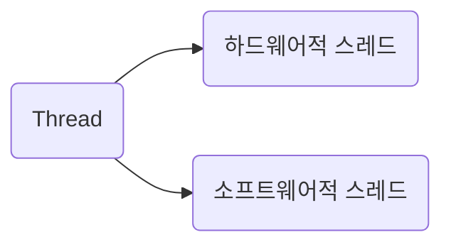
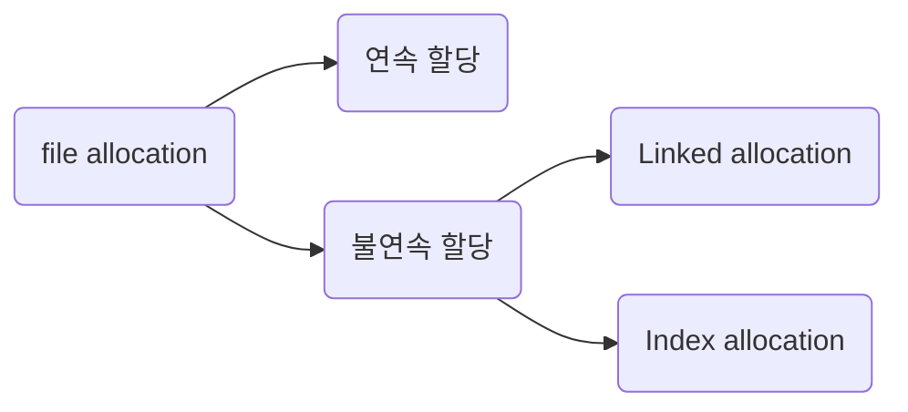

<!-- @import "[TOC]" {cmd="toc" depthFrom=1 depthTo=6 orderedList=false} -->

- [os](#os)
  - [운영체제 왜 공부함](#운영체제-왜-공부함)
    - [OS 큰 그림](#os-큰-그림)
      - [하드웨어 자원 보호 from application](#하드웨어-자원-보호-from-application)
      - [운영 체제의 핵심 서비스](#운영-체제의-핵심-서비스)
        - [프로세스 관리](#프로세스-관리)
  - [프로세스와 스레드](#프로세스와-스레드)
  - [프로세스](#프로세스)
    - [PCB (프로세스 제어 블록)](#pcb-프로세스-제어-블록)
    - [context switching](#context-switching)
      - [애초에 context가 뭐야?](#애초에-context가-뭐야)
    - [프로세스의 메모리 영역(코드, 데이터, 힙, 스택)](#프로세스의-메모리-영역코드-데이터-힙-스택)
    - [프로세스의 상태와 계층 구조](#프로세스의-상태와-계층-구조)
      - [프로세스 상태](#프로세스-상태)
      - [프로세스 계층 구조](#프로세스-계층-구조)
      - [프로세스는 어떻게 자식 프로세스를 만드는가](#프로세스는-어떻게-자식-프로세스를-만드는가)
    - [스레드](#스레드)
    - [멀티 스레드랑 멀티 프로세스](#멀티-스레드랑-멀티-프로세스)
    - [프로세스 간의 통신 (IPC, Inter-Process communication)](#프로세스-간의-통신-ipc-inter-process-communication)
  - [CPU 스케쥴링](#cpu-스케쥴링)
    - [I/O bound process, CPU bound process](#io-bound-process-cpu-bound-process)
    - [스케쥴링 큐](#스케쥴링-큐)
    - [선점형 스케쥴링, 비선점형 스케쥴링](#선점형-스케쥴링-비선점형-스케쥴링)
  - [CPU 스케쥴링 알고리즘](#cpu-스케쥴링-알고리즘)
  - [프로세스 동기화 -\> 공유 자원과 실행 순서](#프로세스-동기화---공유-자원과-실행-순서)
    - [공유 자원과 임계 구역](#공유-자원과-임계-구역)
    - [동기화 기법](#동기화-기법)
      - [뮤텍스, 세마포어, 모니터](#뮤텍스-세마포어-모니터)
      - [뮤텍스 락](#뮤텍스-락)
      - [세마포어](#세마포어)
      - [모니터](#모니터)
  - [dead lock(교착 상태)](#dead-lock교착-상태)
    - [교착 발생의 네 조건](#교착-발생의-네-조건)
    - [dealock 해제 방법](#dealock-해제-방법)
      - [교착 상태 예방](#교착-상태-예방)
      - [교착 상태 회피](#교착-상태-회피)
      - [교착 상태 검출 및 회복](#교착-상태-검출-및-회복)
  - [가상 메모리](#가상-메모리)
    - [swap](#swap)
    - [연속 메모리 할당 문제에서 외부 단편화 문제](#연속-메모리-할당-문제에서-외부-단편화-문제)
    - [페이징](#페이징)
    - [페이지 테이블과 페이지 테이블 엔트리](#페이지-테이블과-페이지-테이블-엔트리)
      - [페이징 주소](#페이징-주소)
    - [페이지 활용](#페이지-활용)
      - [페이지 교체 알고리즘](#페이지-교체-알고리즘)
      - [프레임 할당](#프레임-할당)
  - [File system](#file-system)
    - [FD(file descriptor)](#fdfile-descriptor)
    - [file \& directory](#file--directory)
    - [partitioning \& formatting](#partitioning--formatting)
    - [file allocation](#file-allocation)
    - [FAT, Unix file system](#fat-unix-file-system)
      - [FAT (linked allocation 기반)](#fat-linked-allocation-기반)
      - [Unix file system (index allocation 기반)](#unix-file-system-index-allocation-기반)
    - [Mount](#mount)

<!-- code_chunk_output -->
<!-- /code_chunk_output -->

# os

운영체제는 컴퓨팅 리소스(하드웨어)를 보호하고 적절하게 배분하는 것이 주 역할. 컴퓨팅 리소스에 접근할 때 커널 모드로 변경하여 syscall 호출로 접근하여 응용 프로그램의 직접 접근을 막음.

코드 덩어리
-> 메모리 적재(코드, 데이터, 힙, 스택) 하되 실행을 위해 프로세스의 모든 부분이 메모리에 올라올 필요는 없음. 페이징되어서 일부 영역만 메모리에 있고 몇 부분은 페이지로 쪼개져서 스왑됨. 페이징 교체 알고리즘과 CPU Thrashing을 겪지 않기 위한 적당한 프레임 할당이 필요함.
-> CPU가 가져와 register에 적절하게 값 저장해가면서 명령어와 데이터를 처리함. 페이지 테이블 참고해서 논리 주소에서는 연속적이지만 물리 주소에서는 프레임으로 쪼개져 있음.

운영 체제의 큰 역할 : 프로세스 관리와 메모리 관리 (+ 디스크 관리)
프로세스 관리의 쟁점 : CPU 스케쥴링과 동기화

## 운영체제 왜 공부함

프로그램 실행에 마땅히 필요한 요소들을 가리켜 시스템 자원, 혹은 줄여서 자원이라고 합니다. 지금까지 여러분이 학습한 CPU, 메모리, 보조기억장치, 입출력장치 등과 같은 컴퓨터 부품들은 모두 자원이라고 볼 수 있습니다. 즉, 모든 프로그램은 실행되기 위해 반드시 자원이 필요합니다.여기서 실행할 프로그램에 필요한 자원을 할당하고, 프로그램이 올바르게 실행되도록 돕는 특별한 프로그램이 바로 운영체제 operating system입니다.

운영체제는 매우 특별한 프로그램이기 때문에 항상 컴퓨터가 부팅될 때 메모리 내 커널 영역 kernel space이라는 공간에 따로 적재되어 실행됩니다. 커널 영역을 제외한 나머지 영역, 사용자가 이용하는 응용 프로그램이 적재되는 영역을 사용자 영역 user space이라고 합니다.

어느 한 프로그램이 CPU를 독점하면 다른 프로그램들은 올바르게 실행될 수 없기 때문에 운영체제는 최대한 공정하게 여러 프로그램에 CPU 자원을 할당합니다.

여러분이 접하게 될 대다수의 오류 메시지의 근원은 운영체제입니다.

### OS 큰 그림

#### 하드웨어 자원 보호 from application

운영체제는 사용자가 실행하는 응용 프로그램이 하드웨어 자원에 직접 접근하는 것을 방지하여 자원을 보호합니다
-> 하드웨어 쓰려면 OS의 syscall을 거쳐야만 가능함. 응용 프로그램에서 직접 하드웨어 접근 불가
-> 운영체제의 문지기 역할은 이중 모드로써 구현됩니다. 이중 모드 dual mode란 CPU가 명령어를 실행하는 모드를 크게 **사용자 모드**와 **커널 모드**로 구분하는 방식입니다.
-> syscall을 호출하는 방식으로 커널 모드로 전환이 가능합니다.
-> CPU가 사용자 모드로 실행 중인지, 커널 모드로 실행 중인지는 플래그 레지스터 속 슈퍼바이저 플래그를 보면 알 수 있습니다.

```text
일반적으로 OS는 dual mode를 지원한다. 하드웨어 접근해야 할 때의 커널 모드, 일반 모드인 사용자 모드.

그런데 OS위에 올라간 OS(가상머신)의 경우엔 가상 머신으로 올린 운영 체제도 호스트 운영 체제의 자원을 써야할텐데, 가상 머신의 OS가 사용자 모드라면 아예 접근할 수가 없을 것. 그렇다고 그냥 커널 모드로 둘 수도 없음. 따라서 가상화를 지원하는 CPU는 커널 모드와 사용자 모드 이외에 가상 머신을 위한 모드인 하이퍼바이저 모드를 따로 둡니다.

이를 `하이퍼바이저 형 가상화` 라고 부른다. 그런데 이제 또 이게 오버헤드란다. 컨테이너가 여기에 등장한다.
```

#### 운영 체제의 핵심 서비스

OS는 CPU의 수행 시간을 나누는 ‘프로세스 관리’와 서로 다른 어플리케이션이 메모리를 사용하는데 있어서 문제가 없도록 해주는 ‘메모리 관리’ 그리고 파일이 저장되어 있는 ‘디스크 관리’를 해준다. 이렇게 운영체제는 3대 기능이 가지고 있다. → 현대 폰 노이만 컴퓨터 구조에 따른 CPU, RAM, Disk를 각각 관리한다!

##### 프로세스 관리

메모리에는 여러 프로세스가 적재되고, 하나의 CPU는 한 번에 하나의 프로세스만 실행할 수 있습니다. 그래서 하나의 프로세스가 CPU를 이용하고 있다면 다른 프로세스는 기다려야 합니다. 일반적으로 하나의 CPU는 한 번에 하나의 프로세스만 실행할 수 있기에 CPU는 이 프로세스들을 조금씩 번갈아 가며 실행합니다. 다시 말해 CPU는 한 프로세스를 실행하다가 다른 프로세스로 실행을 전환하고, 그 프로세스를 실행하다가 또 다른 프로세스로 실행을 전환하는 것을 반복합니다.

여러 프로세스가 동시에 실행되는 환경에서는 프로세스 동기화가 필수적이고, 프로세스가 꼼짝도 못하고 더 이상 실행되지 못하는 상황인 교착 상태를 해결해야 합니다.

## 프로세스와 스레드

## 프로세스

백그라운드 프로세스를 유닉스 체계의 운영체제에서는 데몬 daemon이라고 부르고, 윈도우 운영체제에서는 서비스 service라고 부릅니다.

### PCB (프로세스 제어 블록)

운영체제는 빠르게 번갈아 수행되는 프로세스의 실행 순서를 관리하고, 프로세스에 CPU를 비롯한 자원을 배분합니다. 이를 위해 운영체제는 프로세스 제어 블록 PCB; Process Control Block(이하 PCB)을 이용합니다. 즉, 운영체제는 커널 영역에 적재된 PCB를 보고 프로세스를 관리합니다.

**PCB는 메모리의 커널 영역에 생성됩니다**. PCB는 프로세스 생성 시에 만들어지고 실행이 끝나면 폐기됩니다. 다시 말해 새로운 프로세스가 생성되었다는 말은 운영체제가 PCB를 생성했다는 말과 같고, 프로세스가 종료되었다는 말은 운영체제가 해당 PCB를 폐기했다는 말과 같습니다.

PCB 내부에는 이전까지 사용하던 레지스터의 값들(**중간에 돌아오면 다시 재개해야 하기 때문**), 프로세스 상태, CPU 스케쥴링 정보, 프로세스가 저장되어 있는 메모리에 대한 정보, 페이지 테이블 정보, 사용한 입출력장치와 파일에 대한 정보 등등이 저장되어 있습니다.

### context switching

#### 애초에 context가 뭐야?

프로세스 A가 운영체제로부터 CPU를 할당받아 실행되다가 시간이 다 되어 프로세스 B에 CPU 사용을 양보한다고 가정해 봅시다. 이런 상황에서 바로 직전까지 실행되던 프로세스 A는 프로그램 카운터를 비롯한 각종 레지스터 값, 메모리 정보, 실행을 위해 열었던 파일이나 사용한 입출력장치 등 지금까지의 중간 정보를 PCB에 백업해야 합니다. 그래야만 다음 차례가 왔을 때 이전까지 실행했던 내용에 이어 다시 실행을 재개할 수 있을 테니까요. 이러한 중간 정보, 즉 하나의 프로세스 수행을 재개하기 위해 기억해야 할 정보를 문맥 context이라고 합니다.

프로세스 A에서 프로세스 B로 스위칭했다가 다시 돌아오는 과정을 순차적으로 나열하면 다음과 같습니다.

프로세스 A 실행 -> A의 context를 A의 PCB에 저장 -> B의 PCB에서 context를 불러옴 -> 프로세스 B 실행 -> 프로세스 B의 context를 B의 PCB에 저장 -> A의 PCB에서 context를 다시 불러옴 -> 프로세스 A 실행

context switching이이 워낙 빠르기 때문에 동시에 실행되는 것처럼 보인다.
다만 context switching이 자주 일어나면 성능에 좋지 않다.

### 프로세스의 메모리 영역(코드, 데이터, 힙, 스택)

프로세스는 실행된 코드 덩어리이고 메모리에 올라가 있어 CPU가 이들을 다룰 수 있게 된다.
그렇다면 메모리상에서 어디에 위치하고 있을까?

- 커널 영역
  - PCB
- 사용자 영역
  - 정적 할당 영역 -> 프로세스가 실행되는 동안 크기가 고정된 영역임.
    - **코드 영역** : 코드 영역 code segment은 텍스트 영역 text segment이라고도 부릅니다. 이곳에는 말 그대로 실행할 수 있는 코드, 즉 기계어로 이루어진 명령어가 저장됩니다. 코드 영역에는 데이터가 아닌 CPU가 실행할 명령어가 담겨 있기 때문에 쓰기가 금지되어 있습니다. 다시 말해 코드 영역은 읽기 전용 read-only 공간입니다.
    - **데이터 영역** : 프로그램이 실행되는 동안 유지할 데이터. 전역 변수가 대표적임.
  - 동적 할당 영역 -> 프로세스 실행 과정에서 크기가 변할 수 있음
    - 힙 영역 : 힙 영역 heap segment은 프로그램을 만드는 사용자, 즉 프로그래머가 직접 할당할 수 있는 저장 공간입니다. 프로그래밍 과정에서 힙 영역에 메모리 공간을 할당했다면 언젠가는 해당 공간을 반환해야 합니다. 메모리 공간을 반환하지 않는다면 할당한 공간은 메모리 내에 계속 남아 메모리 낭비를 초래합니다. 이런 문제를 **메모리 누수 memory leak**라고 합니다.
    - 스택 영역 : 스택 영역은 데이터를 일시적으로 저장하는 공간입니다. 데이터 영역에 담기는 값과는 달리 잠깐 쓰다가 말 값들이 저장되는 공간이지요. 이런 데이터로는 함수의 실행이 끝나면 사라지는 매개 변수, 지역 변수가 대표적입니다.

### 프로세스의 상태와 계층 구조

운영체제는 프로세스의 상태를 PCB에 기록하여 관리합니다. 그리고 많은 운영체제는 이처럼 동시에 실행되는 수많은 프로세스를 계층적으로 관리합니다.

#### 프로세스 상태

프로세스 상태 다이어그램 process state diagram 구글링 요망

#### 프로세스 계층 구조

프로세스는 실행 도중 시스템 호출을 통해 다른 프로세스를 생성할 수 있습니다. 이때 새 프로세스를 생성한 프로세스를 부모 프로세스 parent process, 부모 프로세스에 의해 생성된 프로세스를 자식 프로세스 child process라고 합니다.

자식 프로세스도 또 자식 프로세스를 생성할 수 있으므로 자연스레 프로세스는 계층 구조를 가지게 됩니다.

모든 프로세스의 가장 위에 있는 최초의 프로세스는 무엇일까요? 최초의 프로세스는 유닉스 운영체제에서는 **init**, 리눅스 운영체제에서는 **systemd**, macOS에서는 **launchd**라고 합니다. 최초의 프로세스 PID는 항상 1번이며, 모든 프로세스 최상단에 있는 부모 프로세스입니다. `pstree` 명령어로 프로세스 계층 구조를 출력해볼 수 있습니다.

#### 프로세스는 어떻게 자식 프로세스를 만드는가

부모 프로세스는 fork를 통해 자신의 복사본을 자식 프로세스로 생성해 내고, 만들어진 복사본(자식 프로세스)은 exec를 통해 자신의 메모리 공간을 다른 프로그램으로 교체합니다. exec를 호출하면 코드 영역과 데이터 영역의 내용이 실행할 프로그램의 내용으로 바뀌고, 나머지 영역은 초기화됩니다

예를 들어, 사용자가 bash 셸에서 ls라는 명령어를 쳤다고 가정해 봅시다. 셸 프로세스는 fork를 통해 자신과 동일한 프로세스를 생성하고, 그로부터 탄생한 자식 프로세스(셸의 복제 프로세스)는 exec를 통해 ls 명령어를 실행하기 위한 프로세스로 전환되어 실행됩니다.

### 스레드



하드웨어적으로 먼저 살펴보자. 쓰레드는 1 core 당 처리하는 명령어 단위이다. 멀티 쓰레드 지원하는 CPU는 1 core에서 여러 개의 명령어를 동시에 실행할 수 있다.

2 core, 4 thead는 CPU에 2개의 코어가 들어가 있고 각 코어당 2개의 명령어를 동시에 처리할 수 있다는 말일 터이다. 어쨌거나 컴퓨터 입장에서는 동시에 4개의 명령어가 동시 처리 되니까 "어? 코어가 4개인가?" 라는 생각을 하게 된다. 그래서 하드웨어 스레드를 논리 프로세서라 부르기도 한다.

어떻게 이런게 가능한가? -> 레지스터를 여러대 두면 된다.

소프트웨어상의 스레드는 프로세스의 실행 단위이다. 하나의 프로세스에서 여러 개의 스레드가 존재 가능하다.

스레드라는 개념이 도입되면서 하나의 프로세스가 한 번에 여러 일을 동시에 처리할 수 있게 되었습니다. 즉, 프로세스를 구성하는 여러 명령어를 동시에 실행할 수 있게 된 것이지요.
-> **멀티쓰레드 프로세스**

스레드는 프로세스를 구성하는 실행 단위라고 볼 수 있습니다. **스레드는 프로세스 내에서 각기 다른 스레드 ID, 프로그램 카운터 값을 비롯한 레지스터 값, 스택으로 구성됩니다.** 각자 프로그램 카운터 값을 비롯한 레지스터 값, 스택을 가지고 있기에 스레드마다 각기 다른 코드를 실행할 수 있습니다.

중요한 점은 프로세스의 **스레드들은 실행에 필요한 최소한의 정보(프로그램 카운터를 포함한 레지스터, 스택)만을 각자 유지한 채 프로세스 자원을 공유하며 실행된다는 점입니다.** 프로세스의 자원을 공유한다는 것이 스레드의 핵심입니다.
-> 프로세스의 코드 영역, 데이터 영역, 힙 영역은 쓰레드간 공유합니다.

다시 언급하자면 프로세스끼리는 기본적으로 자원을 공유하지 않지만, 스레드끼리는 같은 프로세스 내의 자원을 공유한다는 점입니다. 그래서 context switching 비용이 프로세스간 context switching 비용보다 낮다. 다만 없지는 않다.

리눅스는 프로세스와 스레드 모두 실행의 문맥(context of execution)이라는 점에서 동등하다고 간주하고 이 둘을 크게 구분 짓지 않습니다. 프로세스와 스레드라는 말 대신 태스크(task)라는 이름으로 통일하여 명명하지요. (https://lkml.iu.edu/hypermail/linux/kernel/9608/0191.html)

### 멀티 스레드랑 멀티 프로세스

멀티 스레드는 한 프로세스 안에 여러 스레드가 존재한다는 것이다.

멀티 프로세스는 컴퓨터가 여러 프로세스를 실행할 수 있다는 것이다. 물론 CPU에 context switching을 열나게 열심히 한다.

왜 싱글 스레드 프로세스 여러개보다 멀티 스레드 프로세스를 쓰는게 좋냐? -> context switching 비용이 적어서.

스레드들은 각기 다른 스레드 ID, 프로그램 카운터 값을 포함한 레지스터 값, 스택을 가질 뿐 프로세스가 가지고 있는 자원을 공유합니다. 즉, 같은 프로세스 내의 모든 스레드는 아래 그림처럼 동일한 주소 공간의 코드, 데이터, 힙 영역을 공유하고, 열린 파일과 같은 프로세스 자원을 공유합니다. 여러 프로세스를 병행 실행하는 것보다 메모리를 더 효율적으로 사용할 수 있겠지요.

### 프로세스 간의 통신 (IPC, Inter-Process communication)

- file
  - 한 파일을 동시에 활용하면 그것도 통신으로 친다.
- shared memory
- pipe
- socket
- message queue
- memory map
- RPC

## CPU 스케쥴링

### I/O bound process, CPU bound process

모든 프로세스는 CPU를 통해 실행되지만 CPU는 하나고(core는 여러개지만) 프로세스는 여러개임. context switching 해서 동시 실행 처럼 보이게는 하지만 결국 스케쥴링 문제.

운영체제가 프로세스들에게 공정하고 합리적으로 CPU 자원을 배분하는 것을 CPU 스케줄링 CPU scheduling이라고 합니다.

비디오 재생이나 디스크 백업 작업을 담당하는 프로세스와 같이 입출력 작업이 많은 프로세스도 있고, 복잡한 수학 연산, 컴파일, 그래픽 처리 작업을 담당하는 프로세스와 같이 CPU 작업이 많은 프로세스도 있습니다. 전자를 **입출력 집중 프로세스 I/O bound process**라고 하고, 후자를 **CPU 집중 프로세스 CPU bound process**라고 합

CPU를 이용하는 작업을 **CPU 버스트(CPU burst)** 라 하고, 입출력장치를 기다리는 작업을 **입출력 버스트(I/O burst)** 라 부릅니다. 즉, 프로세스는 일반적으로 CPU 버스트와 입출력 버스트를 반복하며 실행된다고 볼 수 있습니다. 그래서 입출력 집중 프로세스는 입출력 버스트가 많은 프로세스, CPU 집중 프로세스는 CPU 버스트가 많은 프로세스라고 정의할 수 있습니다.

입출력 집중 프로세스는 실행 상태보다는 입출력을 위한 대기 상태에 더 많이 머무르게 됩니다. 반대로 CPU 집중 프로세스는 대기 상태보다는 실행 상태에 더 많이 머무르게 되지요. 그래서 보통 I/O bound process가 CPU bound process보다 우선순위가 높음.

운영체제는 프로세스마다 우선순위 priority를 부여합니다. 운영체제는 각 프로세스의 PCB에 우선순위를 명시하고, PCB에 적힌 우선순위를 기준으로 먼저 처리할 프로세스를 결정합니다. 그렇게 자연스레 우선순위가 높은 프로세스는 더 빨리, 더 자주 실행됩니다.

### 스케쥴링 큐

- 큐라고 했지만, 정말로 큐 처럼 선입 선출되지 않음. 용어만 '큐'

운영체제가 매번 일일이 모든 PCB를 검사하여 먼저 자원을 이용할 프로세스를 결정하는 일은 매우 번거로울뿐더러 오랜 시간이 걸리는 일입니다.

그래서 운영체제는 프로세스들에 줄을 서서 기다릴 것을 요구합니다. CPU를 사용하고 싶은 프로세스들, 메모리에 적재되고 싶은 프로세스들, 특정 입출력장치를 사용하고 싶은 프로세스들을 모두 줄 세우는 것이죠. 그리고 운영체제는 이 줄을 스케줄링 큐 scheduling queue로 구현하고 관리합니다. 운영체제가 관리하는 대부분의 자원은 이렇듯 큐로 관리됩니다.

즉, 운영체제는 메모리로 적재되고 싶은(새로 생성되는) 프로세스들을 큐에 삽입하여 줄을 세우고, CPU를 이용하고 싶은 프로세스들 또한 큐에 삽입하여 줄을 세우고, 특정 입출력장치를 이용하고 싶은 프로세스들 역시 큐에 삽입하여 줄을 세웁니다.

**준비 큐**는 CPU를 이용하기 위해 기다리는 줄이고, **대기 큐**는 입출력장치를 이용하기 위해 기다리는 줄입니다.

단, 우선순위가 낮은 프로세스들이 먼저 큐에 삽입되어 줄을 섰다고 할지라도 우선순위가 높은 프로세스는 그들보다 먼저 처리될 수 있습니다. VIP 같은 개념입니다.

### 선점형 스케쥴링, 비선점형 스케쥴링

선점형 스케줄링 preemptive scheduling은 프로세스가 CPU를 비롯한 자원을 사용하고 있더라도 운영체제가 프로세스로부터 자원을 강제로 빼앗아 다른 프로세스에 할당할 수 있는 스케줄링 방식을 의미합니다.

비선점형 스케줄링 non-preemptive scheduling이란 하나의 프로세스가 자원을 사용하고 있다면 그 프로세스가 종료되거나 스스로 대기 상태에 접어들기 전까진 다른 프로세스가 끼어들 수 없는 스케줄링 방식

## CPU 스케쥴링 알고리즘

- 선입 선처리 스케줄링 (FCFS)
  선입 선처리 스케줄링은 FCFS 스케줄링 First Come First Served Scheduling이라고도 부릅니다. 이는 단순히 준비 큐에 삽입된 순서대로 프로세스들을 처리하는 비선점형 스케줄링 방식입니다. 즉, 선입 선처리 스케줄링은 CPU를 먼저 요청한 프로세스부터 CPU를 할당하는 스케줄링 방식입니다.

- 최단 작업 우선 스케줄링 (SJF)
  준비 큐에 삽입된 프로세스들 중 CPU 이용 시간의 길이가 가장 짧은 프로세스부터 실행하는 스케줄링 방식을 최단 작업 우선 스케줄링 혹은 SJF 스케줄링 Shortest Job First Scheduling이라고 합니다. 최단 작업 우선 스케줄링은 기본적으로 비선점형 스케줄링 알고리즘으로 분류되지만, 선점형으로 구현될 수도 있습니다.

- 라운드 로빈 스케줄링
  라운드 로빈 스케줄링 round robin scheduling은 선입 선처리 스케줄링에 타임 슬라이스라는 개념이 더해진 스케줄링 방식입니다. 타임 슬라이스란 각 프로세스가 CPU를 사용할 수 있는 정해진 시간을 의미합니다. 즉, 라운드 로빈 스케줄링은 정해진 타임 슬라이스만큼의 시간 동안 돌아가며 CPU를 이용하는 선점형 스케줄링입니다. 라운드 로빈 스케줄링에서는 타임 슬라이스 크기가 매우 중요합니다. 타임 슬라이스가 지나치게 크면 사실상 선입 선처리 스케줄링과 다를 바 없어 호위 효과가 생길 여지가 있고, 타임 슬라이스가 지나치게 작으면 문맥 교환에 발생하는 비용이 커 CPU는 프로세스를 처리하는 일보다 프로세스를 전환하는 데에 온 힘을 다 쓸 여지가 있기 때문입니다.

- 최소 잔여 시간 우선 스케줄링 (SRT)
  최소 잔여 시간 우선 스케줄링 혹은 SRT Shortest Remaining Time스케줄링은 최단 작업 우선 스케줄링 알고리즘과 라운드 로빈 알고리즘을 합친 스케줄링 방식입니다. 최소 잔여 시간 우선 스케줄링 하에서 프로세스들은 정해진 타임 슬라이스만큼 CPU를 사용하되, CPU를 사용할 다음 프로세스로는 남아있는 작업 시간이 가장 적은 프로세스가 선택됩니다.

- 우선순위 스케줄링
  우선순위 스케줄링 priority scheduling은 프로세스들에 우선순위를 부여하고, 가장 높은 우선순위를 가진 프로세스부터 실행하는 스케줄링 알고리즘입니다.

우선순위 스케줄링은 근본적인 문제를 내포하고 있습니다. 우선순위가 높은 프로세스를 우선하여 처리하는 방식이기에 우선순위가 낮은 프로세스는 (준비 큐에 먼저 삽입되었음에도 불구하고) 우선순위가 높은 프로세스들에 의해 실행이 계속해서 연기될 수 있습니다. 이를 기아 starvation 현상이라고 합니다.

- 다단계 큐 스케줄링
  다단계 큐 스케줄링은 앞서 설명한 우선순위 스케줄링의 발전된 형태입니다. 다단계 큐 스케줄링 multilevel queue scheduling 은 우선순위별로 준비 큐를 여러 개 사용하는 스케줄링 방식입니다. 다단계 큐 스케줄링 하에서는 우선순위가 가장 높은 큐에 있는 프로세스들을 먼저 처리하고, 우선순위가 가장 높은 큐가 비어 있으면 그다음 우선순위 큐에 있는 프로세스들을 처리합니다.

우선순위 0 큐, 우선순위 1큐, ... 우선순위 n큐 중 우선순위 0에 가까운 큐에 담긴 프로세스를 먼저 처리한다는 뜻임.

- 다단계 피드백 큐 스케줄링
  다단계 피드백 큐 스케줄링은 다단계 큐 스케줄링과 비슷하게 작동하지만, 한 가지가 다릅니다. 바로 프로세스들이 큐 사이를 이동할 수 있다는 점입니다. 다단계 피드백 큐 스케줄링에서 새로 준비 상태가 된 프로세스가 있다면 우선 우선순위가 가장 높은 우선순위 큐에 삽입되고 일정 시간(타임 슬라이스) 동안 실행됩니다.

즉, 다단계 피드백 큐 스케줄링 알고리즘은 어떤 프로세스의 CPU 이용 시간이 길면 낮은 우선순위 큐로 이동시키고, 어떤 프로세스가 낮은 우선순위 큐에서 너무 오래 기다린다면 높은 우선순위 큐로 이동시킬 수 있는 알고리즘입니다.

다단계 피드백 큐 스케줄링은 구현이 복잡하지만, 가장 일반적인 CPU 스케줄링 알고리즘으로 알려져 있습니다.

## 프로세스 동기화 -> 공유 자원과 실행 순서

프로세스 동기화란 프로세스들 사이의 수행 시기를 맞추는 것을 의미합니다. 프로세스뿐만 아니라 스레드도 동기화 대상입니다. 정확히 말하면 실행의 흐름을 갖는 모든 것은 동기화의 대상입니다. 여튼, 프로세스들 사이의 수행 시기를 맞추는 것은 무엇을 의미할까요? 크게 아래 두 가지를 일컫습니다.

- 실행 순서 제어: 프로세스를 올바른 순서대로 실행하기
- 상호 배제(Mutual exclusion): 동시에 접근해서는 안 되는 자원(공유 자원)에 하나의 프로세스만 접근하게 하기 -> 대표적으로 생산자와 소비자 문제

### 공유 자원과 임계 구역

공동으로 이용하는 변수, 파일, 장치 등의 자원을 **공유 자원**이라고 하고, 공유 자원에 접근하는 코드 중 동시에 실행하면 문제가 발생하는 코드 영역을 **임계 구역**이라고 합니다.

임계 구역은 두 개 이상의 프로세스가 동시에 실행되면 안 되는 영역이지만, 잘못된 실행으로 인해 여러 프로세스가 동시 다발적으로 임계 구역의 코드를 실행하여 문제가 발생하는 경우가 있습니다. 이를 **레이스 컨디션 race condition**이라고 합니다.

상호 배제 문제를 위해 아래 세 원칙을 지켜야 한다.

- 상호 배제 mutual exclusion: 한 프로세스가 임계 구역에 진입했다면 다른 프로세스는 임계 구역에 들어올 수 없다.
- 진행 progress: 임계 구역에 어떤 프로세스도 진입하지 않았다면 임계 구역에 진입하고자 하는 프로세스는 들어갈 수 있어야 한다.
- 유한 대기 bounded waiting: 한 프로세스가 임계 구역에 진입하고 싶다면 그 프로세스는 언젠가는 임계 구역에 들어올 수 있어야 한다(임계 구역에 들어오기 위해 무한정 대기해서는 안 된다).

### 동기화 기법

동기화를 위한 대표적인 도구인 뮤텍스 락, 세마포어, 모니터

#### 뮤텍스, 세마포어, 모니터

#### 뮤텍스 락

뮤텍스 락의 매우 단순한 형태는 하나의 전역 변수와 두 개의 함수로 구현할 수 있습니다.

자물쇠 역할: 프로세스들이 공유하는 전역 변수 lock  
임계 구역을 잠그는 역할: acquire
함수 임계 구역의 잠금을 해제하는 역할: release 함수

C/C++, python 등의 일부 프로그래밍 언어에서는 사용자가 직접 acquire, release 함수를 구현하지 않도록 뮤텍스 락 기능을 제공합니다.

#### 세마포어

임계 구역에 진입할 수 있는 프로세스의 개수(사용 가능한 공유 자원의 개수)를 나타내는 전역 변수 S  
임계 구역에 들어가도 좋은지, 기다려야 할지를 알려주는 wait 함수  
임계 구역 앞에서 기다리는 프로세스에 이제 가도 좋다고 신호를 주는 signal 함수

#### 모니터

모니터는 그림처럼 공유 자원과 공유 자원에 접근하기 위한 인터페이스(통로)를 묶어 관리합니다. 그리고 프로세스는 반드시 인터페이스를 통해서만 공유 자원에 접근하도록 합니다.

이 밖에도 모니터는 세마포와 마찬가지로 실행 순서 제어를 위한 동기화도 제공합니다. 특정 조건을 바탕으로 프로세스를 실행하고 일시 중단하기 위해 모니터는 조건 변수 condition variable를 사용하는데, 조건 변수는 프로세스나 스레드의 실행 순서를 제어하기 위해 사용하는 특별한 변수입니다

## dead lock(교착 상태)

교착 상태는 자원 할당 그래프 resource-allocation graph를 통해 단순하게 표현할 수 있습니다. 자원 할당 그래프는 어떤 프로세스가 어떤 자원을 사용하고 있고, 또 어떤 프로세스가 어떤 자원을 기다리고 있는지를 표현하는 간단한 그래프입니다. 교착 상태가 발생한 상황은 자원 할당 그래프가 원의 형태를 띄고 있습니다.

### 교착 발생의 네 조건

교착 상태가 발생할 조건에는 네 가지가 있습니다. 바로 **상호 배제, 점유와 대기, 비선점, 원형 대기**입니다. 즉, 아래 조건 중 하나라도 만족하지 않는다면 교착 상태가 발생하지 않지만, 아래 조건이 모두 만족될 때 교착 상태가 발생할 가능성이 생긴다고 보면 됩니다.

- mutual exclusion(mutex)
  - 자원을 사용할 수 있는 프로세스가 하나이기 때문에 데드락이 발생한다.
  - 공유자원에 여러 프로세스가 접근하여 생길 수 있는 문제를 방지하려고 mutex를 걸었지만 이 mutex를 잘못 사용하면 데드락을 발생시킬 수도 있다.
- hold and wait(점유와 대기)
  - 자원을 할당받은 상태에서 다른 자원을 할당받기를 기다리는 상태를 점유와 대기 hold and wait라고 합니다.
- 비선점 nonpreemptive
  - 프로세스가 자원을 비선점 nonpreemptive하고 있었기 때문입니다. 비선점 자원은 그 자원을 이용하는 프로세스의 작업이 끝나야만 비로소 이용할 수 있습니다. 즉, 어떤 프로세스도 다른 프로세스의 자원을 강제로 빼앗지 못했기 때문에 교착 상태가 발생했다고 볼 수 있습니다.
- 원형 대기 circular wait
  - 자원 할당 그래프가 원의 형태로 그려지면 교착 상태가 발생할 수 있습니다. 이렇게 프로세스들이 원의 형태로 자원을 대기하는 것을 원형 대기 circular wait라고 합니다.

### dealock 해제 방법

#### 교착 상태 예방

교착 상태 발생 4조건인 "mutex, 점유와대기, 비선점, 원형대기" 중 하나라도 충족하지 못하게 만드는 것이 deadlock을 예방하는 방법이다.

mutex -> 없애기 어렵습니다. 공유자원에 여러 프로세스가 접근하면 임계 지점에서 잘못된 값이 나올 수 있기 때문.
hold and wait -> 없애기 어렵습니다. 컴퓨터 리소스의 활용도가 낮아지고 대기하는 프로세스가 많아지기 때문. 자원을 많이 사용하는 프로세스는 오래 기다려야 함.
non-preemptive -> 가능은 하지만 선점이 불가능한 자원도 있음. 예를 들어 프린트가 출력 중인데 선점하면 중간에 프린팅을 그만하게 됨.
circular wait -> 가능함. 리소스에 번호표를 붙이고 낮은 번호의 리소스를 먼저 사용하게끔 만들어 원형 구조를 깨는 방식

#### 교착 상태 회피

교착 상태 회피는 교착 상태가 발생하지 않을 정도로만 조심 조심 자원을 할당하는 방식입니다.

프로세스들에 배분할 수 있는 자원의 양을 고려하여 교착 상태가 발생하지 않을 정도의 양만큼만 자원을 배분하는 방법이 교착 상태 회피입니다.

안전 순서열 safe sequence은 교착 상태 없이 안전하게 프로세스들에 자원을 할당할 수 있는 순서를 의미합니다. 안전 순서열은, 프로세스에게 자원을 할당하고, 완료하면 자원을 회수함으로써 리소스가 부족한 상황을 피할 수 있는 배분 순서를 의미합니다. (책의 예시로 확인하면 좋습니다.)

안전 순서열이 존재하는 상태를 **안전 상태 safe state**, 안전 순서열이 없는 상태를 **불안전 상태 unsafe state**라고 합니다.

#### 교착 상태 검출 및 회복

선점 (다른 ps가 쓰고 있던 리소스 강제로 뺏어오기)
강제 종료 (교착 상태를 일으킨 ps 강제 종료)
타조 알고리즘 (그냥 내버려두기)

## 가상 메모리

### swap

스와핑은 메모리에서 사용되지 않는 일부 프로세스를 보조기억장치로 내보내고 실행할 프로세스를 메모리로 들여보내는 메모리 관리 기법입니다.

프로세스들이 쫓겨나는 보조기억장치의 일부 영역을 스왑 영역 swap space이라고 합니다. 그리고 현재 실행되지 않는 프로세스가 메모리에서 스왑 영역으로 옮겨지는 것을 스왑 아웃 swap-out, 반대로 스왑 영역에 있던 프로세스가 다시 메모리로 옮겨오는 것을 스왑 인 swap-in이라고 합니다.

swap space를 확인해보려면 `top`, `free` 를 확인해볼 것

스와핑을 이용하면 프로세스들이 요구하는 메모리 주소 공간의 크기가 실제 메모리 크기보다 큰 경우에도 프로세스들을 동시 실행할 수 있습니다.

### 연속 메모리 할당 문제에서 외부 단편화 문제

메모리에 프로세스를 그냥 순차적으로 넣으면 안되냐는 naive approach가 있다. 이를 연속 메모리 할당이라 한다. 연속 메모리 할당은 외부 단편화 external fragmentation라는 문제를 내포하고 있다.

외부 단편화는 프로세스를 할당하기 어려울 만큼 작은 메모리 공간들로 인해 메모리가 낭비되는 현상을 의미합니다. (짜투리 때문에 메모리가 낭비된다.)

외부 단편화를 해결하기 위해 많은 방법이 존재한다. 메모리 조각 모음(압축), 페이징 등 여러 방법이 존재하지만 페이징이 대표적.

### 페이징

가상 메모리 virtual memory는 실행하고자 하는 프로그램을 일부만 메모리에 적재하여 실제 물리 메모리 크기보다 더 큰 프로세스를 실행할 수 있게 하는 기술입니다.

이를 가능케 하는 가상 메모리 관리 기법에는 크게 페이징과 세그멘테이션이 있다. 대부분의 os에선 페이징을 쓴다. 페이징 기법을 이용하면 물리 메모리보다 큰 프로세스를 실행할 수 있을 뿐만 아니라 앞선 절에서 배운 외부 단편화 문제도 해결할 수 있습니다.

페이징은 메모리의 물리 주소 공간을 프레임 단위로 자르고, 프로세스의 논리 주소 공간을 페이지 단위로 자른 뒤 각 페이지를 프레임에 할당하는 가상 메모리 관리 기법입니다. 물론 이렇게 짤라도 짜투리는 남는다.

예를 들어 페이지 크기가 10KB인데 메모리는 108KB면 8KB가 남는다. 이걸 내부 단편화(internal fragmentation)이라 한다. 외부 단편화보다 훨씬 적게 남기 때문에 괜찮음~
`getconf PAGESIZE` 로 페이지 사이즈를 확인해보자.

페이지는 매우 작게 쪼개면 되지 않느냐? -> 페이지 테이블이 커져서 안됨. tradeoff가 있으니 적당히.

페이징을 사용하는 시스템에서는 프로세스 전체가 스왑 아웃/스왑 인되는 것이 아닌 페이지 단위로 스왑 아웃/스왑 인됩니다. 페이징 시스템에서의 스왑 아웃은 페이지 아웃 page out, 스왑 인은 페이지 인 page in이라고 부르기도 합니다.

### 페이지 테이블과 페이지 테이블 엔트리

- page table이 뭔가

페이징 시스템은 프로세스가 비록 (실제 메모리 내의 주소인) 물리 주소에 불연속적으로 배치되더라도 (CPU가 바라보는 주소인) 논리 주소에는 연속적으로 배치되도록 페이지 테이블 page table을 이용합니다. 페이지 테이블의 페이지 번호를 이용해 페이지가 적재된 프레임을 찾을 수 있습니다.

프로세스마다 각자의 프로세스 테이블을 가지고 있고 각 프로세스의 페이지 테이블들은 메모리에 적재되어 있습니다. 프로세스들의 페이지 테이블 정보들은 각 프로세스의 PCB에 기록됩니다. 그리고 프로세스의 문맥 교환이 일어날 때 다른 레지스터와 마찬가지로 함께 변경됩니다.

- PTBR과 TLB 캐시 메모리

CPU 내의 **페이지 테이블 베이스 레지스터 PTBR; Page Table Base Register(이하 PTBR)** 는 각 프로세스의 페이지 테이블이 적재된 주소를 가리키고 있습니다.

근데 CPU가 메모리 접근하는 것은 CPU의 L1~L3 캐시 메모리나 레지스터에 있는 값들을 읽어오는 것보다 느리다고 했잖아. 페이지 테이블 있으면 더 느린거 아님? -> 맞음. 그래서 속도 높이려고 CPU 곁에(일반적으로 MMU 내에) TLB Translation Lookaside Buffer라는 페이지 테이블의 캐시 메모리를 둡니다 이것도 캐시라고 'hit'라는 용어를 쓴다. CPU가 발생한 논리 주소에 대한 페이지 번호가 TLB에 있을 경우 이를 TLB 히트 TLB hit라고 합니다.

- PTE

페이지 테이블의 각 엔트리, 다시 말해 페이지 테이블의 각각의 행들을 페이지 테이블 엔트리 PTE; Page Table Entry라고 합니다. 페이지 테이블 엔트리에는 이외에도 다른 중요한 정보들이 있습니다. 대표적인 것이 유효 비트, 보호 비트, 참조 비트, 수정 비트입니다.

1. 유효 비트는 현재 페이지가 메모리에 적재되어 있는지 아니면 보조기억장치에 있는지를 알려주는 비트입니다. 만일 CPU가 유효 비트가 0인 메모리에 적재되어 있지 않은 페이지로 접근하려고 하면 어떻게 될까요? 이 경우 **페이지 폴트 page fault**라는 예외(Exception)가 발생합니다.
2. 보호 비트는 페이지에 접근할 권한을 제한하여 페이지를 보호하는 비트입니다.
3. 참조 비트 reference bit는 CPU가 이 페이지에 접근한 적이 있는지 여부를 나타냅니다.
4. 이 외에도 많은 bit들이 존재함.

page table을 그린다면 대강 아래 처럼 생겼다. 이런 테이블을 참조해서 CPU는 물리 메모리에 닿는 것이다.

| page number | frame number | valid bit | protection bit | reference bit | insert bit(dirty bit) | ... |
| ----------- | ------------ | --------- | -------------- | ------------- | --------------------- | --- |
| 1           | 5            | 0         | 1              | 1             | 1                     |     |
| 2           | 3            | 1         | 1              | 0             | 1                     |     |
| 5           | 2            | 1         | 1              | 1             | 1                     |     |

#### 페이징 주소

CPU가 page table 참고해서 물리 메모리 주소를 알아냈으면 해당 물리 메모리 주소 내에서 몇번 째 offset에 내가 찾고자 하는 것이 있는지는 알아야 한다.

즉, 페이징 시스템에서는 모든 논리 주소가 기본적으로 페이지 번호 page number와 변위 offset로 이루어져 있습니다. 가령 CPU가 32비트 주소를 내보냈다면 이 중 N비트는 페이지 번호, 32-N비트는 변위, 이런 식으로 말이지요.

### 페이지 활용

메모리 더 많이 먹는 프로세스의 페이지 중 일부를 보조기억장치의 스왑 영역으로 보내서 더 적은 메모리로도 운용할 수 있다고 했다.

프로세스를 메모리에 적재할 때 처음부터 모든 페이지를 적재하지 않고 필요한 페이지만을 메모리에 적재하는 기법을 요구 페이징 demand paging이라고 합니다.

요구 페이징 시스템이 안정적으로 작동하려면 필연적으로 다음 두 가지를 해결해야 합니다. 하나는 **페이지 교체**이고, 다른 하나는 **프레임 할당**입니다.

#### 페이지 교체 알고리즘

좋은 페이지 교체 알고리즘은 무엇일까요? 일반적으로 페이지 폴트를 가장 적게 일으키는 알고리즘을 좋은 알고리즘으로 평가합니다. 페이지 폴트가 일어나면 보조기억장치로부터 필요한 페이지를 가져와야 하기 때문에 메모리에 적재된 페이지를 가져오는 것보다 느려지기 때문이지요. **한 페이지 교체 알고리즘을 선택했더니 페이지 폴트가 자주 발생했다는 말은 보조기억장치로 내쫓을 페이지를 잘못 골랐다는 뜻**

페이지 교체 알고리즘을 제대로 이해하려면 페이지 폴트 횟수를 알 수 있어야 합니다. 그리고 페이지 폴트 횟수는 페이지 참조열 page reference string을 통해 알 수 있습니다.

- FIFO 페이지 교체 알고리즘
  FIFO 페이지 교체 알고리즘 First-In First-Out Page Replacement Algorithm입니다. 이는 가장 단순한 방법입니다. 이름 그대로 메모리에 가장 먼저 올라온 페이지부터 내쫓는 방식
  -> 쉽게 말해 오래 머물렀다면 나가라는 알고리즘입니다.
  -> 그러나 프로그램 실행 내내 사용될 내용을 포함하고 있을 수도 있습니다. 이런 페이지는 메모리에 먼저 적재되었다고 해서 내쫓아서는 안 되겠죠.

- 최적 페이지 교체 알고리즘
  가장 오랫동안 사용되지 않'을' 페이지를 교체하는 알고리즘.
  최적 페이지 교체 알고리즘 optimal page replacement algorithm
  -> '**않을**'에 방점을 두자. 실제 구현, 앞으로의 사용률을 예측하기 어려움 때문에 이론상으로 존재하며, 다른 알고리즘의 성능을 예측하기 위한 기준으로 사용됨.

- LRU (Least Recently Used Page Replacement Algorithm)
  가장 오랫동안 사용되지 않을 페이지를 교체하는 알고리즘을 구현하기 어렵다면, 이를 조금 변형한 가장 오랫동안 사용되지 않은 페이지를 교체하는 알고리즘은 구현이 가능합니다. 이 알고리즘이 LRU 페이지 교체 알고리즘 LRU; Least Recently Used Page Replacement Algorithm입니다.

#### 프레임 할당

페이지 폴트가 자주 발생하는 이유에 나쁜 페이지 교체 알고리즘만 있는 건 아닙니다. 프로세스가 사용할 수 있는 프레임 수가 적어도 페이지 폴트는 자주 발생합니다. (사실 이것이 더 근본적인 이유라고 볼 수 있습니다.)

그러니까 애초에 메모리 양 자체가 적어도 page fault가 많아진다는 것이다.
이처럼 프로세스가 실제 실행되는 시간보다 페이징에 더 많은 시간을 소요하여 성능이 저해되는 문제를 **스래싱 thrashing**이라고 합니다.

CPU가 쉴새 없이 프로세스를 실행해야 컴퓨터 전체의 생산성도 올라갈 텐데, 페이지 교체에 너무 많은 시간을 쏟으면 당연히 성능에도 큰 악영향이 초래됩니다.

그렇기에 운영체제는 각 프로세스들이 무리 없이 실행하기 위한 최소한의 프레임 수를 파악하고 프로세스들에 적절한 수만큼 프레임을 할당해 줄 수 있어야 합니다.

하나의 프로세스가 실제로 얼마나 많은 프레임이 필요할지는 결국 실행해 봐야 아는 경우가 많습니다. 크게 작업 집합 모델 working set model을 사용하는 방식과 페이지 폴트 빈도 PFF; Page-Fault Frequency를 사용하는 방식이 있습니다.

## File system

### FD(file descriptor)

- 파일을 열면(새로 생성하는 것 포함), OS 커널은 해당 파일에 대한 stream을 생성하고 해당 파일과 연결합니다. 해당 stream을 지칭하기 위하여 임의의 수를 부여하여 process에게 반환합니다. 이 값을 file descriptor라 합니다.
  - 그런데 리눅스에선 모든 게 파일입니다. fd를 조회해보면 REG, DIR, CHR 등의 여러 타입으로 표현됩니다.
- 간단히 말하자면 `열려 있는 파일의 식별자`입니다.
- 좀 더 세련되게 설명을 하자면, 유저는 직접 커널을 직접 제어하지 않고 syscall을 통해 간접적으로 fd를 경유하여 파일 시스템에 접근하므로 파일에 접근하기 위한 일종의 추상화된 인터페이스라 보아도 됩니다.
- unix-like OS에서는 기본적으로 stdin, stdout, stderr에 각각 0, 1, 2의 fd를 부여하였습니다.
- fd 확인해보기
  ```bash
  sleep 1000 & # background 실행, pid가 반환됨
  jobs -l # 실행된 job의 pid 확인
  lsof -p $num # pid 기반으로 lsof 확인. FD와 TYPE 확인 가능
  ```

[File Descriptor](https://bottomupcs.com/ch01s03.html)

### file & directory

파일 시스템은 앞선 절에서 학습한 파일과 디렉터리를 보조기억장치에 일목요연하게 저장하고 접근할 수 있게 하는 운영체제 내부 프로그램입니다.

file과 dir을 다루려면 운영체제에 부탁해야 합니다. 이를 위해 운영체제는 파일 연산, 디렉토리 연산(디렉토리 혹은 파일 생성, 읽기, 열기, 쓰기, 삭제, ...)을 위한 시스템 호출을 제공합니다.

많은 운영체제에서는 디렉터리를 그저 특별한 형태의 파일로 간주합니다. 즉, 디렉터리도 파일입니다. 단지 포함된 정보가 조금 특별할 뿐이지요.

많은 운영체제에서는 디렉터리를 그저 특별한 형태의 파일로 간주합니다. 즉, 디렉터리도 파일입니다. 단지 포함된 정보가 조금 특별할 뿐이지요.파일이 내부에 해당 파일과 관련된 정보를 담고 있다면, 디렉터리는 내부에 해당 디렉터리에 담겨 있는 대상과 관련된 정보를 담고 있습니다. 그리고 이 정보는 보통 테이블(표) 형태로 구성됩니다. -> **디렉토리 테이블**

절대 경로 : /Users/darrenkwon/typed-noti/src/controller/root/index.ts
상대 경로 : src/controller/root/index.ts

### partitioning & formatting

파일 시스템은 앞선 절에서 학습한 파일과 디렉터리를 보조기억장치에 일목요연하게 저장하고 접근할 수 있게 하는 운영체제 내부 프로그램입니다. 대표적인 파일 시스템으로 FAT 파일 시스템과 유닉스 파일 시스템 존재

보조기억장치를 사용하려면 파티션을 나누는 작업(파티셔닝)과 포맷 작업(포매팅)을 거쳐야 하기 때문입니다.

파티셔닝 partitioning은 저장 장치의 논리적인 영역을 구획하는 작업을 의미합니다.
파티셔닝 작업을 통해 나누어진 영역 하나하나를 파티션 partition이라고 합니다.

포매팅이란 파일 시스템을 설정하여 어떤 방식으로 파일을 저장하고 관리할 것인지를 결정하고, 새로운 데이터를 쓸 준비를 하는 작업을 의미합니다. 즉, **어떤 종류의 파일 시스템을 사용할지는 바로 이때 결정납니다.** 파티션마다 다른 파일 시스템을 설정할 수도 있습니다.

### file allocation

운영체제는 파일과 디렉터리를 블록 block 단위로 읽고 씁니다.

파일을 보조기억장치에 할당하는 방법에는 크게 두 가지가 있습니다. 연속 할당과 불연속 할당입니다. 그리고 불연속 할당에는 크게 연결 할당, 색인 할당이 있습니다. 오늘날 주로 사용되는 것은 불연속 할당입니다.



- 연속 할당
  연속 할당은 외부 단편화란 단점을 가지고 있습니다. -> 메모리에 page를 넣을 때 순차적으로 넣을 때 발생하는 외부 단편화와 같은 의미임. 짜투리가 많이 생김.

- linked allocation
  연결 할당은 Linked List 처럼 블록이 다음 블록을 가리키는 방식인데 Linked List의 단점도 그대로 받음. 중간부터 접근할 수 없고 처음부터 접근해야 한다는 점이 단점. 즉, 임의 접근이 불가능하다는 말임.
  -> 연결 할당을 변형한 대표적인 파일 시스템이 오늘날까지도 많이 사용하는 FAT 파일 시스템입니다.

- index allocation
  색인 할당 indexed allocation은 파일의 모든 블록 주소를 색인 블록 index block이라는 하나의 블록에 모아 관리하는 방식입니다.
  색인 할당을 기반으로 만든 파일 시스템이 유닉스 파일 시스템입니다.

### FAT, Unix file system

#### FAT (linked allocation 기반)

linked allocation이라면 블록의 끝 점 마다 다음 블록의 위치를 가지고 있지만 이는 linked list 자료구조 하의 단점인 임의 접근 불가를 가지고 있을터. 이를 방지하기 위해서 FAT을 활용한다.

다음 블록의 주소들을 한데 모아 테이블 형태로 관리하면 앞서 언급한 단점들을 상당 부분 해소할 수 있습니다. 이러한 테이블을 **파일 할당 테이블 FAT; File Allocation Table(이하 FAT)** 이라고 부릅니다.

FAT 파일 시스템은 버전에 따라 FAT12, FAT16, FAT32가 있으며, FAT 뒤에 오는 숫자는 블록을 표현하는 비트 수를 의미합니다.

FAT 파일 시스템에서 FAT는 파티션의 앞부분에 만들어집니다.

#### Unix file system (index allocation 기반)

index allocaiton이면 색인 테이블에서 블록의 위치를 관리하여 임의 접근이 가능하게 만들 것이다. 유닉스 파일 시스템에서는 이 색인 블록을 i-node(index-node)라 부릅니다.

유닉스 파일 시스템에는 파일마다 이러한 i-node가 있고, i-node마다 번호가 부여되어 있습니다. 그리고 i-node들은 파티션 내 특정 영역에 모여 있습니다.

### Mount

한 저장 장치의 파일 시스템에서 다른 저장 장치의 파일 시스템에 접근할 수 있도록 파일 시스템을 편입시키는 작업을 의미합니다.

예를 들어 USB의 file system 내부 경로가 /darren/src/app 까지 존재하는데
/mnt에 해당 usb를 mound 한다면 /mnt/usb/darren/src/app과 같이 접근 가능할 것이다.
